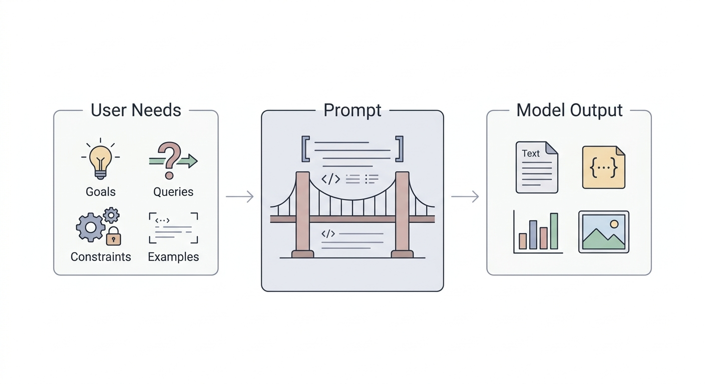
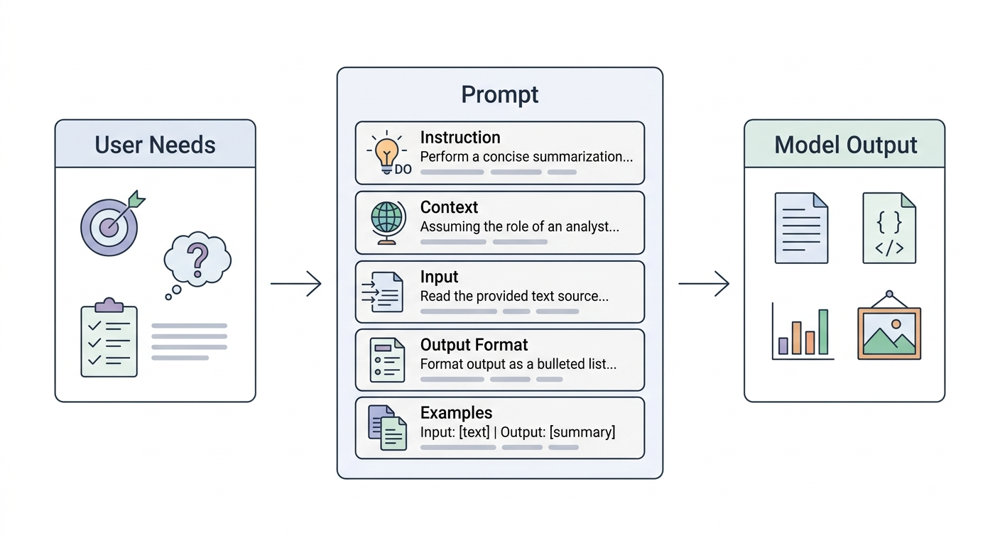
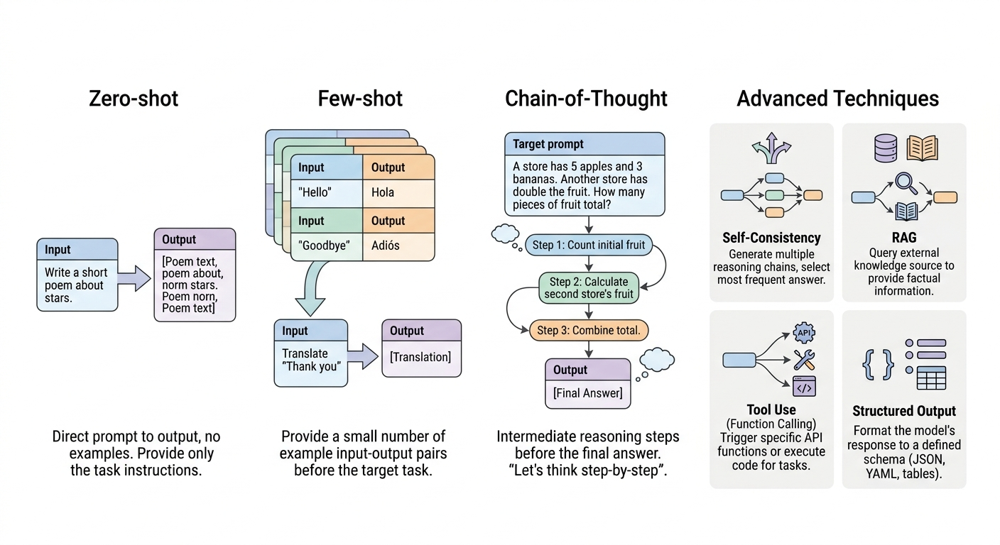
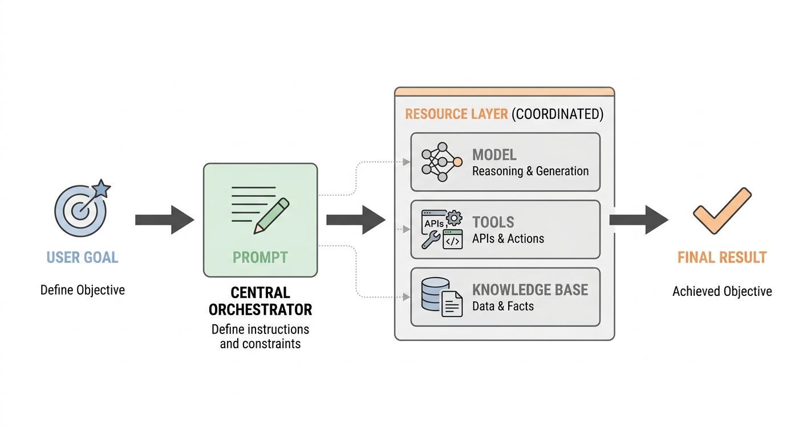

# 02 提示词工程

## 一、什么是 Prompt

Prompt（提示词）是人与大语言模型之间进行沟通的主要方式。它可以是一句话，也可以是一段完整的任务说明，用来告诉模型“要做什么”“基于什么信息来做”“最终如何输出”。

从工程角度看，Prompt 不只是“提问”，而是在设计一种可复用、可调试、可迭代的模型输入接口。一个好的 Prompt，能够让模型输出更准确、更稳定，也更符合业务目标。

在智能体开发中，Prompt 往往承担着以下作用：

- 定义模型角色
- 说明任务目标
- 提供上下文信息
- 约束输出格式
- 决定模型与工具、知识库、工作流如何配合

也就是说，Prompt 工程的本质，是把人类模糊的需求，翻译成模型可以稳定执行的结构化指令。



<div style="text-align:center;font-weight:bold;">图1 Prompt 作为“用户需求”与“模型输出”之间桥梁</div>

## 二、为什么 Prompt 工程很重要

很多初学者会觉得，只要模型能力足够强，随便问也能得到不错的结果。但在真实应用里，同一个模型面对不同写法的 Prompt，表现可能差异很大。

提示词工程之所以重要，是因为它直接影响以下几个方面：

- **准确性**：是否真正理解任务意图
- **稳定性**：同类输入下输出是否一致
- **可控性**：是否能遵循格式、风格、边界要求
- **可集成性**：是否方便接入程序、工作流和工具调用
- **可维护性**：Prompt 是否便于测试、版本迭代和复用

从工程实践角度看，提示词工程并不是“写一段神奇咒语”，而是一种围绕任务目标不断实验、评估和优化的过程。这一点非常重要，因为它说明 Prompt 和代码一样，需要测试、调整与迭代。

## 三、Prompt 的核心组成

一个高质量 Prompt 往往包含以下几个部分。

### 1. 指令（Instruction）

指令用于明确告诉模型要完成什么任务，是 Prompt 中最核心的部分。

例如：

```text
请将下面这段英文翻译成自然、准确的中文。
```

如果任务复杂，就不要只写“帮我优化一下”这种模糊说法，而应该把优化目标讲清楚。

### 2. 上下文（Context）

上下文用于补充背景信息，帮助模型判断场景和标准。

例如：

```text
下面是一段面向大学新生的宣讲稿，请将语言改得更亲切、更易懂。
```

有了“大学新生”这一背景后，模型就更容易控制语气和用词。

### 3. 输入数据（Input Data）

输入数据是模型真正要处理的内容，例如一段文章、一条评论、一段代码，或一份结构化文本。

例如：

```text
请总结下面文章的核心观点：

【文章内容】
……
```

### 4. 输出要求（Output Indicator）

输出要求用来说明结果该以什么形式呈现，包括格式、字数、语气、字段结构等。

例如：

```text
请使用 3 条要点总结，每条不超过 30 个字。
```

这类约束在实际开发里非常关键，特别适合需要结构化输出、接口对接或工作流传参的场景。

### 5. 示例（Examples）

示例用于告诉模型“你应该按什么标准来做”。当任务涉及风格模仿、分类标准、固定格式时，示例尤其有效。

例如：

```text
输入：今天天气很好
输出：天气晴朗，适合出行

输入：这个产品不太稳定
输出：该产品当前稳定性仍有优化空间
```

这种方式就是常见的 Few-shot Prompting（少样本提示）。



<div style="text-align:center;font-weight:bold;">图2 Prompt 的常见组成要素：指令、上下文、输入、输出要求与示例</div>

## 四、Prompt 工程的基本原则

### 1. 指令要清晰，不要让模型猜

如果你希望模型做摘要、改写、分类、抽取信息，就应该明确写出来，而不是模糊表达。

不好的写法：

```text
帮我处理一下这段内容。
```

更好的写法：

```text
请将下面这段产品介绍优化成适合电商详情页的文案，要求语言简洁、突出卖点、保留原始参数信息。
```

### 2. 任务越具体，结果越稳定

在实际撰写 Prompt 时，“具体化”非常重要。也就是说，你应该尽量补充：

- 面向对象是谁
- 任务目标是什么
- 应优先遵循哪些规则
- 不允许做什么
- 输出应该是什么格式

例如：

```text
请为一款少儿编程课程撰写宣传文案，面向 8-12 岁孩子家长，语言要专业但不生硬，输出 1 个标题和 3 条卖点。
```

### 3. 为模型提供必要背景

模型虽然“知道很多”，但它并不知道你当前业务里的隐含前提。因此，背景信息越明确，模型越容易输出贴合场景的内容。

例如，不要只说：

```text
请写一段介绍。
```

而要改成：

```text
请为企业内部培训课程写一段课程介绍，面向新入职工程师，风格正式但不生硬，长度控制在 120 字以内。
```

### 4. 复杂任务要拆解步骤

复杂任务通常不适合一句话“打包解决”。更有效的方式，是把任务拆成几个清晰步骤。

例如：

```text
请按以下步骤完成任务：
1. 提取文章中的核心观点
2. 判断每个观点是否有事实或数据支撑
3. 给出一段 100 字以内的总结
```

这种写法通常比“帮我分析一下这篇文章”更稳定。

### 5. 明确限制条件和边界

除了告诉模型“做什么”，也要尽量告诉模型“不要做什么”。这对减少幻觉、限制越界回答很有帮助。

例如：

```text
请仅依据给定材料作答，不要补充材料中未出现的信息；如果无法判断，请明确回答“材料中未提及”。
```

### 6. 优先要求结构化输出

如果结果最终要被程序消费，就应该尽量提前规定输出结构，而不是事后再人工整理。

例如：

```text
请以 JSON 格式输出，字段包含：
- title
- summary
- keywords
```

### 7. 用迭代方式优化 Prompt

Prompt 很少第一次就达到最佳效果。实际开发中更常见的过程是：

1. 先写一个基础版本
2. 观察模型输出问题
3. 针对问题补充规则、上下文或示例
4. 反复测试，逐步收敛

这和调试代码很像，本质上也是一种工程化迭代。

## 五、常见 Prompt 技术

提示词工程包含多种不同的技术路径。对于入门学习与常见应用场景而言，以下几种方法具有较高的代表性，也更便于理解和实践。

### 1. Zero-shot Prompting

Zero-shot Prompting 指不给示例，直接向模型描述任务，让模型基于自身能力完成。

例如：

```text
请判断下面这条评论的情感倾向，只输出“正面”“中立”或“负面”。

评论：这个耳机音质还行，但续航太差了。
```

这种方式适合翻译、摘要、基础分类、简单改写等模型已经比较擅长的任务。

### 2. Few-shot Prompting

Few-shot Prompting 指先给模型若干输入输出示例，再让它模仿示例规律完成新任务。

例如：

```text
请根据示例判断情感倾向。

示例1：
评论：发货很快，包装也很好。
情感：正面

示例2：
评论：能用，但体验比较一般。
情感：中立

示例3：
评论：刚买两天就坏了，非常失望。
情感：负面

现在请判断：
评论：价格不便宜，不过做工确实不错。
情感：
```

当任务标准较细、边界不够清晰时，Few-shot 通常比 Zero-shot 更稳定。

### 3. Chain-of-Thought Prompting

Chain-of-Thought（思维链）提示通过引导模型分步骤推理，提升复杂问题的回答质量，是提示词工程中常见的推理方法之一。

例如：

```text
请一步一步分析并给出答案。

某支球队第一阶段打了 20 场比赛，胜率为 70%；第二阶段打了 10 场比赛，赢了 6 场。请计算总胜率。
```

这种方式适用于数学计算、逻辑分析、多条件判断等需要中间推理过程的任务。

### 4. Self-Consistency

Self-Consistency（自我一致性）可以理解为：让模型围绕同一问题生成多条推理路径，再从中选择更一致、更可靠的答案。它通常与思维链提示结合使用。

从功能上看，可以作如下理解：

- Chain-of-Thought 强调“分步骤想”
- Self-Consistency 强调“多想几次，再选更一致的结果”

它适合需要更高推理稳定性的题目，但实现上通常比普通 Prompt 更复杂。

### 5. 其他提示技术简介

除上述常用方法外，提示词工程中还包括一些更偏进阶应用或系统设计的技术形式。它们在复杂任务编排、知识增强、自动优化和工具调用等场景中具有实际价值。

- **Generated Knowledge Prompting**：先让模型生成相关知识点，再基于这些知识点回答问题，适合“先整理知识、再组织答案”的场景。
- **Prompt Chaining**：把复杂任务拆成多个连续的 Prompt，前一步输出作为后一步输入，适合工作流编排和多阶段任务。
- **RAG（Retrieval Augmented Generation）**：先检索外部资料，再基于检索结果生成回答，适合知识密集型任务。
- **APE（Automatic Prompt Engineer）**：通过自动化方式搜索、生成或优化 Prompt，属于更偏研究和工程优化方向的技术。
- **ReAct**：让模型在“推理”和“行动”之间交替进行，适合需要工具调用、搜索、数据库查询等能力的智能体场景。



<div style="text-align:center;font-weight:bold;">图3 常见 Prompt 技术示意：Zero-shot、Few-shot、思维链以及其他进阶提示技术</div>

## 六、Prompt 编写模板

下面这个模板在实际项目中非常常用，适合大多数任务场景：

```text
你是【角色】。

你的任务是：【任务目标】。

已知背景信息：
【上下文】

请按以下要求完成：
1. 【要求1】
2. 【要求2】
3. 【要求3】

限制条件：
【禁止事项 / 边界要求】

输出格式：
【格式要求】

输入内容：
【用户输入 / 待处理数据】
```

例如，把它用在文章总结场景中：

```text
你是一名资深内容编辑。

你的任务是：总结文章核心观点，并输出适合做读书笔记的内容。

已知背景信息：
文章面向职场新人，主题是时间管理。

请按以下要求完成：
1. 提取 3 个核心观点
2. 每个观点配一句简短说明
3. 最后补充 1 条可执行建议

限制条件：
不要照抄原文，不要输出空泛评价。

输出格式：
使用 Markdown 列表输出，总字数不超过 200 字。

输入内容：
【此处粘贴文章正文】
```

## 七、Prompt 撰写规范与最佳实践

结合前文介绍的提示词要素、常见技术与应用经验，可以进一步归纳出一组较为通用的 Prompt 撰写规范。

### 1. 先定义成功标准，再写 Prompt

不要一开始就盯着“怎么写句子”，而是先想清楚：

- 希望模型完成什么任务
- 什么样的输出算成功
- 哪些错误是不能接受的

只有先明确目标，后面的 Prompt 调整才有方向。

### 2. 从简单版本开始，再逐步增强

最佳实践通常不是一开始就写一个巨大的 Prompt，而是先从最小可用版本出发，再逐步补充：

- 背景
- 示例
- 规则
- 格式要求
- 安全边界

### 3. 把 Prompt 当成可测试资产

Prompt 一旦用于生产系统，就应该像代码一样管理。建议保留一组固定测试样例，用来验证每次修改后效果有没有变差。

例如可以记录：

- 典型输入
- 容易出错的边界输入
- 高风险输入
- 期望输出格式

### 4. 理解模型能力边界

Prompt 工程不是无限放大模型能力。即使 Prompt 写得很好，模型依然可能受限于：

- 知识时效性
- 推理能力上限
- 长上下文处理能力
- 幻觉问题

因此，遇到知识查询、精确计算、事实验证等任务时，往往需要与检索、数据库或工具调用结合。

### 5. 为高风险场景加入防护语句

在客服、金融、医疗、审核等场景中，应当通过 Prompt 明确规定风险边界。

例如：

```text
如果问题涉及政策、金额、资格判断等高风险信息，请仅依据提供材料回答；若材料不足，请明确说明无法判断，不得自行补充。
```

## 八、Prompt 常见问题

### 1. 提示词是不是越长越好

不一定。重点不是长，而是清楚、结构化、有效。冗长但无重点的 Prompt，反而容易让模型忽略真正关键的要求。

### 2. 为什么模型有时“不听话”

常见原因包括：

- 指令不清晰
- 任务太复杂但没有拆解
- 上下文不足
- 输出格式要求不明确
- 没有给出示例
- 缺少边界约束

### 3. 为什么同一个 Prompt 输出不稳定

通常与以下因素有关：

- 模型存在随机性
- 温度等采样参数不同
- 输入上下文细节发生变化
- Prompt 中存在歧义

如果业务对稳定性要求高，可以考虑：

- 降低模型温度
- 固定输出格式
- 提供 Few-shot 示例
- 减少模糊表达
- 增加失败兜底语句

## 九、作业练习

本章作业位于：

`minimal_agents/hw/chapter-2/prompt/`

这一组作业不是只要求记住概念，而是要求真正动手修改 Prompt，并观察不同提示技术带来的输出变化。目录中已经提前准备好多个练习脚本，读者只需要围绕每个文件中的 `TODO` 位置继续完成即可。

当前包含的练习主题有：

- `k_shot_prompting.py`
- `chain_of_thought.py`
- `tool_calling.py`
- `self_consistency_prompting.py`
- `rag.py`
- `reflexion.py`

建议按下面的顺序完成：

1. 先阅读 `README.md`，了解环境准备与运行方式；
2. 从 `k_shot_prompting.py` 和 `chain_of_thought.py` 开始，先熟悉最基础的 Prompt 设计；
3. 再继续完成 `tool_calling.py`、`rag.py` 等更贴近智能体场景的练习；
4. 每完成一个任务，都记录“最初 Prompt”“修改后的 Prompt”“最终输出效果”的变化。

这一章的作业重点，不在于一次性写出完美 Prompt，而在于理解：

- 为什么有的 Prompt 更稳定；
- 为什么有的 Prompt 更容易让模型按要求输出；
- 为什么复杂任务往往需要示例、步骤或额外上下文。

## 十、小结

Prompt 工程不是“会不会提问”的问题，而是“能不能把任务清晰、稳定、可控地交给模型”的问题。建议至少掌握以下能力：

- 会写清晰的任务说明
- 会补充必要的背景信息
- 会约束输出格式
- 会使用 Zero-shot、Few-shot、思维链等方法
- 会给 Prompt 增加边界和限制条件
- 会通过测试和迭代持续优化

当 Prompt 写得更清楚，模型就更容易“听懂”；当 Prompt 设计得更结构化，智能体系统也会更稳定、更容易集成。



<div style="text-align:center;font-weight:bold;">图4 Prompt 在智能体系统中的位置：与模型、工具、知识库和工作流协同工作</div>

## 参考资料

- [Prompt Engineering Guide（中文）](https://www.promptingguide.ai/zh)
- [提示词要素：Elements](https://www.promptingguide.ai/zh/introduction/elements)
- [设计 Prompt 的通用技巧：Tips](https://www.promptingguide.ai/zh/introduction/tips)
- [Few-shot Prompting](https://www.promptingguide.ai/zh/techniques/fewshot)
- [Chain-of-Thought Prompting](https://www.promptingguide.ai/zh/techniques/cot)
- [ReAct](https://www.promptingguide.ai/zh/techniques/react)
- [What is prompt engineering?](https://cloud.google.com/discover/what-is-prompt-engineering)
- [Five best practices for prompt engineering](https://cloud.google.com/blog/products/application-development/five-best-practices-for-prompt-engineering)
