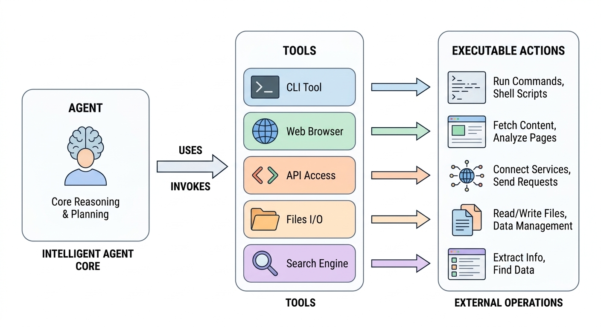
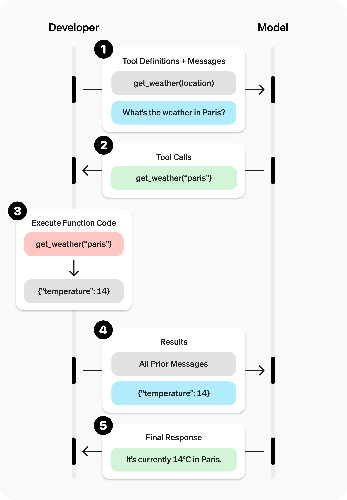
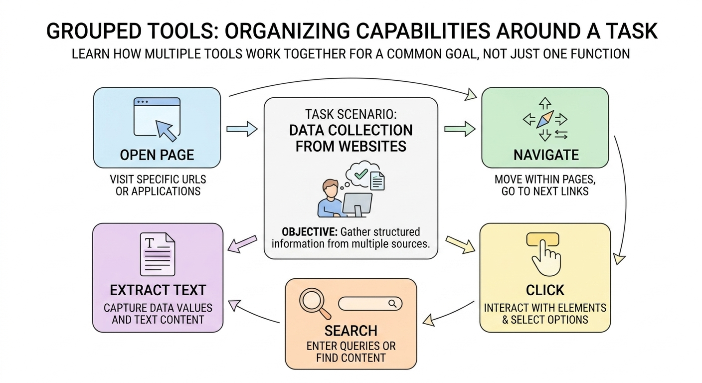

# 03 Tools：让模型真正动手做事


## 一、为什么 Prompt 之后还需要 Tool

在上一章里，我们已经讲了 Prompt 工程。

如果把 Prompt 看成“你如何把事情交代清楚”，那么接下来很自然就会遇到一个新问题：

> 事情已经说清楚了，那谁来做？

这正是 Tools 这一章要解决的问题。

很多初学者在刚接触 Agent 时，会有一种很常见的疑惑：

- 我已经把 Prompt 写得很清楚了，为什么 AI 还是不能直接帮我读文件？
- 为什么它知道“去查天气”是什么意思，却不能真的帮我查？

事实上，Prompt 负责把任务说明白，但 **Prompt 本身不提供执行能力**。它只能告诉模型“你应该做什么”，却不能直接让模型拥有“读文件、调接口、执行命令、访问平台”的手脚。

所以，到了这一章，我们就要补上 Agent 系统里的下一块拼图：**Tool**。

可以先把 Tool 理解成一句话：

> **Tool 是模型可以调用的动作。**

Tool解决的是“怎么让系统真的去做”。



<div style="text-align:center;font-weight:bold;">图1 Tools 的作用：让模型从“会说”走向“会做”</div>


---

## 二、什么是 Tool

在 Agent 系统里，**Tool 就是模型可以调用的可执行能力**。

这个能力不一定很复杂。它可以是：

- 一个 Python 函数；
- 一个命令行命令；
- 一个接口调用等等；

例如，下面这些都可以看成 Tool：

- `read_file(path)`：读取文件内容；
- `get_weather(city)`：查询某个城市的天气；
- `search_docs(query)`：搜索文档；
- `create_pull_request(...)`：创建 Pull Request；
- `run_tests()`：执行测试脚本。

如果用最直白的话来解释：

> Tool 就是“系统允许模型调用的一段能力”。

它和普通函数的区别不在于“代码写法突然变得很高级”，而在于：

- 普通函数只是程序员自己调用；
- Tool 是被暴露给模型调用。

也就是说，同样是一段函数代码：

- 没注册进 Agent 之前，它只是你的程序逻辑；
- 注册进 Agent 之后，它才成为模型可用的 Tool。

> Tool 的本质，就是把原本由程序执行的某个动作，包装成“模型也能调用”的形式。

---

## 三、一个 Tool 至少要说清楚什么

如果你希望模型正确使用一个 Tool，那这个 Tool 本身也要“说得清楚”。

一个设计比较清晰的 Tool，通常至少要包含下面几个部分。

### 1. 名称

名称最好一眼就能看出是干什么的。

例如：

- `read_file`
- `get_weather`
- `search_docs`
- `create_issue`

比起一些抽象或含糊的名字，清楚直接的名字更适合给模型使用。因为模型本质上也在“读说明”。名字越清晰，越容易选对。

### 2. 描述

描述用来告诉模型：这个 Tool 是做什么的，适合在什么情况下调用。

例如：

```text
Read UTF-8 text from a local file.
```

这句话不长，但已经足够告诉模型两件事：

- 这是一个“读文件”的 Tool；
- 读的是 UTF-8 文本文件。

### 3. 参数

参数要让模型知道：调用这个 Tool 时，需要提供什么信息。

例如：

```python
def read_file(path: str) -> dict:
```

这里就很明确：要给一个 `path`。

如果参数写得模糊，比如既不知道要文件路径、仓库名还是 URL，模型调用时就更容易传错。所有在这里良好的编程习惯就非常重要了。

### 4. 返回结果

返回结果也需要清楚。

因为 Tool 执行完以后，模型还要继续“读结果、接着往下做”。如果返回结构很乱，后续步骤也更容易乱。一个比较常用的清晰且自包含的表示结果的方法是json格式。

例如：

```python
return {"path": path, "content": content}
```

这就比只返回一句“读取成功”有用得多。

### 5. 失败时怎么反馈

真实系统里，Tool 不可能永远成功。文件可能不存在，网络可能超时，参数可能传错，权限也可能不够。

所以，一个能在系统里稳定使用的 Tool，不能只考虑“成功时返回什么”，还要考虑：

- 出错时返回什么；
- 出错信息是否能让模型继续判断下一步；
- 这个错误是暂时的，还是参数本身就有问题。

你会发现，这一部分其实和上一章讲 Prompt 很像：

> Prompt 要把事情说清楚，Tool 也要把自己的边界说清楚。

---

## 四、一个最小例子：查询天气 Tool

我们先看一个最小案例：**做一个天气查询 Tool，并把它注册给 Agent。**

这个案例的目标很简单：

- 我们先写一个普通函数 `get_weather`；
- 然后把它注册进 `ToolRegistry`；
- 最后让 `MinimalAgent` 在运行过程中调用它。

这个案例清楚的展示了“函数 → Tool → Agent 调用”的完整链路。

本节配套示例位于：

`minimal_agents/examples/chapter-3/tool/teaching_weather_tool.py`

`minimal_agents/examples/chapter-3/tool/teaching_tools_demo.py`

下面先看 `minimal_agents/examples/chapter-3/tool/teaching_weather_tool.py`，在这里实现 `get_weather` 函数：
```python
"""Shared weather tool for the Tools chapter."""

from __future__ import annotations

WEATHER_DATA = {
    "Beijing": {"city": "Beijing", "weather": "Sunny", "temperature_c": 18},
    "Shanghai": {"city": "Shanghai", "weather": "Cloudy", "temperature_c": 22},
    "Guangzhou": {"city": "Guangzhou", "weather": "Rainy", "temperature_c": 26},
}


def get_weather(city: str) -> dict:
    """Get weather data for a supported city."""
    return WEATHER_DATA.get(city, {"city": city, "error": "weather not found"})
```

接下来介绍如何将函数变为Tool：

```python
import json
from pathlib import Path
import sys

# 本代码基于仓库minimal_agents
project_root = Path(__file__).resolve().parents[2]
src_path = project_root / "minimal_agents" / "src"
sys.path.insert(0, str(src_path))

from minimal_agents import HelloAgentsLLM, MinimalAgent, ScriptedLLMBackend, ToolRegistry
from teaching_weather_tool import get_weather

# 1）先创建一个工具注册表。
# 后面所有希望交给 Agent 使用的工具，都要先注册到这里。
registry = ToolRegistry()

# 2）把普通函数 get_weather 注册成 Tool。
# 第二个参数是给模型看的说明文字。
registry.register_function(
    get_weather,
    "Get weather data for a supported city.",
)

# 3）这里用一个脚本化的 LLM 后端来模拟模型行为。
# 第一轮只负责发起工具调用；
# 第二轮会从 tool 消息里读取真实返回结果，再组织最终回答。
def first_turn(messages, tools):
    return {
        "content": "我先调用天气工具。",
        "tool_calls": [
            {
                "id": "tool-1",
                "name": "get_weather",
                "arguments": {"city": "Shanghai"},
            }
        ],
    }


def second_turn(messages, tools):
    weather_payload = {}
    for message in messages:
        if message.get("role") != "tool":
            continue
        if message.get("name") != "get_weather":
            continue
        weather_payload = json.loads(message["content"])
        break

    city = weather_payload.get("data", {}).get("city", "未知城市")
    weather = weather_payload.get("data", {}).get("weather", "未知天气")
    temperature = weather_payload.get("data", {}).get("temperature_c", "未知温度")
    return {"content": f"{city}当前{weather}，气温 {temperature}C。"}


llm = HelloAgentsLLM(
    backend=ScriptedLLMBackend([first_turn, second_turn])
)

# 如果需要接入真实在线模型，也可以将上面的 llm 替换为下面这一段。
#
# llm = HelloAgentsLLM(
#     model="YOUR_MODEL_NAME",
#     api_key="YOUR_API_KEY",
#     base_url="YOUR_BASE_URL",
# )

# 4）把工具注册表交给 Agent。
agent = MinimalAgent("tools-demo", llm, tool_registry=registry)

# 5）运行 Agent。
print(agent.run("查询上海天气"))
```

上面的默认写法使用了脚本化后端，是为了让读者把注意力集中在 Tool 的注册与调用流程上。如果后续想接入真实模型，可以直接使用下面这种形式：

```python
llm = HelloAgentsLLM(
    model="YOUR_MODEL_NAME",
    api_key="YOUR_API_KEY",
    base_url="YOUR_BASE_URL",
)
```

其中：

- `model` 表示要使用的模型名称；
- `api_key` 表示访问模型服务所需的密钥；
- `base_url` 表示模型服务地址；如果使用 OpenAI 兼容接口，通常填写服务提供方给出的 API 地址。

让“普通函数”变成了“模型能用的 Tool”的关键就是这一句：

```python
registry.register_function(
    get_weather,
    "Get weather data for a supported city.",
)
```

这一步可以理解成：

- 你把 `get_weather` 这个函数交给系统；
- 同时告诉系统，这个函数是做什么的；
- 后面 Agent 再把这些信息提供给模型；
- 模型在判断“我该调用哪个工具”时，就会把它当成候选能力之一。

系统先把函数整理成模型能理解的形式，再让模型做选择。不管未来你使用了什么框架，最终要让模型能够使用这个工具，一定会有这么一个步骤。

---

## 五、这段代码运行时，内部到底发生了什么

当你执行：

```python
print(agent.run("查询上海天气"))
```

系统里会发生下面这几步：

#### 第一步：用户提出任务

用户说：“查询上海天气。”

这时 Agent 拿到的是用户提供的一个自然语言任务，而不是直接的函数调用。

#### 第二步：模型判断是否要用 Tool

模型看到任务后，会判断：

- 这件事能不能只靠文字回答？
- 还是需要调用外部能力？

模型是否调用 Tool，不是随机决定的，而是结合任务需求和可用 Tool 列表一起判断的。像‘查询天气’这种任务，如果系统中已经提供了 get_weather 这样的 Tool，并且它的说明明确指向天气查询，那么模型就更容易判断应该调用它。

所以模型会返回一条工具调用意图，例如：

- 要调用 `get_weather`
- 参数是 `{"city": "Shanghai"}`

#### 第三步：Agent 去执行 Tool

系统会到 `ToolRegistry` 里找到 `get_weather`，然后用模型给出的参数去调用这个函数。


#### 第四步：Tool 返回结果

例如，`get_weather("Shanghai")` 返回：

```python
{"city": "Shanghai", "weather": "Cloudy", "temperature": 22}
```

或者其他的类似结构。

#### 第五步：模型基于结果组织最终回答

拿到真实结果以后，模型再把它整理成更自然的输出，例如：

> 上海当前多云，气温 22C。

所以，这里真正的链路是：

**用户任务 → 模型决定调用工具 → 系统执行工具 → 工具返回结果 → 模型整理结果**

Tool 在 Agent 系统里的基本工作方式可以总结为：

> 模型负责决定“要不要调用”以及“要调用什么”，系统负责真的去调用。这里要不要调用，以及要调用什么功能实现的好坏，就非常影响一个Agent的实际使用效果了。



<div style="text-align:center;font-weight:bold;">图2 Tool 的典型调用流程：模型决定调用，系统执行工具，再返回结果。来源：OpenAI官方文档</div>

---


## 六、从代码结构上看，Tool 是怎么接进 Agent 的

接下来我们将从代码层面解释：**Tool 在代码结构上是怎么接进去的。** 在 `minimal_agents` 里，可以把这条链路理解成：

**普通函数 → ToolRegistry → Agent → 模型返回 tool_calls → 系统执行函数**


#### 1. `ToolRegistry.register_function(...)`

这一步负责把普通 Python 函数收进工具注册表。可以把它理解成“备案”。系统先知道：

- 现在有哪些工具；
- 每个工具叫什么；
- 每个工具的描述是什么；
- 每个工具接收什么参数。

#### 2. Agent 把工具信息交给模型

当 Agent 开始运行时，它会把这些 Tool 信息整理后一起提供给模型。模型虽然不会直接执行函数，但它会看到：

- 有哪些工具可用；
- 每个工具大概是干什么的。

#### 3. 模型返回 `tool_calls`

如果模型判断当前任务需要某个 Tool，它就不会只输出普通文本，而是返回一段工具调用指令。这一步的重点是：

> 模型返回的是“我要调用哪个工具、参数是什么”。

#### 4. 系统执行 Tool

Agent 收到这段调用指令后，会去工具注册表里找到对应函数，再真正执行。

#### 5. 执行结果再回到模型上下文

Tool 的返回结果会被追加回当前上下文，模型再基于这个结果继续生成最终回答。

这样一来，整个过程就闭环了。

也正因为有这一套闭环，Tool 才不是“概念上的工具”，而是真正能在 Agent 运行过程中参与任务执行的能力单元。

---
## 七、案例：真实系统里，往往不是一个 Tool，而是一组 Tool

前面的天气查询时为了帮助理解 **“一个 Tool 是怎么工作的”**。但在真实系统里，任务通常不会靠一个单独的 Tool 完成，而是需要一组彼此配合的能力。

我们以**Playwright**为例。Playwright 是一个实际广泛使用的浏览器自动化工具。它原本常用于测试和自动化脚本。从智能体开发的角度看，我们可以看到：

> 真实系统里的能力，往往天然就是成组出现的。

以网页操作为例，系统通常不会只需要“一个浏览器 Tool”，而是会需要多种不同动作，例如：

- 打开页面：`page.goto()`
- 查找页面元素：`page.locator(...)`
- 在输入框中填写内容：`locator.fill()`
- 点击按钮：`locator.click()`等等

你会发现，这已经不是“一个函数完成一个任务”这么简单了。更贴近真实情况的方式通常是：

> 围绕同一个任务场景，准备一组可以互相配合的 Tool。

#### 为什么会是一组 Tool？

因为真实任务本身就是分步骤完成的。例如，一个看起来很简单的任务：

> “打开某个网页，输入关键词，点击搜索，然后把结果页面截图保存下来。”

这件事如果拆开看，通常至少包含下面几个动作：

1. 打开网页；
2. 定位输入框；
3. 输入文本；
4. 点击按钮；
5. 等待页面更新；
6. 截图保存结果。

如果把这些动作全部塞进一个超级大的 Tool，比如叫 `do_browser_task(...)`，虽然也不是完全不行，但会马上出现几个问题：

- 参数会变得很复杂；
- Tool 的用途会变得模糊；
- 模型不容易判断什么时候该调用它；
- 一旦失败，也很难判断具体是哪个步骤出了问题。

所以更合理的做法，通常是把它拆成一组职责更清楚的 Tool。而 Playwright 这类真实工具本身，也正是按这种方式组织能力的。

由此，我们可以总结出 Tool 设计的基本原则：

- 清楚：模型知道它做什么 
- 明确：模型知道怎么调用 
- 稳定：结果便于后续推理 
- 可控：避免高风险误操作

一个很重要的认识是：

> 学习 Tool，不只是学习“怎么写一个函数”，还要学习“怎么围绕任务去组织能力”。



<div style="text-align:center;font-weight:bold;">图3 成组 Tool 的典型形态：围绕同一任务场景组织多个可配合调用的能力</div>

而当开发者自己编写 Agent 时，常见的 Tool 接入方式可以分为两类：

### 1. 自己编写 Tool

第一种方式是由开发者自己实现 Tool。最常见的做法，是把本地函数、业务接口或命令封装成模型可调用的能力，再注册给 Agent。

例如，在 OpenAI 官方的 `function calling` 指南中，开发者可以定义一个天气查询函数，说明它的名称、用途和参数结构；当模型判断当前任务需要天气信息时，就会发起一次工具调用，再由应用侧真正执行这个函数并把结果返回给模型。  

这种方式的优点是：

- 能力边界最清楚；
- 与本地业务逻辑结合最紧密；
- 便于按项目需求定制输入输出结构。

### 2. 接入外部已有能力

第二种方式不是自己从零实现每个 Tool，而是把已经存在的外部能力接入 Agent。这些能力可以来自现成的工具服务器、外部系统接口。

我们在后续的讲解中会介绍 MCP（Model Context Protocol），一种引入外部工具的常见方式。MCP 可以给出多种可以直接复用的能力类型，例如 `Filesystem`、`Fetch`、`Git`、`Memory`、`Sequential Thinking` 等。对于 Agent 而言，这些能力虽然不是当前项目手写的函数，但依然可以被接入为可调用工具。  

这种方式的优点是：

- 可以直接复用成熟能力；
- 减少重复开发；
- 更适合快速接入文件系统、网页抓取、版本控制、记忆等通用能力。

无论采用哪一种方式，最终目标都是一致的：**让 Agent 获得一组边界清楚、参数明确、可以稳定调用的能力入口。** 

---

## 八、作业练习

本节作业位于：

`minimal_agents/hw/chapter-3/tool/tools_homework_template.py`

这份模板已经提前写好了：

- `bootstrap()` 与 `minimal_agents` 的导入；
- `ToolRegistry` 与 `MinimalAgent` 的基本接线；
- 一个现成的 Markdown 文件 `sample_note.md`；
- 一份脚本化后端的基本结构。

读者需要自己完成的部分，已经全部用 `TODO` 标出来了。核心任务包括：

1. 实现一个读取 Markdown 文件的 Tool，例如 `read_markdown(path)`；
2. 把这个 Tool 注册进 `ToolRegistry`；
3. 修改 `tool_calls`，让模型在运行时读取目标文件；
4. 根据工具返回结果，补全最终回答；
5. 让用户任务与工具调用保持一致。

配套的练习文件目录如下：

```text
minimal_agents/
└── hw/
    └── chapter-3/
        └── tool/
            ├── tools_homework_template.py
            └── sample_note.md
```

完成这道练习后，可以思考一个问题：

> 当系统里同时存在多个 Tool 时，名称、描述、参数和返回结构写得是否清楚，会直接影响模型能否选对工具、传对参数、读懂结果。

---

## 九、小结

这一章回答了一个问题：

> 为什么 Prompt 写得再好，Agent 还是需要 Tool？

答案是：因为 Prompt 负责把任务说清楚，但 Tool 才负责提供执行动作。

在本章的学习中，我们可以总结出这样的结论：

- Prompt 解决的是“怎么表达任务”，Tool 解决的是“系统到底能做什么”；
- 一个 Tool 本质上就是被暴露给模型调用的能力；
- 最简单的 Tool，通常就是一个职责清楚的函数，真实系统里的 Tool，往往会围绕同一业务域组织成一组；
- Tool 设计得越清晰，Agent 后面的行为就越稳定。

## 参考资料

- GitHub MCP Server 官方仓库：<https://github.com/github/github-mcp-server>
- OpenAI 官方指南：<https://platform.openai.com/docs/guides/function-calling>
