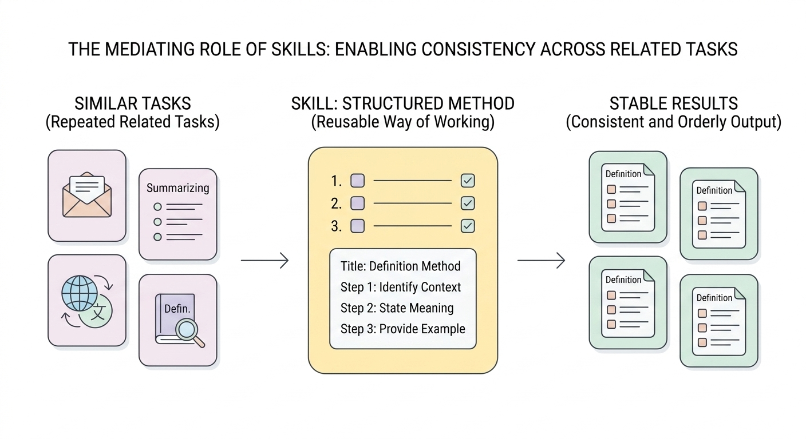
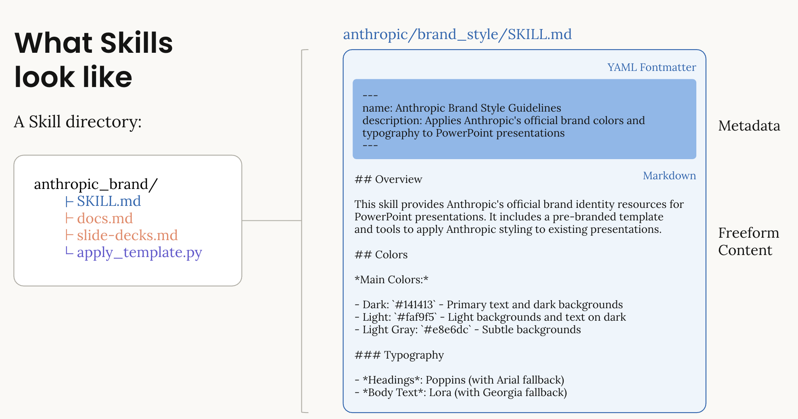
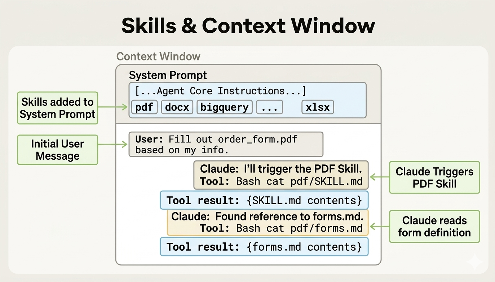
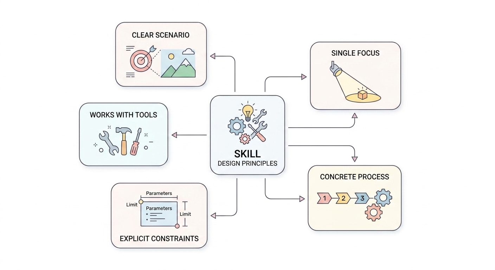

# 03 Skills：智能体的方法与流程能力

## 一、为什么有了 Tool 之后，还是需要 Skill

上一章已经讲过，**Tool 解决的是“模型能做什么动作”**。比如：

- 读取文件；
- 查询天气；
- 搜索代码；
- 运行测试。

学到这里，很多人会自然地产生一个想法：

> 既然 Tool 已经能让模型“动手做事”，那是不是把 Tool 接进去就够了？

实际用起来后，你很快会发现，事情没有这么简单。

即使给模型提供了同样一组 Tool，不同轮次的执行过程也可能不同。比如面对“撰写一份结构清晰的 Markdown 教程”这个任务，模型这次可能先列提纲再写正文；下一次可能直接开始写，结果结构混乱；再下一次虽然也写出了内容，但标题层级、代码块和示例风格都不稳定。

也就是说，**模型可能已经有动作能力了，但还不一定有稳定的方法。**

这正是这一章要解决的问题。可以先把 Skill 理解成一句话：

> Skill 将会告诉模型：遇到某类任务时，应该按什么方法去做。

从工程实现的角度看，Skill 还可以理解为一份可复用的任务说明包。用户只需要提出一个相对简洁的目标，系统就可以在后台加载对应 Skill，把更完整的流程、格式要求和领域约束补进当前任务。

把上一章看作“给模型装上手和脚”，那么这一章更像是在讲：

> 手和脚已经有了，但做事还需要方法、步骤和章法。



<div style="text-align:center;font-weight:bold;">图1 Skills 的作用：让模型在同类任务中采用更稳定的方法完成工作</div>

---

## 二、什么是 Skill

在智能体系统里，**Skill 可以理解为一套可复用的任务方法**。Skill通常会告诉模型：

- 这类任务适用于什么场景；
- 一般应该按什么顺序处理；
- 哪些步骤不能跳过；
- 输出最好长什么样；
- 需要时应该配合哪些 Tool 使用。

因此我们可以总结出：

> Tool 更像动作，Skill 更像做事的方法。

比如：

- `read_file` 是 Tool，因为它负责“读取文件”；
- `search_docs` 是 Tool，因为它负责“搜索资料”；
- “代码审查 Skill” 是 Skill，因为它告诉模型代码审查时应该先看改动范围、再找风险点、再组织结论；
- “需求拆解 Skill” 是 Skill，因为它告诉模型如何把模糊需求拆成目标、边界、验收条件和待确认问题。

由此我们可以总结出Skill的本质：

> 把一类任务中反复会用到的方法，提前写成一份可复用的工作说明。

这样，模型在以后再次遇到类似任务时，就不需要每次都临时发挥，而可以沿着更稳定的方式去处理。换句话说，用户只需要给出一个简洁任务，复杂的方法、结构和写作规范可以由 Skill 在后台补上。

---

## 三、一个 Skill 通常长什么样

在很多实现里，Skill 并不是一段散落在代码里的说明文字，而通常会被单独组织成一个目录。目录里最核心的文件，一般就是 `SKILL.md`。

在本文提供的教学示例里，Skill 的目录组织为以下形式：

```text
minimal_agents/
└── examples/
    └── chapter-3/
        └── skill/
            ├── teaching_skills_demo.py
            └── skills_demo/
                └── markdown_reader/
                    ├── SKILL.md
                    ├── REFERENCE.md
                    ├── sample_source.md
                    └── scripts/
                        └── read_markdown_source.py
```

基于该形式我们可理解Skill的构造规范：

- Skill 并非零散写在函数注释中，而是作为独立能力单元统一管理；
- 后续任务复杂时，可在该目录下持续补充文件。
- 主说明与补充资源可以放在同一目录中，便于后续扩展成更完整的能力包。
- 在真实项目里，Skill 目录下也可以放辅助脚本。应用可以先调用这些脚本生成结构化上下文，再把结果连同 `SKILL.md` 一起注入本轮任务。

### 1. `SKILL.md` 里一般会写什么

一个skill里面最核心的文件就是SKILL.md。里面的内容，通常包括下面几类：

- 这个 Skill 是做什么的；
- 它适合什么场景；
- 处理任务时推荐遵循什么流程；
- 输出有什么要求；
- 需要时可以引用哪些补充说明。

我们以 `markdown_reader` 作为示例：

```markdown
---
name: markdown_reader
description: Use this skill to read a Markdown source file first, then extract and explain its key points in a beginner-friendly way.
---

# Markdown Reader Skill

## Purpose
This skill is used for tasks where the agent should first read a Markdown document, then organize the document into a clearer explanation, summary, or study note.

## When To Use
- The task asks to explain, summarize, or整理 a Markdown file
- The answer should come from an actual source file, not from guessing
- The output should help beginners quickly understand the source material

## Workflow
1. Identify the source Markdown file that should be read
2. Read the file before giving any conclusion
3. Extract the document title, key sections, and core points
4. Reorganize the result into a concise beginner-facing explanation
5. If the file cannot be read, clearly explain what is missing

## Tool Use Rules
- Prefer using a file-reading tool before answering
- Do not invent content that is not present in the source file
- If the source file is missing, report that directly

## Output Style
- Use clear Markdown headings
- Prefer short paragraphs and short bullet lists
- Explain the document in plain language
- Keep the structure stable and easy to scan

## Current Task
$ARGUMENTS
```

这个最小例子体现了Skill的设计特点：

第一，Skill 有自己的名字和描述；  
第二，Skill 不只是在说“回答这个问题”，而是在规定回答这类问题时应遵循的流程、风格与边界。

### 2. Skill 为什么要单独放成目录

任务复杂度提升后，一个 Skill 目录下可逐步补充：
- EXAMPLES.md：输入输出示例
- REFERENCE.md：背景知识与规则说明
- 模板文件
- 辅助脚本
- 其他补充资料

优势在于：
- 主文件只保留核心逻辑
- 细节内容按需拆分
- 后续维护更清晰
- 同一 Skill 更便于迭代升级
可以简单理解为：

> 主文档负责讲方法，附加文件负责补细节。



<div style="text-align:center;font-weight:bold;">图2 Skill 的基本结构：核心说明写在 SKILL.md 中，复杂任务再配合附加资源。

图源——参考资料 Anthropic Cookbook：Skills Introduction</div>

---

## 四、Skill 在代码里是怎么被用起来的

Skill 通常是先被**发现**，再被**加载**，最后作为一段方法说明注入到当前任务里。可以先把这个过程理解成三步。

#### 1. 第一步：先找到有哪些 Skill

系统首先会扫描某个目录，看看里面有哪些可用 Skill：

- 现在系统里有哪些方法包；
- 它们分别叫什么；
- 大致适合什么场景。

这件事通常由 `SkillLoader` 完成。

#### 2. 第二步：决定当前任务要用哪一个

接下来，系统需要根据当前任务，决定这次要不要启用某个 Skill。这个过程可以是显式指定，也可以由应用层先做一次路由判断。

> Skill 只会在合适的时候被选出来使用。

#### 3. 第三步：把 Skill 内容注入当前任务

一旦选中了某个 Skill，系统就会读取对应的 `SKILL.md`，把里面的方法说明加入到当前任务上下文中。这样，模型在后续处理任务时，就会带着这份“做事方法”一起工作。从实现层面看，这一步本质上是在任务开始前补充一段额外上下文，使模型更容易按照既定流程执行。因此，Skill 也可以理解为一种面向任务方法的 Prompt 工程。

所以从运行机制上看，Skill 更像是：

> 在任务开始前，先给模型补上一份该怎么做这件事的说明。



<div style="text-align:center;font-weight:bold;">图3 Skill 的典型调用链</div>

---

## 五、案例：把一个 Markdown 撰写 Skill 接进最小示例里

这一节我们会实现一个简单的目标：

> 看一个最小 Skill 到底是怎样写出来、再怎样被接进 Agent 里用起来的。

这里改用一个更接近真实工作的 `markdown_reader` Skill。它的目标不是“凭空写一段结果”，而是先读取一个真实 Markdown 文件，再在 Skill 的指导下整理出更易读的说明。

教学示例代码文件可查看：

`minimal_agents/examples/chapter-3/skill/teaching_skills_demo.py`

`minimal_agents/examples/chapter-3/skill/skills_demo/markdown_reader/SKILL.md`

`minimal_agents/examples/chapter-3/skill/skills_demo/markdown_reader/scripts/read_markdown_source.py`

### 1. 先看 Skill 文件本身

我们以刚刚实现的 `markdown_reader` 来作为案例。

这段内容已经做了三件事：

1. 给这个 Skill 取了名字：`markdown_reader`；
2. 说明了它适合什么场景；
3. 明确了处理流程、输出风格与工具使用规则。

完成了以下的功能：

> 把“读取 Markdown 后应该如何整理与解释”这件事先讲清楚。

### 2. 再看智能体侧代码

下面这段代码的作用，是把这个 Skill 加载进 Agent，并在执行任务前先做一次 Skill 路由，让系统自己决定这次是否启用它。

```python
from __future__ import annotations

import json
from pathlib import Path
import subprocess
import sys

SKILLS_ROOT = Path(__file__).resolve().parent / "skills_demo"
SOURCE_PATH = SKILLS_ROOT / "markdown_reader" / "sample_source.md"


def bootstrap() -> None:
    project_root = Path(__file__).resolve().parents[2]
    src_path = project_root / "minimal_agents" / "src"
    src_str = str(src_path)
    if src_str not in sys.path:
        sys.path.insert(0, src_str)


bootstrap()

from minimal_agents import HelloAgentsLLM, MinimalAgent, ScriptedLLMBackend, ToolRegistry
from minimal_agents.skills import SkillLoader, SkillResolver

# 这里用一个很小的路由函数，模拟“系统先判断当前任务该用哪个 Skill”。
def choose_skill(user_task: str) -> tuple[str | None, str]:
    lowered = user_task.lower()
    if any(
        keyword in lowered
        for keyword in ["markdown", "read", "reader", "summary", "summarize", "note"]
    ):
        return (
            "markdown_reader",
            "Read the source Markdown file first, then explain it for beginner readers.",
        )
    return None, ""


def build_skill_args(skill_name: str, source_path: Path) -> str:
    # 调用Skill中指出的tool完成功能
    script_path = SKILLS_ROOT / skill_name / "scripts" / "read_markdown_source.py"
    completed = subprocess.run(
        [sys.executable, str(script_path), str(source_path)],
        capture_output=True,
        text=True,
        check=True,
    )
    return completed.stdout.strip()


def read_markdown_file(path: str) -> dict:
    """Read UTF-8 content from a Markdown file."""

    file_path = Path(path)
    if not file_path.exists():
        return {"path": str(file_path), "error": "file not found"}
    return {
        "path": str(file_path),
        "content": file_path.read_text(encoding="utf-8"),
    }


def build_demo_agent() -> MinimalAgent:
    # SkillLoader 负责扫描目录；SkillResolver 负责在运行时取出选中的 Skill。
    resolver = SkillResolver(SkillLoader(SKILLS_ROOT))

    registry = ToolRegistry()
    registry.register_function(
        read_markdown_file,
        "Read UTF-8 content from a Markdown file.",
    )

    def first_turn(messages, tools):
        system_prompt = messages[0]["content"]
        if "Markdown Reader Skill" not in system_prompt:
            return {"content": "This run did not inject the markdown_reader skill."}

        return {
            "content": "I should read the Markdown source file before summarizing it.",
            "tool_calls": [
                {
                    "id": "tool-1",
                    "name": "read_markdown_file",
                    "arguments": {"path": str(SOURCE_PATH)},
                }
            ],
        }

    def second_turn(messages, tools):
        tool_payload = {}
        for message in messages:
            if message.get("role") != "tool":
                continue
            if message.get("name") != "read_markdown_file":
                continue
            tool_payload = json.loads(message["content"])
            break

        source_data = tool_payload.get("data", {})
        content = source_data.get("content", "")
        if not content:
            return {"content": "未能读取到 Markdown 文件内容。"}

        lines = [line.strip() for line in content.splitlines() if line.strip()]
        title = next((line.lstrip("# ").strip() for line in lines if line.startswith("# ")), "Untitled")
        sections = [line.lstrip("# ").strip() for line in lines if line.startswith("## ")]

        bullets = []
        for line in lines:
            if line.startswith("- "):
                bullets.append(line[2:].strip())

        section_text = "、".join(sections[:3]) if sections else "无"
        bullet_text = "；".join(bullets[:3]) if bullets else "无"

        return {
            "content": (
                f"# {title} 阅读说明\n\n"
                f"## 核心结构\n"
                f"这份 Markdown 主要包括：{section_text}。\n\n"
                f"## 关键信息\n"
                f"{bullet_text if bullet_text != '无' else '文档重点主要通过段落说明给出。'}"
            )
        }

    llm = HelloAgentsLLM(
        backend=ScriptedLLMBackend([first_turn, second_turn, first_turn, second_turn])
    )

    # 如果需要接入真实在线模型，可将上面的 llm 替换为下面这一段。
    #
    # llm = HelloAgentsLLM(
    #     model="YOUR_MODEL_NAME",
    #     api_key="YOUR_API_KEY",
    #     base_url="YOUR_BASE_URL",
    # )

    # 这一步非常关键：把 skill_resolver 和 tool_registry 一起交给 Agent。
    return MinimalAgent("skills-demo", llm, tool_registry=registry, skill_resolver=resolver)


def run_auto_skill_demo(agent: MinimalAgent, user_task: str) -> None:
    print("=== Auto skill routing ===")
    # 先做路由：判断这次任务是否要启用某个 Skill。
    skill_name, skill_args = choose_skill(user_task)

    if skill_name is None:
        print(agent.run(user_task))
        return

    rendered_args = build_skill_args(skill_name, SOURCE_PATH)

    print(
        agent.run(
            user_task,
            # 如果这里传入了 skill 名称，Agent 会去读取对应的 SKILL.md，
            # 再把这份方法说明一起注入到当前任务中。
            skill=skill_name,
            skill_args=f"{skill_args}\n\n{rendered_args}",
        )
    )


def run_manual_override_demo(agent: MinimalAgent) -> None:
    print("\n=== Manual override for testing ===")
    user_task = "Read the Markdown source and explain its main points."
    rendered_args = build_skill_args("markdown_reader", SOURCE_PATH)
    print(
        agent.run(
            # 手动指定更适合调试或教学演示，方便和自动路由做对照。
            user_task,
            skill="markdown_reader",
            skill_args=(
                "Read the source Markdown file first, then explain the structure and key points.\n\n"
                f"{rendered_args}"
            ),
        )
    )


def main() -> None:
    agent = build_demo_agent()
    run_auto_skill_demo(agent, "Read this Markdown note and summarize the key points.")
    run_manual_override_demo(agent)


if __name__ == "__main__":
    main()
```

接下来，我们将详细解释这段代码的执行原理：

#### 第一步：告诉系统 Skill 放在哪里

```python
skills_root = Path(__file__).resolve().parent / "skills_demo"
resolver = SkillResolver(SkillLoader(skills_root))
```

代码的具体含义为：

- `skills_demo` 目录里放着可用的 Skill；
- `SkillLoader` 负责去扫描这些 Skill；
- `SkillResolver` 负责后续按需解析和提供它们。

#### 第二步：创建一个带 Skill 能力的 Agent

```python
agent = MinimalAgent("skills-demo", llm, tool_registry=registry, skill_resolver=resolver)
```

这一行的重点是：把 `skill_resolver` 和 `tool_registry` 一起交给 `MinimalAgent`。这样 Agent 不仅知道该加载哪份 Skill，也能在 Skill 指导下实际调用文件读取工具。

#### 第三步：运行任务前先做 Skill 路由

```python
user_task = "Read this Markdown note and summarize the key points."
skill_name, skill_args = choose_skill(user_task)
rendered_args = build_skill_args(skill_name, SOURCE_PATH)

print(
    agent.run(
        user_task,
        skill=skill_name,
        skill_args=f"{skill_args}\n\n{rendered_args}",
    )
)
```

系统会根据任务内容判断当前是否需要某个 Skill，再把结果传给 Agent。这里：

- `user_task` 是用户的原始任务；
- `choose_skill(user_task)` 负责根据任务内容判断是否要启用某个 Skill；
- `skill_name` 和 `skill_args` 是路由阶段给出的结果；
- `agent.run(...)` 只负责真正执行任务。

在当前示例中，用户只需要提出“读取这份 Markdown 并总结重点”这样的任务，路由逻辑就会把它匹配到 `markdown_reader`。这样做的意义在于：用户输入可以保持简洁，而“先读文件、再提取结构、最后整理输出”这一整套方法由 Skill 负责补充。

在这个示例里，`choose_skill()` 只是一个很小的规则路由器，用来帮助读者理解“自动选择 Skill”这一层通常发生在什么位置。真实系统里，这一步也可以换成：

- 基于关键词或标签的路由；
- 基于检索的匹配；
- 由模型先判断应该启用哪个 Skill。

也可以手动指定某个 Skill，用来验证注入后的表现是否符合预期：

```python
agent.run(
    "Read the Markdown source and explain its main points.",
    skill="markdown_reader",
    skill_args=(
        "Read the source Markdown file first, then explain the structure and key points.\n\n"
        f"{rendered_args}"
    ),
)
```

如果需要接入真实模型，则可以直接使用下面这类写法：

```python
llm = HelloAgentsLLM(
    model="YOUR_MODEL_NAME",
    api_key="YOUR_API_KEY",
    base_url="YOUR_BASE_URL",
)
```

其中：

- `model` 表示模型名称；
- `api_key` 表示访问模型服务所需的密钥；
- `base_url` 表示模型服务地址，如果使用 OpenAI 兼容接口，通常填写对应服务提供方给出的 API 地址。

这里更容易把 Skill 看清楚：真正“决定这次该用什么 Skill”的，通常发生在 Agent 执行前的路由阶段；而 Agent 在执行时拿到的，是已经准备好的任务上下文与 Skill 配置。

在这个例子中我们可以看到 Skill 的角色：

- Skill **没有替代模型**，Skill **也没有替代 Tool**；
- Skill 做的是另一件事：**给任务补上一层可复用的方法说明。**

---

## 六、Skill设计原则

#### 原则一：明确适用场景

设计Skill时，开篇需清晰界定其核心信息，包括具体用途、适用的任务场景以及明确的不适用范围。若场景界定模糊，会导致系统无法精准调用该Skill，同时也会让使用者难以理解其核心价值，影响复用效果。

#### 原则二：流程具象化，拒绝空泛表述

设计Skill的执行流程时，应拆解为具体可操作的步骤。标准执行逻辑示例：
- 第一步确认输入信息的完整性；
- 第二步检查关键信息缺口；
- 第三步若可调用工具，优先通过工具获取佐证；
- 第四步按照固定结构整理并输出结果。

需明确的是：Skill的核心价值在于步骤的可操作性，而非态度层面的表述。

#### 原则三：明确约束边界

优质的Skill不仅需要明确“需执行的操作”，更要清晰界定“禁止的行为”。清晰的约束的能让Skill成为可标准化复用的方法，而非空洞的指导性表述。

#### 原则四：明确工具配合逻辑

多数Skill的实际价值依赖于工具的配合使用，因此设计时需明确工具调用的逻辑规则：明确何种场景下需优先调用工具；何种场景可直接组织现有信息输出结论；哪些结论必须基于工具返回的结果才能得出。

例如本章中的 `markdown_reader` Skill 就已经写明：

- 应优先读取真实 Markdown 文件，再给出解释；
- 不要编造源文件中没有出现的内容；
- 如果文件缺失，应直接报告而不是猜测。

这类规则虽然还没有绑定某一个具体 Tool，但已经把“什么时候该用工具，什么时候不该用工具”定义清楚了。后续一旦 Agent 里接入搜索、文件读取或联网查询等 Tool，这份 Skill 就能够继续复用。

#### 原则五：聚焦单一主题，拒绝“万能化”

设计Skill时需避免陷入“万能化”误区。正确做法是：一个Skill聚焦一个明确的任务主题，例如专门用于代码审查、文献总结、需求拆解或实验结果分析等，这样能大幅提升Skill的复用性和后期维护效率。



<div style="text-align:center;font-weight:bold;">图4 Skill 的设计原则：场景明确、流程具体、约束清楚、能与 Tool 配合，聚焦单一主题</div>

---


## 七、作业练习

我们为读者准备好两份模板文件：

`minimal_agents/hw/chapter-3/skill/skills_homework_template.py`

`minimal_agents/hw/chapter-3/skill/skills_demo/study_card_writer/SKILL.md`

这组练习的目标，不只是“写一个 Skill 文件”，而是把一个 Skill 真正接进 Agent。模板中已经提前写好了：

- `bootstrap()` 与 `minimal_agents` 的导入；
- `SkillLoader` 和 `SkillResolver` 的基本接线；
- 一个最小的脚本化后端；
- 一个待补全的 Skill 目录结构。

读者需要自己完成的部分，已经全部用 `TODO` 标出来了。核心任务包括：

1. 在 `SKILL.md` 里补全这个 Skill 的用途、适用场景、流程和输出风格；
2. 在 `choose_skill(user_task)` 中写出最简单的路由逻辑；
3. 让 `agent.run(...)` 在任务匹配时真正启用这个 Skill；
4. 对照 Skill 的方法说明，修改脚本化后端中的输出内容。

配套的练习目录如下：

```text
minimal_agents/
└── hw/
    └── chapter-3/
        └── skill/
            ├── skills_homework_template.py
            └── skills_demo/
                └── study_card_writer/
                    └── SKILL.md
```

## 八、小结

这一章的核心要点在于：

> 有了 Tool，模型开始能做事；有了 Skill，模型才更可能把事做得有条理。

所以我们可以将所学习的内容连起来理解：

- **Prompt** 负责把任务说清楚；
- **Tool** 负责提供可执行动作；
- **Skill** 负责提供处理这类任务的方法。

当 Prompt、Tool 和 Skill 逐步配合起来时，一个系统才会慢慢从“会说话的模型”，变成“能按方法完成任务的智能体”。

## 参考资料

- Anthropic Cookbook：Skills Introduction  
  <https://platform.claude.com/cookbook/skills-notebooks-01-skills-introduction>

- Anthropic 文档：Agent Skills Overview  
  <https://platform.claude.com/docs/en/agents-and-tools/agent-skills/overview>

- Anthropic 文档：Build with Claude Overview  
  <https://platform.claude.com/docs/en/build-with-claude/overview>

- minimal_agents 项目源码：`minimal_agents.skills` 相关实现
