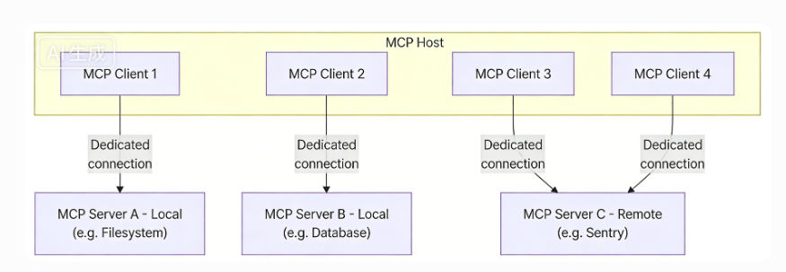
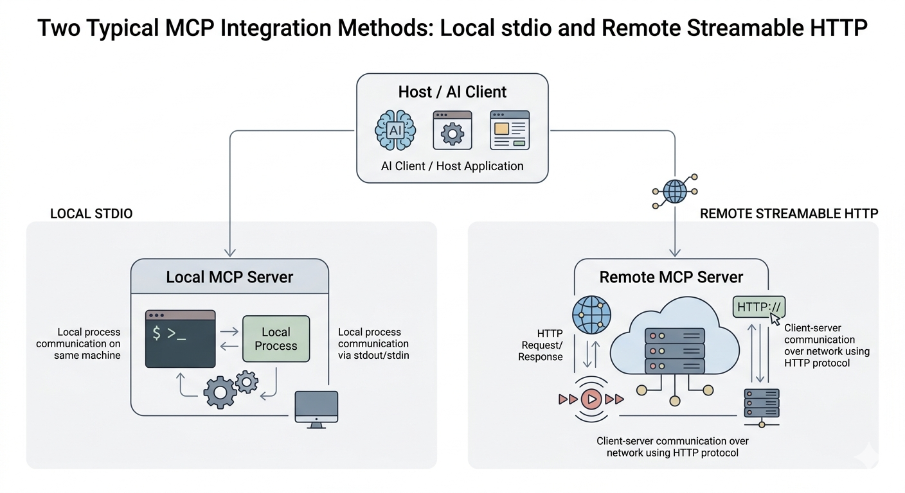
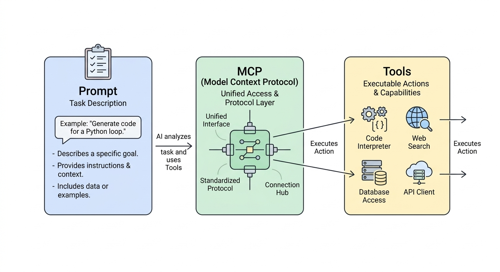

# 04 MCP 与外部能力接入

## 一、为什么需要 MCP

前面的章节已经介绍了 **Tool**。Tool 解决的是：**为模型补充具体的可执行能力**，使其不仅能够理解和生成，还能够读取文件、查询天气、搜索信息或调用外部服务。

但当系统进一步从“本地少量 Tool”走向“广泛接入外部能力”时，新的问题就出现了。

在本地示例中，Tool 往往由开发者自行实现，因此函数形式、参数结构和返回结果都可以自行控制。  而一旦需要接入网络上的更多工具或服务，就会发现不同企业、不同平台、不同服务商提供能力的方式并不一致，例如：

- 调用协议不同；
- 接口形式不同；
- 参数组织方式不同；
- 返回结果结构不同；
- 认证与权限控制方式不同。

这意味着，**如果缺少统一的接入规范，每增加一种外部能力，Host 或 Agent 往往都需要单独适配一次。**  
能力来源越多，接入和维护成本就越高，系统也越容易变得零散和混乱。

因此，问题进一步变成了：

> 来自不同来源的 Tool，能否以一致方式被发现、接入和调用。

MCP（Model Context Protocol）正是在这样的背景下提出的。它的重点并不是重新定义 Tool 本身，而是为外部能力提供一套更统一的接入协议，使不同来源的工具和服务能够以相对一致的方式接入 Host，并被模型调用。

换句话说：

- **Tool** 解决的是“模型可以做什么”；
- **MCP** 解决的是“这些能力如何按统一方式接入系统”。

因此，这一章的重点不是再增加一个新概念，而是进一步说明：

> 当系统需要接入越来越多、越来越复杂的外部能力时，为什么需要协议化的设计。


## 二、MCP 基础：Host、Client 与 Server

可以先用一句更朴素的话理解这些概念：

> 用户在 Host 里提要求，Host 发现需要外部能力时，就去找 MCP Server；MCP Server 执行完，再把结果交回来。

如果把它类比成“点外卖”：

- **用户**：提出需求的人；
- **Host**：你下单的平台；
- **MCP Server**：真正提供服务的一方；
- **Client**：平台内部负责把订单传过去、把结果拿回来的那层。

在这个类比里，我们可以总结出：

- 需求是从 Host 发起的；
- 能力是由 Server 提供的；
- 两者之间通过 MCP 这套协议沟通。

### 1. Host 是什么

Host 就是用户实际操作的 AI 宿主环境。例如：

- Claude Code
- Cline
- 某些 IDE 插件
- 某些桌面端 AI 工具
- 某些支持工具调用的 Agent 框架

用户并不是直接对着 MCP Server 说话，而是先在 Host 里提要求。

### 2. Client 是什么

Client 主要负责两件事：

- 按 MCP 协议发请求；
- 把返回结果交回 Host。

也就是说，Client 更像“中间的通信部件”。

### 3. Server 是什么

MCP Server 才是真正“提供能力”的地方。

它可以把某种外部能力包装出来，供模型调用。这个能力可以是：

- 读取文件；
- 查询天气；
- 执行脚本；
- 访问数据库等；

所以，**MCP Server 是把外部能力整理成模型可调用接口的一层服务。**

一个典型调用过程大致如下：

1. 用户在 Host 中提出任务；
2. Host 判断这个任务仅靠模型回答不够，需要外部能力；
3. Host 通过 Client 去调用某个 MCP Server；
4. MCP Server 执行工具，返回结果；
5. Host 再把结果交给模型组织成最终回答。



<div style="text-align:center;font-weight:bold;">图2 MCP 的基本关系：用户通过 Host 使用由 Server 提供的能力</div>

---

## 三、MCP 最常见的两种接入方式

学到这里，很多人接着会问：

**“这个 Server 到底是跑在我电脑上，还是跑在远程服务器上？”**

答案是：两种都可以。

在实际使用中，MCP Server 最常见的两种接入方式是：

1. 本地 `stdio`
2. 远程 `Streamable HTTP`

### 1. 本地 MCP：`stdio`

`stdio` 是 standard input / standard output 的缩写，也就是“标准输入 / 标准输出”。

如果你以前写过命令行程序，可以这样理解：

- 程序可以从输入里接收内容；
- 程序处理后，再把结果打印到输出里。

本地 `stdio` MCP 的核心思想就是：

> Host 在本机启动一个 MCP Server 进程，然后通过标准输入把请求发过去，再从标准输出把结果读回来。


可以理解成下面这个过程：

1. Host 在本地执行一条命令，例如 `python weather_server.py`；
2. 这个 Python 程序启动后，开始等待 Host 发请求；
3. Host 通过标准输入把“请调用哪个工具、参数是什么”发过去；
4. Server 执行完以后，再通过标准输出把结果返回。

### 2. 远程 MCP：Streamable HTTP

若MCP Server部署在远程机器，Host不再启动本地进程，而是通过网络连接访问。此时更适合采用远程传输方式，简单理解为：

- 本地 `stdio`：如同在本地启动助手；
- 远程 HTTP：如同访问在线运行的服务。

远程方式更适用于：

- 多人共享服务；
- 企业内部统一接入；
- 需鉴权与权限控制；
- 需集中部署与维护。



<div style="text-align:center;font-weight:bold;">图3 MCP 的两类常见接入方式：本地 stdio 与远程 Streamable HTTP</div>


---

## 四、案例：天气 MCP Server

这一节我们将实现一个简单的案例：**做一个“天气 MCP Server”，让 Host 可以通过它查询天气和支持的城市列表。**

这个案例完整体现了 MCP 的基本过程：

- 先定义一个 Server；
- 再把函数暴露成工具；
- 然后以 `stdio` 方式运行；
- 最后让 Host 或 Agent 去调用它。

### 1. 安装依赖

先安装示例需要的 Python 包：

```bash
pip install mcp
```

### 2. MCP Server有哪些工具

这个示例里，我们准备了两个工具：

- `get_weather(city)`：查询某个城市的天气；
- `list_supported_cities()`：列出目前支持查询的城市。

为了让示例结构更清楚，真正的天气逻辑放在 `minimal_agents/examples/chapter-4/mcp/teaching_weather_tools.py` 中，MCP Server 只负责把这些函数注册成工具并对外暴露。这个文件的重点是：**如何把已有函数包装成 MCP 工具。**

### 3. 示例代码

下面这段代码就是一个最小可运行的本地 MCP Server：

```python
from mcp.server.fastmcp import FastMCP
from teaching_weather_tools import (
    get_weather as get_weather_impl,
    list_supported_cities as list_supported_cities_impl,
)

# 创建一个 MCP Server 实例。
# 这里的名字可以理解为这个 Server 的标识。
mcp = FastMCP("weather-server")


@mcp.tool()
def get_weather(city: str) -> str:
    """查询某个城市的天气。"""
    # 这里没有直接写复杂逻辑，而是调用已经实现好的业务函数。
    return get_weather_impl(city)


@mcp.tool()
def list_supported_cities() -> list[str]:
    """返回当前支持查询的城市列表。"""
    return list_supported_cities_impl()


if __name__ == "__main__":
    # 以 stdio 方式运行这个 Server。
    # 这意味着：Host 会把它当作一个本地进程启动，
    # 再通过标准输入/输出与它通信。
    mcp.run(transport="stdio")
```

### 4. 这段代码到底在做什么

可以把上面的代码拆成三步来看。

#### 第一步：创建一个 Server

```python
mcp = FastMCP("weather-server")
```

这一步就是在告诉程序：

“我要创建一个名为 `weather-server` 的 MCP Server。”

#### 第二步：把函数注册成工具

```python
@mcp.tool()
def get_weather(city: str) -> str:
```

`@mcp.tool()` 这个装饰器的作用，可以直接理解为：

> 把下面这个 Python 函数暴露成可被 Host 发现和调用的工具。

#### 第三步：以 `stdio` 方式启动

```python
mcp.run(transport="stdio")
```

这一步具体代表的含义为：

> 让这个 Server 进入等待通信的状态，等 Host 来连接它。

只不过这里使用的通信方式不是 URL，而是本地进程的标准输入输出。

### 5. 如何运行它

本节配套示例位于：

`minimal_agents/examples/chapter-4/mcp/teaching_weather_tools.py`

`minimal_agents/examples/chapter-4/mcp/teaching_stdio_weather_server.py`

`minimal_agents/examples/chapter-4/mcp/teaching_mcp_demo.py`

假设这个文件名是 `teaching_stdio_weather_server.py`，那么可以这样启动：

```bash
python minimal_agents/examples/chapter-4/mcp/teaching_stdio_weather_server.py
```

需要强调的是：

- 对于 `stdio` 类型的 MCP Server，通常没有单独的访问网址；
- 它是“等着 Host 来调用的本地工具进程”。

如果你现在只是手动在终端里运行它，看到程序保持运行状态，这通常说明它已经启动成功，正在等待连接。


---

## 五、如何把这个 MCP Server 接到 Agent 里使用

### 1. 示例代码

```python
import json
from pathlib import Path
import sys

from _bootstrap import bootstrap

bootstrap()

from minimal_agents import HelloAgentsLLM, MinimalAgent, ScriptedLLMBackend, ToolRegistry
from minimal_agents.mcp import StdioMCPClient, register_mcp_tools

examples_dir = Path(__file__).resolve().parent

# 创建一个 stdio MCP 客户端。
# 它会使用当前 Python 解释器启动 teaching_stdio_weather_server.py，
# 然后通过标准输入输出与这个 Server 通信。
client = StdioMCPClient(
    command=sys.executable,
    args=["teaching_stdio_weather_server.py"],
    cwd=examples_dir,
)

# 创建工具注册表，用来存放从 MCP Server 发现到的工具。
registry = ToolRegistry()

# 读取 MCP Server 暴露出来的工具，并注册到本地 registry 中。
register_mcp_tools(client, registry)


def extract_string_list(value):
    """在嵌套返回结果里找到第一个 list[str]。"""

    if isinstance(value, list):
        if all(isinstance(item, str) for item in value):
            return value
        for item in value:
            result = extract_string_list(item)
            if result:
                return result
        return None

    if isinstance(value, dict):
        for item in value.values():
            result = extract_string_list(item)
            if result:
                return result
        return None

    return None

# 第一轮只负责发起工具调用。
def first_turn(messages, tools):
    return {
        "content": "我先查询支持的城市，再查询上海天气。",
        "tool_calls": [
            {"id": "m1", "name": "mcp_list_supported_cities", "arguments": {}},
            {"id": "m2", "name": "mcp_get_weather", "arguments": {"city": "Shanghai"}},
        ],
    }


# 第二轮从 tool 消息中读取 MCP Server 的真实返回结果，再组织最终回答。
def second_turn(messages, tools):
    tool_payloads = {}
    for message in messages:
        if message.get("role") != "tool":
            continue
        content = message.get("content", "")
        try:
            tool_payloads[message["name"]] = json.loads(content)
        except json.JSONDecodeError:
            tool_payloads[message["name"]] = {"text": content, "data": {}}

    # 这里注册的工具名基于之前server里实现的函数名，并添加前缀mcp
    supported = tool_payloads.get("mcp_list_supported_cities", {})
    weather = tool_payloads.get("mcp_get_weather", {})

    supported_data = supported.get("data", {})
    cities = extract_string_list(supported_data)
    if cities is None:
        raw_text = supported.get("text", "").strip()
        if raw_text.startswith("[") and raw_text.endswith("]"):
            try:
                parsed = json.loads(raw_text.replace("'", "\""))
                cities = extract_string_list(parsed)
            except json.JSONDecodeError:
                cities = None
    if not isinstance(cities, list):
        cities = []

    weather_text = weather.get("text", "未获取到天气结果")
    city_list = "、".join(cities) if cities else "未知"

    return {
        "content": (
            f"已通过 MCP Server 查询到支持的城市有：{city_list}。"
            f"其中上海天气为：{weather_text}。"
        )
    }


llm = HelloAgentsLLM(
    backend=ScriptedLLMBackend([first_turn, second_turn])
)

# 创建 Agent，并把注册好的工具交给它。
agent = MinimalAgent("mcp-demo", llm, tool_registry=registry)

# 运行任务。
print(agent.run("查询上海天气"))
```

### 2. 这段代码应该怎么看

#### 动作一：启动 Server

```python
client = StdioMCPClient(
    command=sys.executable,
    args=["teaching_stdio_weather_server.py"],
    cwd=examples_dir,
)
```

这里只是在做一件事：

> 告诉客户端：到这个目录下去启动 `teaching_stdio_weather_server.py`。

这就是 `stdio` 模式下最常见的接入方式。

#### 动作二：发现并注册工具

```python
register_mcp_tools(client, registry)
```

这一句可以理解为：

> 去问这个 MCP Server：你暴露了哪些工具？然后把这些工具注册到当前 Agent 可用的工具表里

也就是说，前面 Server 端完成的 `get_weather` 和 `list_supported_cities`，到这里才真正“接进” Agent 侧，这里注册的工具名基于之前server里实现的函数名，并添加前缀`mcp`。

#### 动作三：先发起工具调用，再基于真实结果组织回答

在这个示例里，`ScriptedLLMBackend` 分成两轮工作：

1. 先调用 `mcp_list_supported_cities` 
2. 再调用 `mcp_get_weather`

随后，第二轮不会直接写死答案，而是会读取前一轮工具返回的 `tool` 消息，再把真实结果组织成最终回答。
  
#### 动作四：执行任务

```python
print(agent.run("查询上海天气"))
```

这步执行背后发生的事情，可以理解为：

1. Agent 收到用户任务“查询上海天气”；
2. 模型决定调用 MCP 工具；
3. Client 启动并连接本地 MCP Server；
4. Server 执行工具；
5. 工具结果返回给 Agent；
6. Agent 输出最终结果。

---

## 六、案例：远程 MCP Server

远程MCP服务的特点：

> 远程 MCP Server 本质上也是“提供工具能力的 Server”，只是它不跑在你本机，而是作为网络服务存在。

#### 1. 它和本地 `stdio` 的差别是什么

最核心的差别只有一条：

- 本地 `stdio`：Host 负责在本机启动进程；
- 远程 HTTP：Host 通过网络去连接一个已经在线的服务。

#### 2. 一个典型例子：GitHub MCP Server

我们以Github MCP Server为例。它通常包括的功能有：

- 读取仓库信息；
- 查看代码文件；
- 查询 Issue等；

这种场景下，把服务做成远程形态就很自然，因为：

- 它不是只给一台本地机器用；
- 它通常要连接真实平台；
- 它常常需要账号权限和访问控制；
- 它更适合被多个客户端复用。

---

## 七、常见Host配置MCP流程

前面的案例中，我们介绍了基于本教程提供的`minimal_agents`接入本地MCP Server。

在实际的生产生活中，我们常常使用配置文件的方式来配置MCP相关服务。常见的配置文件需要包含的内容为：

- 这个 Server 叫什么；
- 怎么启动它，或者去哪里连接它；
- 必要时要带什么参数或鉴权信息。

#### 1. 接入本地 MCP 

对于本地 `stdio` Server，Host 往往需要知道：

- 启动命令；
- 启动参数；
- 可选环境变量；
- 可选工作目录。

一个抽象化配置示例如下：

```json
{
  "mcpServers": {
    "weather": {
      "command": "python",
      "args": ["minimal_agents/examples/chapter-4/mcp/teaching_stdio_weather_server.py"]
    }
  }
}
```

### 2. 接入远程 MCP

对于远程 MCP，Host 通常要知道：

- 远程服务地址；
- 是否需要认证；
- 是否要附加请求头。

例如：

```json
{
  "servers": {
    "github": {
      "type": "http",
      "url": "https://api.githubcopilot.com/mcp/"
    }
  }
}
```

如果需要鉴权，可能还会进一步写成：

```json
{
  "servers": {
    "github": {
      "type": "http",
      "url": "https://api.githubcopilot.com/mcp/",
      "headers": {
        "Authorization": "Bearer ${input:github_mcp_pat}"
      }
    }
  }
}
```

无论是本地还是远程，都具备相同的特点：

- **Server 负责提供能力；**
- **Host 负责接入能力。**

---

## 八、MCP、Tools、Prompt 到底是什么关系

### 1. Prompt 解决的是“你要模型做什么”

Prompt 关注的是任务表达。

例如：

- 帮我总结这个文档；
- 帮我查询上海天气；
- 帮我把这段代码改成异步版本；
- 输出时请使用表格格式。

也就是说，Prompt 解决的是：

> **任务怎么说清楚。**

### 2. Tools 解决的是“模型能做什么动作”

例如：

- 读取文件；
- 查天气；
- 搜索网页；
- 调数据库；
- 创建 GitHub Issue。

也就是说，Tools 解决的是：

> **模型手里有哪些可调用能力。**

### 3. MCP 解决的是“这些能力怎么统一接进来”

MCP 不负责替你写 Prompt，也不等于某一个具体 Tool。

它解决的是：

> **工具和资源如何以统一协议暴露给 Host 和模型使用。**

所以三者的关系可以概括成：

- **Prompt**：说明任务；
- **Tools**：提供动作；
- **MCP**：统一接入动作与资源。



<div style="text-align:center;font-weight:bold;">图4 Prompt、Tools 与 MCP 的关系：任务描述、能力提供与统一接入</div>

---

## 九、小结

本章节最重要的内容是理解下面这条主线：

> **模型会理解任务，但不一定会执行任务；MCP 的作用，就是把外部能力按统一方式接进来，让 Host 可以调用这些能力。**

---

## 参考资料

- Model Context Protocol 官方文档：<https://modelcontextprotocol.io/>
- MCP 传输规范（Transports）：<https://modelcontextprotocol.io/specification/2025-03-26/basic/transports>
- MCP 官方路线图：<https://modelcontextprotocol.io/development/roadmap>
- Anthropic / Claude Code：Connect Claude Code to tools via MCP
- Anthropic：Remote MCP servers
- Cline：Adding & Configuring Servers
- GitHub 官方 MCP Server 仓库：<https://github.com/github/github-mcp-server>
