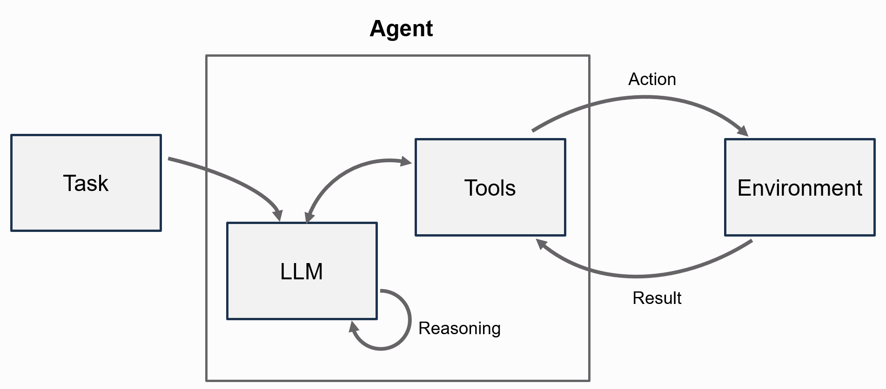
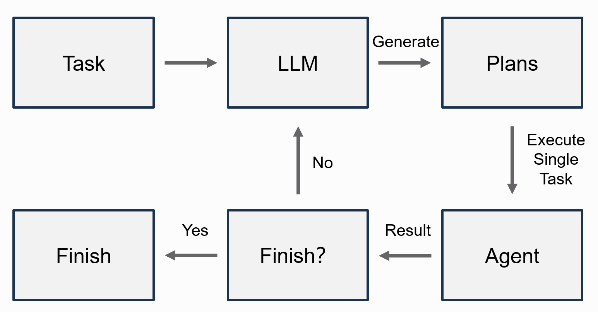

# 05 智能体（Agent）

## 一、Agent 的基本概念

在前面的内容中，我们已经分别介绍了 Prompt、MCP、Tools 和 Skills。  
如果说 Prompt 负责描述任务，Tool 负责执行动作，Skill 负责提供方法，那么 Agent 负责把这些能力组织起来，让系统能够连续地完成一项任务。
Agent这个词中文有好几种翻译，有人叫“代理”，这是字面的翻译，有人叫“智能体”。我们在这个文档中就叫做Agent吧。

如果你学完了本章节，你会发现，其实龙虾也不是新的概念，从你的角度，你也可以从底层开始实现自己的“龙虾”。另外龙虾里面的很多机制，尤其是上下文管理等，还有很大优化空间，如果有机会实现你自己的Agent，尤其是从底层实现你自己的Agent，你可以从头开始考虑这个问题如何设计。

从工程角度看，Agent 可以理解为一个“任务调度器”或“控制器”：

- 它接收用户输入；
- 它把输入整理成模型可理解的上下文；
- 它决定是否要调用工具；
- 它会根据工具返回的结果继续行动；
- 最后再把结果组织成对用户可读的答案。

因此，Agent 解决的是：

> **模型如何在真实任务中持续思考、调用能力并完成闭环。**

一个最小的 Agent 模型可以写成：

> **Agent = LLM + Context + Tools + Control Loop**

其中：

- **LLM** 负责理解任务、做出决策；
- **Context** 负责保存当前输入、系统提示和必要历史；
- **Tools** 负责执行具体动作；
- **Control Loop** 负责把“思考 -> 调用能力 -> 获取结果 -> 继续处理”串起来。

如果写成介于“概念图”和“真实代码”之间的简化伪代码，可以理解成：

```python
messages = build_messages(input_text)
tools = available_tools

while True:
    llm_response = llm.complete(messages, tools=tools)

    if llm_response.tool_calls:
        tool_results = execute_tool_calls(llm_response.tool_calls)
        messages.extend(tool_results)
    else:
        return llm_response.content
```

在本项目 `minimal_agents` 中，Agent 的公共运行时逻辑由 `AgentBase` 提供，而教学用的三种典型 Agent 分别是：

- `MinimalAgent`：最基础的工具调用闭环
- `ReActAgent`：显式采用 Thought / Action / Observation / Finish 的推理模式
- `PlanAndExecuteAgent`：先规划，再按步骤执行

前面讲的 `Agent = LLM + Context + Tools + Control Loop` 是概念层的抽象结构；  
而在本项目里，这个抽象结构被实现成了 Python 类：公共运行时由 `AgentBase` 提供，`MinimalAgent`、`ReActAgent` 和 `PlanAndExecuteAgent` 是三种具体实现。  
因此，后面代码里出现的 `MinimalAgent` 不是 Python 自带的类，而是本仓库 `minimal_agents` 里定义的一个教学用 Agent。

如果把三种 Agent 看成三种不同“工作风格”，那么 `AgentBase` 就是它们共用的底座。它定义在 `src/minimal_agents/core/agent_base.py` 中，负责提供消息构造、Skill 注入、工具执行和历史保存等公共能力：

```python
class AgentBase(ABC):
    """Shared runtime utilities for all teaching agents."""

    def __init__(self, name, llm, *, system_prompt=None, tool_registry=None, config=None, skill_resolver=None):
        self.name = name
        self.llm = llm
        self.system_prompt = system_prompt or "You are a helpful assistant."
        self.tool_registry = tool_registry or ToolRegistry()
        self.config = config or AgentConfig()
        self.skill_resolver = skill_resolver
        self.history: list[Message] = []

    def _build_messages(self, user_input: str, *, extra_system_prompt: Optional[str] = None) -> list[dict]:
        messages: list[dict] = []
        ...
        messages.append({"role": "user", "content": user_input})
        return messages

    def _resolve_skill_context(self, skill: Optional[str], skill_args: Optional[str]) -> Optional[str]:
        if not skill or self.skill_resolver is None:
            return None
        return self.skill_resolver.render(skill, skill_args or "")

    def _execute_tool_call(self, tool_name: str, arguments: dict) -> str:
        response = self.tool_registry.execute_tool(tool_name, arguments)
        return response.to_message()

    def _save_turn(self, user_input: str, assistant_output: str) -> None:
        self.history.append(Message(role="user", content=user_input))
        self.history.append(Message(role="assistant", content=assistant_output))

    @abstractmethod
    def run(self, input_text: str, **kwargs) -> str:
        ...
```

从这段代码可以直接看出：

- 上下文的组装由 `_build_messages(...)` 负责
- Skill 的注入由 `_resolve_skill_context(...)` 负责
- 工具执行最终落到 `ToolRegistry.execute_tool(...)`
- `run(...)` 是抽象接口，三种具体 Agent 主要区别就在于各自的控制循环怎么写

为了让后面的代码例子更容易看懂，可以先看一下 `HelloAgentsLLM` 这个 LLM 封装在源码里的核心结构。它定义在 `src/minimal_agents/core/llm.py` 中，负责对外提供统一的 `complete(...)` 调用接口：

```python
class HelloAgentsLLM:
    """LLM facade with pluggable backends and OpenAI-compatible fallback."""

    def __init__(self, backend=None, model=None, api_key=None, base_url=None, temperature=None):
        self.backend = backend
        self.model = model or os.getenv("LLM_MODEL_ID", "gpt-4o-mini")
        ...

    def complete(self, messages, tools=None, tool_choice="auto", **kwargs) -> LLMResponse:
        if self.backend is not None:
            return self.backend.complete(
                messages=messages,
                tools=tools,
                tool_choice=tool_choice,
                **kwargs,
            )
        return self._complete_with_openai(
            messages=messages,
            tools=tools,
            tool_choice=tool_choice,
            **kwargs,
        )
```

这段代码说明两件事：

- 对 Agent 来说，模型入口统一是 `llm.complete(...)`
- 无论底层接的是脚本化后端还是真实 OpenAI 接口，上层 Agent 的调用方式都不需要变化

## 二、如何在 Agent 中使用 MCP、Tools 和 Skills

在 Agent 里，`Tool`、`MCP` 和 `Skill` 分别扮演不同角色：

- **Tool**：本地可执行能力
- **MCP**：把外部能力以统一方式接进系统
- **Skill**：给模型补充任务方法和输出约束

### 1. Tools 如何进入 Agent

最直接的方式，是把本地 Tool 注册到 `ToolRegistry`，再传给 Agent。

下面这段代码还没有真正运行 Agent，只是在演示 Agent 运行前的一步准备工作：先把可用工具注册进 `ToolRegistry`。后面 `MinimalAgent.run()` 才会读取这些工具，并把它们整理成模型可消费的 tool schema。

`ToolRegistry` 自己的职责也可以直接从源码看出来。它定义在 `src/minimal_agents/tools/registry.py` 中，核心代码如下：

```python
class ToolRegistry:
    def __init__(self):
        self._tools: Dict[str, Tool] = {}

    def register_tool(self, tool: Tool) -> None:
        self._tools[tool.name] = tool

    def register_function(self, func_or_name, description=None, func=None, *, name=None) -> None:
        ...
        self.register_tool(FunctionTool(tool_name, tool_description, function))

    def list_tools(self) -> list[str]:
        return sorted(self._tools.keys())

    def execute_tool(self, name: str, parameters: Dict[str, Any]) -> ToolResponse:
        tool = self.get_tool(name)
        ...
        return tool.run(parameters)

    def to_openai_tools(self) -> list[Dict[str, Any]]:
        return [tool.to_openai_schema() for tool in self._tools.values()]
```

这里最值得注意的是最后两个方法：

- `execute_tool(...)` 负责在运行时真正执行工具
- `to_openai_tools()` 负责把注册过的工具转成模型可读取的 schema

```python
from minimal_agents import ToolRegistry
from minimal_agents.tools.builtin import CalculatorTool

registry = ToolRegistry()
registry.register_tool(CalculatorTool())

print(registry.list_tools())
```

运行输出如下：

```text
['calculator']
```

这段代码在整个链路中的位置可以理解为：

1. 先把本地能力注册进 `ToolRegistry`
2. 再把 `ToolRegistry` 传给 `MinimalAgent`
3. Agent 运行时再把这些工具描述暴露给模型

### 2. MCP 如何进入 Agent

MCP 本身不是一种新的 Tool，而是一种统一接入外部能力的协议。  
但在这个项目里，Agent 最终仍然是通过 `ToolRegistry` 把能力暴露给模型的，所以 MCP 能力进入 Agent 之前，还需要先桥接成 Tool。

因此，这一小节分成两层来看会更清楚：

- `client.list_tools()` 看到的是 MCP 这一层“发现到了哪些外部能力规格”
- `register_mcp_tools(...)` 做的是适配工作：把这些 MCP 能力包装成 Agent 可直接使用的 Tool

```python
from minimal_agents.mcp import InMemoryMCPClient

client = InMemoryMCPClient()
client.register_tool(
    "lookup_fact",
    "Look up one concise teaching fact for a topic",
    lambda topic: {"topic": topic},
    parameters={
        "type": "object",
        "properties": {"topic": {"type": "string", "description": "topic name"}},
        "required": ["topic"],
    },
)

print([spec.name for spec in client.list_tools()])
```

运行输出如下：

```text
['lookup_fact']
```

这里打印出的 `lookup_fact`，表示的是：MCP client 当前发现了一项可调用能力。  
它还停留在 MCP 这一层，说明“远端有这样一个能力可以被调用”，但还没有进入 Agent 自己的本地工具表。

桥接到 `ToolRegistry` 之后：

```python
from minimal_agents import ToolRegistry
from minimal_agents.mcp import register_mcp_tools

registry = ToolRegistry()
register_mcp_tools(client, registry)

print(registry.list_tools())
```

运行输出如下：

```text
['mcp_lookup_fact']
```

这一步之所以又回到了 “tools”，是因为本项目里的 Agent 运行时只直接消费 Tool。  
`register_mcp_tools(client, registry)` 会把 `client.list_tools()` 返回的每个 `MCPToolSpec` 包装成一个 `MCPToolAdapter`，再注册进 `ToolRegistry`。  
注册后的名字变成 `mcp_lookup_fact`，表示它来源于 MCP，但对 Agent 来说，它已经是一个可以统一调度的 Tool 了。

所以这里四者的职责分别是：

- `InMemoryMCPClient`：保存 MCP 工具规格，并负责调用对应能力
- `register_mcp_tools(...)`：把 MCP 能力适配成本地 Tool
- `ToolRegistry`：收集 Agent 最终可用的工具列表
- `MinimalAgent`：消费这些工具列表，并执行“模型决定调用 -> 工具执行 -> 结果回填”的闭环

### 3. Skills 如何进入 Agent

Skill 不会出现在 `registry.list_tools()` 中，而是通过 `SkillLoader + SkillResolver` 被读取并注入到系统提示里。
本章后面会用到的 `study_card`，就定义在 `minimal_agents/examples/chapter-5/agent/skills_demo/study_card/SKILL.md`。它的内容很简单：要求模型“用中文回答”，并严格按“标题：...\n内容：...”的两行格式输出；调用时传入的 `skill_args` 会继续拼到这个 Skill 末尾，作为额外约束。

如果直接看 `study_card` 这个 Skill 文件，本体大致就是这样：

```markdown
---
name: study_card
description: format a beginner-friendly study card
---
You are preparing a beginner study card.
Reply in Chinese.
Use exactly this format:
标题：...
内容：...

Extra constraints:
$ARGUMENTS
```

```python
from pathlib import Path
from minimal_agents.skills import SkillLoader

loader = SkillLoader(Path("minimal_agents/examples/chapter-5/agent/skills_demo"))

print(loader.list_skills())
print(loader.get_descriptions())
```

运行输出如下：

```text
['qa', 'study_card']
- qa: answer concise
- study_card: format a beginner-friendly study card
```

### 4. 一个完整的综合例子

前面三小节分别拆开看了三类能力如何进入系统。现在把它们合在一起看：

- 先有本地 Tool
- 再把 MCP 能力桥接成 Tool
- Skill 另外注入提示词
- 最后统一交给 `MinimalAgent`

下面用一个完整例子，把 Tool、MCP 和 Skill 放到同一个 `MinimalAgent` 中。
这里用的 Skill 就是上面那个 `minimal_agents/examples/chapter-5/agent/skills_demo/study_card/SKILL.md`，所以后面你会看到 `skill="study_card"`，以及一段额外传入的格式约束。

```python
from pathlib import Path

from minimal_agents import HelloAgentsLLM, MinimalAgent, ScriptedLLMBackend, ToolRegistry
from minimal_agents.mcp import InMemoryMCPClient, register_mcp_tools
from minimal_agents.skills import SkillLoader, SkillResolver


def extract_focus(topic: str) -> dict:
    cleaned = topic.replace("请给", "").replace("做一张入门学习卡片", "").strip("：: ，,。.")
    return {"text": f"focus term: {cleaned}", "focus": cleaned}


skills_root = Path("minimal_agents/examples/chapter-5/agent/skills_demo")
resolver = SkillResolver(SkillLoader(skills_root))

registry = ToolRegistry()
registry.register_function(extract_focus)

client = InMemoryMCPClient()
client.register_tool(
    "lookup_fact",
    "Look up one concise teaching fact for a topic",
    lambda topic: {
        "text": f"fact: {topic} lets plants convert light into stored chemical energy and release oxygen.",
        "topic": topic,
        "fact": "植物把光能转成储存起来的化学能，并释放氧气。",
    },
    parameters={
        "type": "object",
        "properties": {"topic": {"type": "string", "description": "topic name"}},
        "required": ["topic"],
    },
)
register_mcp_tools(client, registry)

print("skills:", ["study_card"])
print("tools:", registry.list_tools())

backend = ScriptedLLMBackend([
    {
        "content": "I need the topic and one concise fact.",
        "tool_calls": [
            {"id": "tool-1", "name": "extract_focus", "arguments": {"topic": "请给光合作用做一张入门学习卡片"}},
            {"id": "tool-2", "name": "mcp_lookup_fact", "arguments": {"topic": "光合作用"}},
        ],
    },
    {
        "content": "标题：光合作用\n内容：植物把光能转成储存起来的化学能，并释放氧气。",
    },
])

agent = MinimalAgent(
    "full-capabilities-demo",
    HelloAgentsLLM(backend=backend),
    tool_registry=registry,
    skill_resolver=resolver,
)

print(
    agent.run(
        "请给光合作用做一张入门学习卡片",
        skill="study_card",
        skill_args="标题和内容各一行，每行尽量短。",
    )
)
```

运行输出如下：

```text
skills: ['study_card']
tools: ['extract_focus', 'mcp_lookup_fact']
标题：光合作用
内容：植物把光能转成储存起来的化学能，并释放氧气。
```

完整运行轨迹如下：

```text
answer: 标题：光合作用
内容：植物把光能转成储存起来的化学能，并释放氧气。
llm_calls: 2
-- call 1 --
tool_names: ['extract_focus', 'mcp_lookup_fact']
last_message: {'role': 'user', 'content': '请给光合作用做一张入门学习卡片'}
-- call 2 --
tool_names: ['extract_focus', 'mcp_lookup_fact']
last_message: {'role': 'tool', 'name': 'mcp_lookup_fact', 'tool_call_id': 'tool-2', 'content': '{"status": "success", "text": "fact: 光合作用 lets plants convert light into stored chemical energy and release oxygen.", "data": {"text": "fact: 光合作用 lets plants convert light into stored chemical energy and release oxygen.", "topic": "光合作用", "fact": "植物把光能转成储存起来的化学能，并释放氧气。"}}'}
```

这个例子说明，Agent 能把 Skill、本地 Tool 和 MCP Tool 组织成一个完整任务流程。

## 三、最简单 Agent 的写法

下面按项目中的三种教学 Agent 依次说明。为了让示例稳定可复现，代码都使用仓库中的 `ScriptedLLMBackend`，不依赖在线模型。

### 1. `MinimalAgent`

`MinimalAgent` 的核心逻辑非常直接：把当前消息发给模型，如果模型要求调用工具，就执行工具并把结果回填；如果模型直接给出答案，就结束。

它在源码 `src/minimal_agents/agents/minimal_agent.py` 里的核心部分如下：

```python
class MinimalAgent(AgentBase):
    """Smallest useful agent loop: model -> tool calls -> model."""

    def run(self, input_text: str, *, skill: Optional[str] = None, skill_args: Optional[str] = None, **kwargs) -> str:
        skill_context = self._resolve_skill_context(skill, skill_args)
        messages = self._build_messages(input_text, extra_system_prompt=skill_context)
        tools = self.tool_registry.to_openai_tools()

        if not tools:
            result = self.llm.complete(messages, **kwargs)
            ...

        for _ in range(self.config.max_tool_iterations):
            llm_response = self.llm.complete(messages, tools=tools, tool_choice="auto", **kwargs)

            if not llm_response.tool_calls:
                final_answer = llm_response.content.strip() or final_answer
                break

            messages.append({...})

            for call in llm_response.tool_calls:
                tool_result = self._execute_tool_call(call.name, call.arguments)
                messages.append({...})

        ...
        return final_answer
```

这段源码几乎就是前面那段伪代码的落地版本：

1. 先构造 `messages`
2. 再从 `ToolRegistry` 取出工具 schema
3. 调 `llm.complete(...)`
4. 如果模型返回 `tool_calls`，就执行工具并把结果写回消息
5. 如果模型直接返回文本答案，就结束循环

```python
from minimal_agents import MinimalAgent, HelloAgentsLLM, ScriptedLLMBackend, ToolRegistry
from minimal_agents.tools.builtin import CalculatorTool

backend = ScriptedLLMBackend([
    {
        "content": "我先调用计算器",
        "tool_calls": [
            {"id": "c1", "name": "calculator", "arguments": {"expression": "2+3"}}
        ],
    },
    {"content": "结果是 5。"},
])

registry = ToolRegistry()
registry.register_tool(CalculatorTool())
print(registry.list_tools())

agent = MinimalAgent("mini", HelloAgentsLLM(backend=backend), tool_registry=registry)
print(agent.run("2+3 等于多少"))
```

运行输出如下：

```text
['calculator']
结果是 5。
```

完整运行轨迹如下：

```text
answer: 结果是 5。
llm_calls: 2
-- call 1 --
tool_names: ['calculator']
last_message: {'role': 'user', 'content': '2+3 等于多少'}
-- call 2 --
tool_names: ['calculator']
last_message: {'role': 'tool', 'name': 'calculator', 'tool_call_id': 'c1', 'content': '{"status": "success", "text": "2+3 = 5.0", "data": {"expression": "2+3", "result": 5.0}}'}
```

运行过程可以概括为：

1. Agent 先把用户问题组织成 `messages`；
2. 模型在第一轮返回 `tool_calls`，要求调用 `calculator`；
3. Agent 执行工具，把结果写回 `role="tool"` 消息；
4. 模型再基于这个 observation 输出最终答案。

### 2. `ReActAgent`

`ReActAgent` 强调把推理过程显式拆出来。  
它与 ReAct 范式的核心思想一致：让模型在推理和行动之间交替前进 [1]。



<div style="text-align:center;font-weight:bold;">图1 ReAct 工作流示意：通过 Thought、Action、Observation 交替推进，并在 Finish 时结束。</div>

在本项目中，`ReActAgent` 内置了两个特殊工具：

- `Thought`
- `Finish`

从源码 `src/minimal_agents/agents/react_agent.py` 来看，`ReActAgent` 相比 `MinimalAgent` 的关键区别就在于：它先额外注入了一组内置工具，并且对 `Thought` / `Finish` 做了特殊处理。

```python
class ReActAgent(AgentBase):
    """ReAct loop with built-in Thought and Finish tools."""

    def _builtin_tools(self) -> list[Dict[str, Any]]:
        return [
            {"type": "function", "function": {"name": "Thought", ...}},
            {"type": "function", "function": {"name": "Finish", ...}},
        ]

    def run(self, input_text: str, *, skill: Optional[str] = None, skill_args: Optional[str] = None, **kwargs) -> str:
        skill_context = self._resolve_skill_context(skill, skill_args)
        extra_system = _REACT_PROMPT
        ...

        messages = self._build_messages(input_text, extra_system_prompt=extra_system)
        tools = self._builtin_tools() + self.tool_registry.to_openai_tools()

        for _ in range(self.config.max_react_steps):
            llm_response = self.llm.complete(messages, tools=tools, tool_choice="auto", **kwargs)
            ...
            for call in llm_response.tool_calls:
                if call.name == "Thought":
                    observation = ...
                elif call.name == "Finish":
                    final_answer = ...
                    should_finish = True
                else:
                    observation = self._execute_tool_call(call.name, call.arguments)
```

因此可以把 `ReActAgent` 理解成：

- 外层仍然是 Agent 的“模型调用 -> 工具执行 -> 继续推理”循环
- 只是它比 `MinimalAgent` 多了一层 ReAct 风格的内置动作约束

```python
from minimal_agents import ReActAgent, HelloAgentsLLM, ScriptedLLMBackend, ToolRegistry
from minimal_agents.tools.builtin import CalculatorTool

backend = ScriptedLLMBackend([
    {
        "content": "reasoning",
        "tool_calls": [
            {"id": "1", "name": "Thought", "arguments": {"reasoning": "Need calculator"}},
            {"id": "2", "name": "calculator", "arguments": {"expression": "6*7"}},
        ],
    },
    {
        "content": "finish",
        "tool_calls": [
            {"id": "3", "name": "Finish", "arguments": {"answer": "42"}},
        ],
    },
])

registry = ToolRegistry()
registry.register_tool(CalculatorTool())
print(registry.list_tools())
print("builtin react tools:", ["Thought", "Finish"])

agent = ReActAgent("react-demo", HelloAgentsLLM(backend=backend), tool_registry=registry)
print(agent.run("what is 6*7"))
```

运行输出如下：

```text
['calculator']
builtin react tools: ['Thought', 'Finish']
42
```

完整运行轨迹如下：

```text
answer: 42
llm_calls: 2
-- call 1 --
tool_names: ['Thought', 'Finish', 'calculator']
last_message: {'role': 'user', 'content': 'what is 6*7'}
-- call 2 --
tool_names: ['Thought', 'Finish', 'calculator']
last_message: {'role': 'tool', 'name': 'calculator', 'tool_call_id': '2', 'content': '{"status": "success", "text": "6*7 = 42.0", "data": {"expression": "6*7", "result": 42.0}}'}
```

从这组输出可以直接看出：

- Agent 实际暴露给模型的可选工具不只有 `calculator`；
- 还额外包括 `Thought` 和 `Finish`；
- 第二轮模型在看到 `calculator` 的结构化 observation 后，再决定通过 `Finish` 返回最终答案。

### 3. `PlanAndExecuteAgent`

有些任务不适合一步完成，而更适合先拆成几个步骤，再逐步完成。  
`PlanAndExecuteAgent` 对应的就是这种思路。它与 Plan-and-Solve prompting 的核心思想相近：先规划，再解决问题 [2]。



<div style="text-align:center;font-weight:bold;">图2 Plan-and-Execute 工作流示意：先生成计划，再按步骤执行，最后汇总结果。</div>

从源码 `src/minimal_agents/agents/plan_execute_agent.py` 来看，它的关键点不是“自己重新实现一套工具循环”，而是把任务拆成了三个阶段：先规划、再逐步执行、最后汇总；其中执行阶段内部直接复用了 `MinimalAgent`。

```python
class PlanAndExecuteAgent(AgentBase):
    """Two-phase agent: plan first, then execute each step."""

    def _create_plan(self, question: str, **kwargs) -> list[str]:
        planning_messages = [
            {"role": "system", "content": self.planner_prompt},
            {"role": "user", "content": question},
        ]
        response = self.llm.complete(planning_messages, **kwargs)
        steps = self._parse_plan(response.content)
        return steps or [question]

    def run(self, input_text: str, *, skill: Optional[str] = None, skill_args: Optional[str] = None, **kwargs) -> str:
        plan = self._create_plan(input_text, **kwargs)[: self.config.plan_max_steps]

        execution_log: list[tuple[str, str]] = []
        for index, step in enumerate(plan, start=1):
            step_prompt = (
                f"Task: {input_text}\n"
                f"Current step ({index}/{len(plan)}): {step}\n"
                f"Previous results:\n{previous}"
            )

            executor = MinimalAgent(
                name=f"{self.name}-executor",
                llm=self.llm,
                system_prompt=self.executor_prompt,
                tool_registry=self.tool_registry,
                config=self.config,
                skill_resolver=self.skill_resolver,
            )
            step_result = executor.run(
                step_prompt,
                skill=skill if index == 1 else None,
                skill_args=skill_args if index == 1 else None,
                **kwargs,
            )
            execution_log.append((step, step_result))

        summary = self.llm.complete(summary_messages, **kwargs).content.strip()
        final_answer = summary or (execution_log[-1][1] if execution_log else "")
        return final_answer
```

这段代码可以概括成：

1. 先调用模型生成计划
2. 再把每个步骤交给一个 `MinimalAgent` 执行
3. 最后再用一次模型，把各步骤结果汇总成最终答案

```python
from pathlib import Path

from minimal_agents import PlanAndExecuteAgent, HelloAgentsLLM, ScriptedLLMBackend, ToolRegistry
from minimal_agents.skills import SkillLoader, SkillResolver

resolver = SkillResolver(SkillLoader(Path("minimal_agents/examples/chapter-5/agent/skills_demo")))

llm = HelloAgentsLLM(
    backend=ScriptedLLMBackend([
        {"content": '{"steps": ["Collect facts", "Summarize"]}'},
        {"content": "Facts collected."},
        {"content": "Draft summary."},
        {"content": "Final answer from plan-and-execute."},
    ])
)

agent = PlanAndExecuteAgent(
    "pae-demo",
    llm,
    tool_registry=ToolRegistry(),
    skill_resolver=resolver,
)

print("skills:", ["qa"])
print(agent.run("summarize this project", skill="qa", skill_args="请尽量简洁"))
```

运行输出如下：

```text
skills: ['qa']
Final answer from plan-and-execute.
```

完整运行轨迹如下：

```text
answer: Final answer from plan-and-execute.
llm_calls: 4
-- call 1 --
roles: ['system', 'user']
last_message: {'role': 'user', 'content': 'summarize this project'}
-- call 2 --
roles: ['system', 'user']
last_message: {'role': 'user', 'content': 'Task: summarize this project\nCurrent step (1/2): Collect facts\nPrevious results:\nNone'}
-- call 3 --
roles: ['system', 'user']
last_message: {'role': 'user', 'content': 'Task: summarize this project\nCurrent step (2/2): Summarize\nPrevious results:\n1. Collect facts => Facts collected.'}
-- call 4 --
roles: ['system', 'user']
last_message: {'role': 'user', 'content': 'Original task: summarize this project\n- Collect facts: Facts collected.\n- Summarize: Draft summary.'}
```

这组输出对应的内部结构是：

- 第 1 轮负责产出计划；
- 第 2、3 轮分别执行两个步骤；
- 第 4 轮把步骤结果压缩成最终答案。

在本项目里，`PlanAndExecuteAgent` 的执行器内部复用了 `MinimalAgent`。  
当前实现中传入的 `skill` 只会注入到第一个执行步骤中，而不是每一步都自动生效。

## 四、作业练习

我们已经为读者准备好一份模板文件：

`minimal_agents/hw/chapter-5/agent/checklist_agent_homework_template.py`

这道作业的重点是练习如何设计一个定制化的 Agent loop。  
前面的示例已经展示了 `MinimalAgent`、`ReActAgent` 和 `PlanAndExecuteAgent` 的用法；这里的作业会让你实现一个新的 `ChecklistAgent`。

这个 `ChecklistAgent` 的循环结构如下：

```text
1. 生成 checklist
2. 逐项执行 checklist item
3. 检查每一步结果
4. 如果检查失败，带 feedback 重试一次
5. 汇总所有步骤，输出最终答案
```

模板已经提前写好了：

- `bootstrap()` 与 `minimal_agents` 的导入；
- 一个现成的 Markdown 课程笔记 `sample_lesson_note.md`；
- 一个已经实现好的 `read_markdown` 工具；
- `ToolRegistry` 的注册逻辑；
- JSON 解析 helper；
- 一份确定性的 `ScriptedLLMBackend`。

读者需要自己完成的部分，已经全部用 `TODO` 标出来了。核心任务包括：

1. 调用模型生成 checklist；
2. 把之前步骤的执行结果整理成下一步可用的上下文；
3. 构造单步执行 prompt，并把当前步骤交给 `MinimalAgent` 执行；
4. 调用模型检查单步结果是否合格；
5. 在检查失败时根据 feedback 重试一次；
6. 汇总所有步骤结果，保存历史并返回最终答案。

配套的练习文件目录如下：

```text
minimal_agents/
└── hw/
    └── chapter-5/
        └── agent/
            ├── README.md
            ├── checklist_agent_homework_template.py
            └── sample_lesson_note.md
```

## 五、小结

在这套教程里，可以把 Agent 理解为“智能体系统的调度中心”。

- Prompt 负责描述任务；
- Tool 负责执行动作；
- MCP 负责接入外部能力；
- Skill 负责提供方法和约束；
- Agent 负责把它们串起来，形成完整闭环。

继续深入本项目时，建议按以下顺序理解：

1. 先理解 Agent 如何接入和组织 Tool、MCP 与 Skill；
2. 再掌握 `MinimalAgent` 的最小闭环；
3. 然后理解 `ReActAgent` 如何显式组织推理过程；
4. 最后再看 `PlanAndExecuteAgent` 如何先规划再执行。

## 参考资料

- [1] Yao S, Zhao J, Yu D, et al. ReAct: Synergizing reasoning and acting in language models[C]//International Conference on Learning Representations. 2023.  
  <https://openreview.net/forum?id=WE_vluYUL-X>

- [2] Wang L, Xu W, Lan Y, et al. Plan-and-Solve Prompting: Improving Zero-Shot Chain-of-Thought Reasoning by Large Language Models[J]. arXiv preprint arXiv:2305.04091, 2023.  
  <https://arxiv.org/abs/2305.04091>
