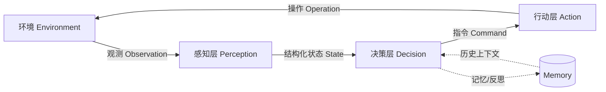
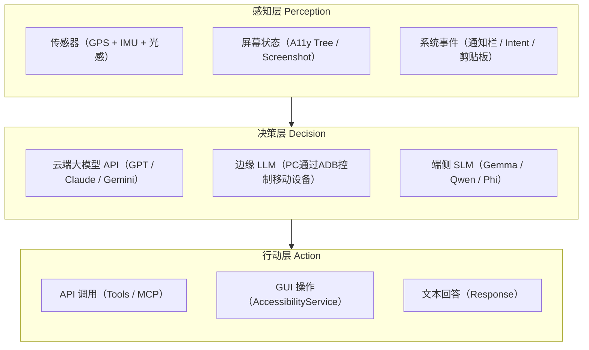
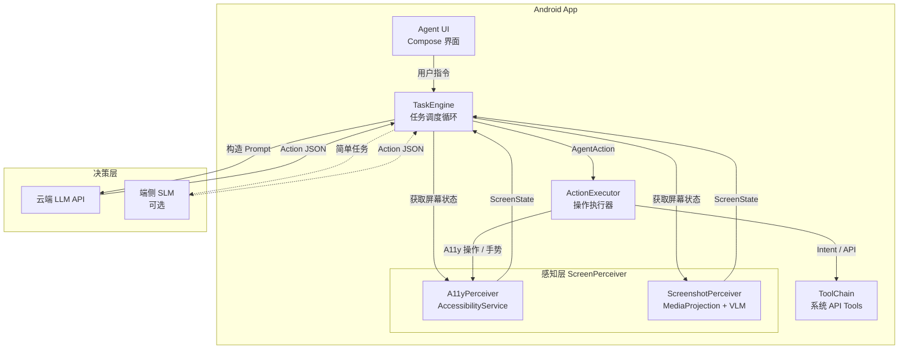

# 06 移动端侧智能体（Mobile On-device Agent）
---

## 目录

1. [端侧智能体与普通智能体的区别](#1-端侧智能体与普通智能体的区别)
2. [智能体通用架构及其移动端特殊形态](#2-智能体通用架构及其移动端特殊形态)
3. [端侧智能体的实现方法和案例](#3-端侧智能体的实现方法和案例)
4. [纯端侧智能体：隐私、性能与挑战](#4-纯端侧智能体隐私性能与挑战)
5. [实战：构建一个简单的移动端智能体](#5-实战构建一个简单的移动端智能体)
6. [课程动手作业](#6-课程动手作业)

---

## 1. 端侧智能体与普通智能体的区别

| 维度 | 服务器/桌面端智能体 | 移动端智能体 |
|---|---|---|
| **算力与供电** | 算力高、长期供电，适合持续推理 | 算力和内存有限，受电量与发热限制 |
| **系统权限** | 系统资源访问范围更大，自动化接口更多 | 沙盒隔离强，跨 App 操作受限 |
| **网络条件** | 网络稳定、带宽高 | 网络波动大，常见弱网和离线 |
| **交互与场景** | 键盘鼠标交互，文件为主，场景相对稳定 | 以触屏为主，场景变化快 |
| **隐私风险** | 个人敏感数据相对少 | 涉及位置、通讯录、消息、照片等高敏数据 |


---

## 2. 智能体通用架构及其移动端特殊形态

### 2.1 通用 PDA 循环

> **什么是 PDA 循环？**
> **PDA**（Perception-Decision-Action，感知-决策-行动）是所有智能体的核心工作方式：
> 1. **感知（Perception）**：读取当前环境状态，例如"现在屏幕上显示什么？"
> 2. **决策（Decision）**：由 AI 大模型分析状态，决定下一步做什么，例如"点击搜索框"
> 3. **行动（Action）**：实际执行操作，例如模拟点击屏幕上的某个位置
>
> 这个循环会不断重复，直到任务完成。

所有智能体本质上都在执行一个不断迭代的 **PDA（Perception-Decision-Action）循环**：



### 2.2 移动端 PDA 的特殊形态

移动端的每一层都呈现独特特征：


现有的移动端智能体在决策层和感知层的实现各不相同，可以进行以下的分类：

#### 决策层：云边端模型部署

| 决策大脑 | 对应实现思路 | 典型实现 | 优点 | 局限 |
|---|---|---|---|---|
| **云端大脑（API）** | 云端模型实现全部推理工作 | GPT/Claude/Gemini + Tool Calling | 能力强、泛化好、上线快 | 依赖网络，隐私与成本压力较大 |
| **边缘大脑（ADB）** | 边缘设备部署LLM，通过 adb 下发动作 | Open-AutoGLM | 调试方便、流程可控、适合原型验证 | 对真实用户场景迁移较弱，依赖调试环境 |
| **端侧大脑（On-device）** | 模型在手机本地完成决策 | Gemma/Qwen/Phi + MLC-LLM/llama.cpp | 隐私好、离线可用、时延稳定 | 模型能力和资源受限 |

#### 感知层：A11y vs Screenshot

| 感知策略 | 典型方式 | 优点 | 局限 | 适用场景 |
|---|---|---|---|---|
| **A11y 感知** | AccessibilityService 读取节点树 | 结构化、轻量、可精准定位节点 | 依赖 App 的无障碍标注质量 | 常规原生 App、对时延敏感任务 |
| **截图感知（GUI）** | Screenshot + 视觉模型理解界面 | 所见即所得，不依赖节点质量 | 推理和传输开销高 | 自定义控件、Canvas、WebView 场景 |

---

## 3. 端侧智能体的实现方法和案例

在上一章中我们提到，端侧智能体的实现可以使用不同的决策层设计与感知层设计。在这一章中，我们分别展示决策层和感知层的不同实现。定义以下全局代码以便复用模块：

```java
public interface DecisionEngine {
    AgentAction decide(DecisionInput input) throws Exception;
}

public interface PerceptionProvider {
    ScreenState perceive() throws Exception;
}

public final class DecisionInput {
    public final String task;
    public final ScreenState screenState;
    public DecisionInput(String task, ScreenState screenState) {
        this.task = task;
        this.screenState = screenState;
    }
}

public final class AgentAction {
    public String type;      // click/type/scroll/wait/done
    public String nodeId;    // A11y 可用
    public Integer x, y;     // GUI 坐标可用
    public String text;
}
```

### 3.1 决策层

#### 3.1.1 API 决策（云端大脑）

思路：云端模型负责推理，端侧执行动作。适合能力优先、快速迭代。


(1) API Key 

把密钥放在本地 `local.properties`（不要提交到 Git）：

```properties
# local.properties（本地文件，不要提交）
LLM_API_KEY=sk-xxxxxxxxxxxxxxxx
LLM_BASE_URL=https://api.openai.com/v1
```

然后在 `app/build.gradle.kts` 注入到 `BuildConfig`。（这里Gradle 构建脚本使用的是 Kotlin DSL（`.kts`），实现代码逻辑仍以 Java 为主）
```kotlin
import com.android.build.gradle.internal.cxx.configure.gradleLocalProperties

android {
    defaultConfig {
        val localProps = gradleLocalProperties(rootDir, providers)
        val llmApiKey = localProps.getProperty("LLM_API_KEY") ?: ""
        val llmBaseUrl = localProps.getProperty("LLM_BASE_URL") ?: "https://api.openai.com/v1"

        buildConfigField("String", "LLM_API_KEY", "\"$llmApiKey\"")
        buildConfigField("String", "LLM_BASE_URL", "\"$llmBaseUrl\"")
    }
}
```

(2) 云端接口调用（Java + OkHttp）

```java
public final class LlmApiClient {
    private static final MediaType JSON = MediaType.get("application/json; charset=utf-8");
    private final OkHttpClient client = new OkHttpClient();

    public String chat(String prompt) throws IOException, JSONException {
        JSONObject body = new JSONObject()
                .put("model", "gpt-4o-mini")
                .put("messages", new JSONArray()
                        .put(new JSONObject().put("role", "user").put("content", prompt)))
                .put("temperature", 0.2);

        Request request = new Request.Builder()
                .url(BuildConfig.LLM_BASE_URL + "/chat/completions")
                .addHeader("Authorization", "Bearer " + BuildConfig.LLM_API_KEY)
                .post(RequestBody.create(body.toString(), JSON))
                .build();

        try (Response response = client.newCall(request).execute()) {
            if (!response.isSuccessful()) {
                throw new IOException("LLM HTTP " + response.code() + ": " + response.body().string());
            }
            String resp = response.body().string();
            JSONObject obj = new JSONObject(resp);
            return obj.getJSONArray("choices")
                    .getJSONObject(0)
                    .getJSONObject("message")
                    .getString("content");
        }
    }
}
```

> 依赖示例：`implementation("com.squareup.okhttp3:okhttp:4.12.0")`

```java
public class ApiDecisionEngine implements DecisionEngine {
    private final LlmApiClient llmApiClient;

    public ApiDecisionEngine(LlmApiClient llmApiClient) {
        this.llmApiClient = llmApiClient;
    }

    @Override
    public AgentAction decide(DecisionInput input) throws Exception {
        String prompt = "任务:" + input.task + "\n界面状态:" + input.screenState.summary();
        String json = llmApiClient.chat(prompt);
        // 提示词约束 LLM 仅返回 AgentAction 对应的 JSON
        AgentAction action = Jsons.fromJson(json, AgentAction.class);
        if (action == null || action.type == null) {
            throw new IllegalStateException("LLM 返回的动作 JSON 非法: " + json);
        }
        return action;
    }
}
```

如果需要工具调用，可把闹钟、短信、定位等系统能力注册到 `ToolRegistry` 中。下面给出完整的“注册 + 调度”示例：
```java
public class ToolRegistry {
    public interface ToolHandler {
        String call(JSONObject args) throws Exception;
    }

    private final Context context;
    private final Map<String, ToolHandler> handlers = new HashMap<>();

    public ToolRegistry(Context context) {
        this.context = context;
        registerBuiltInTools();
    }

    private void registerBuiltInTools() {
        handlers.put("set_alarm", args -> {
            int hour = args.getInt("hour");
            int minute = args.getInt("minute");
            String label = args.optString("label", "Agent Alarm");
            setAlarm(hour, minute, label);
            return "ok";
        });
    }

    public String call(String toolName, JSONObject args) throws Exception {
        ToolHandler handler = handlers.get(toolName);
        if (handler == null) {
            throw new IllegalArgumentException("Unknown tool: " + toolName);
        }
        return handler.call(args);
    }

    private void setAlarm(int hour, int minute, String label) {
        Intent intent = new Intent(AlarmClock.ACTION_SET_ALARM);
        intent.putExtra(AlarmClock.EXTRA_HOUR, hour);
        intent.putExtra(AlarmClock.EXTRA_MINUTES, minute);
        intent.putExtra(AlarmClock.EXTRA_MESSAGE, label);
        intent.addFlags(Intent.FLAG_ACTIVITY_NEW_TASK);
        context.startActivity(intent);
    }
}
```

在 `TaskEngine` 中，当 LLM 返回 `ToolCall` 动作时可这样调度：

```java
ToolRegistry toolRegistry = new ToolRegistry(context);
String result = toolRegistry.call("set_alarm",
        new JSONObject().put("hour", 7).put("minute", 30).put("label", "晨会"));
```

#### 3.1.2 ADB 决策（边缘大脑）

思路：在 PC上做决策，通过 adb 下发动作。

环境准备：

1. 电脑已安装 Android Platform Tools，并确保 `adb` 在 PATH 中可用。
2. 手机打开开发者选项与 USB 调试，首次连接时在手机端确认授权。
3. 建议使用真机（或 Android Emulator）并确认唯一设备序列号，避免多设备冲突。
4. 若出现连接异常，可先执行 `adb kill-server` 与 `adb start-server` 再重试。

检查命令：

```bash
adb devices
adb -s <serial> shell wm size
```

下面是一个可直接运行的 PC 端控制脚本（Python）：

```python
# pc_adb_controller.py
import subprocess
from typing import Dict, Any

SERIAL = "emulator-5554"  # 改成你的设备 serial


def adb(*args: str) -> str:
    cmd = ["adb", "-s", SERIAL, *args]
    out = subprocess.run(cmd, capture_output=True, text=True, check=True)
    return out.stdout.strip()


def tap(x: int, y: int) -> None:
    adb("shell", "input", "tap", str(x), str(y))


def swipe(x1: int, y1: int, x2: int, y2: int, duration_ms: int = 300) -> None:
    adb("shell", "input", "swipe", str(x1), str(y1), str(x2), str(y2), str(duration_ms))


def input_text(text: str) -> None:
    safe = text.replace(" ", "%s")
    adb("shell", "input", "text", safe)


def dump_ui(local_path: str = "ui.xml") -> None:
    adb("shell", "uiautomator", "dump", "/sdcard/ui.xml")
    adb("pull", "/sdcard/ui.xml", local_path)


def execute_action(action: Dict[str, Any]) -> None:
    t = action.get("type")
    if t == "click":
        tap(int(action["x"]), int(action["y"]))
    elif t == "type":
        input_text(action.get("text", ""))
    elif t == "scroll_down":
        swipe(540, 1600, 540, 700)
    elif t == "scroll_up":
        swipe(540, 700, 540, 1600)
    else:
        raise ValueError(f"unknown action: {t}")


if __name__ == "__main__":
    # 实战里这里由边缘 LLM 输出，例如 {"type":"click","x":540,"y":300}
    action = {"type": "click", "x": 540, "y": 300}
    execute_action(action)
```

#### 3.1.3 端侧部署决策（端侧大脑）

思路：模型在手机本地运行。这里只给接口，后文会提及具体端侧推理细节。

```java
public class OnDeviceDecisionEngine implements DecisionEngine {
    private final LocalModelRunner localModelRunner; 

    public OnDeviceDecisionEngine(LocalModelRunner localModelRunner) {
        this.localModelRunner = localModelRunner;
    }

    @Override
    public AgentAction decide(DecisionInput input) throws Exception {
        String output = localModelRunner.run(input.task, input.screenState.summary());
        return Jsons.fromJson(output, AgentAction.class);
    }
}
```

三种决策方式对比如下：

| 方式 | 优点 | 局限 | 典型场景 |
|---|---|---|---|
| API | 能力最强，迭代快 | 依赖网络、隐私和成本压力 | 复杂任务、快速 PoC |
| ADB | 可控、易调试 | 依赖主机与调试链路 | 实验、评测、固定场景 |
| 端侧部署 | 离线可用、隐私好 | 算力受限、调优复杂 | 本地助手、弱网场景、移动场景 |

### 3.2 感知层

#### 3.2.1 A11y 感知

核心：读取无障碍节点树，获得结构化页面信息和可操作节点。

```java
public class AgentAccessibilityService extends AccessibilityService {
    @Override
    public void onAccessibilityEvent(AccessibilityEvent event) {
        if (event.getEventType() == AccessibilityEvent.TYPE_WINDOW_CONTENT_CHANGED
                || event.getEventType() == AccessibilityEvent.TYPE_WINDOW_STATE_CHANGED) {
            AccessibilityNodeInfo root = getRootInActiveWindow();
            if (root != null) {
                // 可在这里序列化节点树并上报给决策层
            }
        }
    }

    public boolean clickNode(AccessibilityNodeInfo node) {
        return node != null && node.performAction(AccessibilityNodeInfo.ACTION_CLICK);
    }

    @Override
    public void onInterrupt() {
    }
}
```

#### 3.2.2 GUI 感知（截图）

核心：抓屏后交给视觉模型理解，返回坐标动作。

```java
public class ScreenshotPerceptionProvider implements PerceptionProvider {
    private final MediaProjection mediaProjection;
    private final int width;
    private final int height;
    private final int density;

    public ScreenshotPerceptionProvider(MediaProjection mediaProjection, int width, int height, int density) {
        this.mediaProjection = mediaProjection;
        this.width = width;
        this.height = height;
        this.density = density;
    }

    @Override
    public ScreenState perceive() {
        // 示例化：实际可通过 ImageReader + VirtualDisplay 获取 Bitmap
        return ScreenState.fromScreenshot("<base64-image>");
    }
}
```

API 孤岛：很多第三方 App 没有开放可控 API，必须回到“看屏幕 + 操作界面”的路径。

| 感知策略 | 优点 | 局限 | 适用场景 |
|---|---|---|---|
| A11y | 结构化、轻量、节点定位准 | 依赖无障碍标注质量 | 原生 App 主流程 |
| GUI 截图 | 所见即所得，跨 App 一致 | 开销更高、坐标可能偏 | 自定义控件、WebView、复杂页面 |


### 3.3 开源案例

| 项目 | 链接 | 决策层主思路（云/边/端） | 感知层主思路（A11y/截图） |
|---|---|---|---|
| MobileAgent | https://github.com/X-PLUG/MobileAgent | 云 | 截图 |
| Open-AutoGLM | https://github.com/zai-org/Open-AutoGLM | 边 | 截图+A11y |
| MobiAgent | https://github.com/IPADS-SAI/MobiAgent | 边 | 截图 |
| OpenPhone | https://github.com/HKUDS/OpenPhone | 边 | 截图 |
| OMG-Agent | https://github.com/Safphere/OMG-Agent | 边 | 截图 |
| GElab-Zero | https://github.com/stepfun-ai/gelab-zero/ | 边 | 截图 |
| Droidrun | https://github.com/droidrun/droidrun | 云 | 截图+A11y |
| V-Droid | https://github.com/V-Droid-Agent/V-Droid | 边 | A11y |

---

## 4. 纯端侧智能体：隐私、性能与极限挑战

### 4.1 为什么需要"大脑本地化"

前文的案例中，决策层依赖云端 API或者边缘设备 ADB控制。但移动场景下有以下强驱动力推动推理大脑下沉到端侧：

**1. 隐私合规的硬要求**

GUI 智能体的感知层会获取完整的屏幕内容——包括聊天记录、银行 App 余额、私人照片。将这些数据上传至云端，面临巨大的合规风险。

**2. 网络不可靠性**

移动设备的使用场景天然包括地铁、电梯、高铁、飞机、山区等弱网/无网环境。依赖云端意味着 Agent 在这些场景下完全失能。使用边缘设备推理ADB控制在移动场景下也并不稳定。


### 4.2 端侧推理：在受限硬件上运行大模型

#### 模型选择

端侧可用的模型通常在 **0.5B–4B 参数**范围内。

| 模型 | 参数量 | 推理速度* | 特点 |
| **Qwen 3.5** | 0.8B / 2B / 4B | 40 / 24 / 14 t/s | Alibaba；0.8B 推理速度最快；原生支持多模态|
| **Llama 3.2** | 1B / 3B | 36 / 18 t/s | Meta 开源；生态工具链最成熟 |
| **Gemma 3** | 1B / 4B | 36 / 14 t/s | Google；支持多模态 |
| **Phi-4 Mini Reasoning** | 3.8B | 15 t/s | Microsoft；专为指令遵循与推理优化|

\* **推理速度**为估算，硬件参考 Adreno 830，模型Q4_K_M量化，量化方式与运行时不同时数值会有差异，具体估算方法参考https://www.canirun.ai/

Gemma 4已经出来了??

#### 量化技术

> **为什么要量化？** 大模型的参数（权重）通常用 16 位浮点数（FP16）存储，一个 3B（30亿参数）的模型大约需要 6 GB 内存，普通手机承载不了。"量化"是一种压缩技术：把精确的浮点数换成精度稍低的整数存储，牺牲少量精度换取大幅的内存节省——就像把高清图片压缩成 JPEG，体积变小，视觉效果基本不变。
>
> - **FP16**：16 位浮点数，高精度，内存占用大
> - **INT8**：8 位整数，精度稍低，内存减半
> - **INT4**：4 位整数，精度进一步降低，内存只有 FP16 的 1/4

原始 FP16 模型无法直接在移动端运行——一个 3B 参数模型需要约 6 GB 显存。量化是必经之路：

```
FP16 (16-bit)  →  3B 模型 ≈ 6.0 GB    ← 不可接受
INT8 (8-bit)   →  3B 模型 ≈ 3.0 GB    ← 勉强可行
INT4 (4-bit)   →  3B 模型 ≈ 1.5 GB    ← 推荐
GGUF Q4_K_M    →  3B 模型 ≈ 1.8 GB    ← 质量/大小均衡
```

##### 权重量化 vs. 激活量化：WxAy 记号

量化有两个可以独立控制的对象：**权重（Weight）** 和 **激活值（Activation）**。二者在计算图中的角色不同，量化策略也因此分开表示，业界常用 **`WxAy`** 这一简洁记号：

```
W4A16
│ │
│ └── Activation 激活值：保持 16-bit（FP16）精度
└──── Weight 权重：量化为 4-bit 整数

W8A8
│ │
│ └── Activation：量化为 8-bit 整数
└──── Weight：量化为 8-bit 整数
```

**为什么通常权重比激活量化得更激进？**

- **权重**在模型加载后静态不变，量化误差可在训练/校准阶段离线补偿，且 INT4 权重只在推理时临时反量化（dequantize）回高精度再参与矩阵乘，对精度冲击有限。
- **激活值**在推理时动态生成、分布随输入变化大（尤其存在离群值/outlier），激进量化容易引入难以预测的精度损失。

因此 **W4A16** 是移动端最常用的折中：模型体积压到 FP16 的 1/4，矩阵乘法仍以 FP16 进行，精度损失通常在可接受范围内。以 Llama 3.2 3B 为例：

```
Llama 3.2 3B  FP16    →  6.4 GB   （无法在 8 GB RAM 设备上稳定运行）
Llama 3.2 3B  W4A16   →  ~1.9 GB  （ExecuTorch / MLC-LLM 导出，主流旗舰均可承载）
Llama 3.2 3B  W8A8    →  ~3.2 GB  （精度更高，但内存压力仍偏大）
```


##### GGUF 量化命名解读

`GGUF` 是 llama.cpp 使用的模型文件格式，其量化文件名遵循 `Q{bits}_{strategy}_{size}` 结构：

```
Q  4  _  K  _  M
│  │     │     │
│  │     │     └─ Size（规模）：S / M / L / XL
│  │     │           S = Small，对精度要求低，文件最小
│  │     │           M = Medium，精度/大小均衡（最常用）
│  │     │           L = Large，精度更高，文件较大
│  │     │
│  │     └─ Strategy（量化策略）：
│  │           K   = k-quant（基于 k-means 聚类的非均匀量化）
│  │                 → 将权重分组，组内用聚类中心表示，比均匀量化精度更高
│  │           （无 K 时，如 Q4_0 / Q4_1，表示早期的均匀线性量化）
│  │
│  └─ Bits（量化位宽）：每个权重用多少 bit 表示
│         常见值：2 / 3 / 4 / 5 / 6 / 8
│
└─ Q：Quantized 的缩写，表明这是量化格式
```

实际选择参考（以 Gemma 3 4B 为例）：

| 格式 | 文件大小 | 生成质量 | 推荐场景 |
|---|:---:|:---:|---|
| `Q2_K` | ~1.8 GB | ⚠️ 明显退化 | 极限受限场景 |
| `Q4_K_S` | ~2.5 GB | ✅ 可接受 | 对体积敏感的场景 |
| `Q4_K_M` | ~2.7 GB | ✅ 好 | **移动端首选**，均衡点 |
| `Q5_K_M` | ~3.2 GB | ✅✅ 更好 | 内存充裕的旗舰机 |
| `Q8_0` | ~4.6 GB | ≈ FP16 | 精度验证/对比基线 |

##### 常用量化方法

- **GPTQ**：后训练量化（Post-Training Quantization），逐层以 Hessian 矩阵引导校准，减少累积误差；产出格式可转为 GGUF，也可直接被 vLLM / TGI 消费。
- **AWQ**（Activation-aware Weight Quantization）：在量化前识别激活中的"显著通道"（高激活值对应的权重），对这些通道放大后再量化，等效于重点保护重要权重，精度损失更小；Qwen 系列官方量化包多采用 AWQ。
- **GGUF k-quant**：llama.cpp 原生格式，采用 k-means 非均匀量化，支持混合精度（如 attention 层 Q8、FFN 层 Q4），CPU NEON / Vulkan 友好，是移动端纯 CPU 推理的首选格式。
- **QAT**（Quantization-Aware Training）：训练时在前向传播中模拟量化误差（Straight-Through Estimator），模型"学会"对量化鲁棒；精度最优，但需要重新训练，成本高，通常由模型厂商提供官方 QAT 版本（如 Qualcomm AI Hub 上的部分模型）。

#### 推理引擎

| 引擎 | 维护方 | 后端 | 特点 |
|---|---|---|---|
| **[llama.cpp](https://github.com/ggerganov/llama.cpp)** | 社区 | CPU (NEON) / GPU (Vulkan, OpenCL) | C/C++，最广泛的 GGUF 生态；Android 可直接 JNI 集成 |
| **[MLC-LLM](https://github.com/mlc-ai/mlc-llm)** | CMU / 社区 | TVM，支持 Vulkan/OpenCL/Metal | 编译优化，支持多种模型架构；提供 Android AAR 包；[文档](https://llm.mlc.ai/docs/) |
| **[MediaPipe LLM](https://ai.google.dev/edge/mediapipe/solutions/genai/llm_inference/android)** | Google | GPU delegate / CPU | 与 Android / Flutter 生态深度集成；API 最简洁；[GitHub](https://github.com/google-ai-edge/mediapipe) |
| **[ExecuTorch](https://github.com/pytorch/executorch)** | Meta | XNNPACK / CoreML / QNN | PyTorch 原生导出；对 Qualcomm Hexagon NPU 有一等支持；[文档](https://pytorch.org/executorch/) |
| **[MNN](https://github.com/alibaba/MNN)** | 阿里 | CPU / GPU / NPU | 国内生态完善，轻量，已在淘宝/天猫大规模落地；[文档](https://mnn-docs.readthedocs.io/) |
| **[GENIE](https://github.com/qualcomm/ai-hub-apps)** | Qualcomm | QNN NPU / GPU / CPU | 官方 Snapdragon 优化 App 模板；支持 Genie SDK（生成式 AI 运行时）、TFLite、ONNX；含从导出到 Android/Windows 部署的完整教程；[AI Hub Models](https://github.com/quic/ai-hub-models) |
| **[mllm](https://github.com/UbiquitousLearning/mllm)** | UbiquitousLearning | ARM CPU / OpenCL GPU / QNN NPU | 专为移动端多模态 LLM 设计；v2 支持 Eager 执行与编译优化；内置 In-App Go Server 架构，可在 Xiaomi 14 / OnePlus 13（Snapdragon 8 Elite）上原生运行 Qwen3、DeepSeek 等模型；支持 W4A8 量化；[文档](https://ubiquitouslearning.github.io/mllm/) |
---

## 5. 实战：构建一个简单的移动端智能体

本节以构建一个 Android GUI Agent 原型为例，将前文的理论串联起来。

### 5.1 整体架构

核心设计理念：**感知层可插拔**。A11y 和 Screenshot 作为两个独立的感知模块，实现同一接口 `ScreenPerceiver`，TaskEngine 通过依赖注入选择使用哪一种（或同时融合两者）。



### 5.2 核心代码骨架

#### Step 2A：A11y 感知模块

基于 `AccessibilityService`，获取结构化 UI 树，通过节点 ID 精准操作：

```java
public final class A11yPerceiver implements ScreenPerceiver {

    private final AgentAccessibilityService a11yService;

    public A11yPerceiver(AgentAccessibilityService a11yService) {
        this.a11yService = a11yService;
    }

    @Override
    public PerceiveMode mode() {
        return PerceiveMode.A11Y;
    }

    @Override
    public ScreenState perceive() {
        AccessibilityNodeInfo root = a11yService.getRootInActiveWindow();
        if (root == null) {
            return new ScreenState("", "", null, null, mode());
        }
        UiNode uiTree = parseNode(root);
        String serialized = UiTreeSerializer.serialize(uiTree, 8);
        return new ScreenState(
                String.valueOf(root.getPackageName()),
                a11yService.currentActivityName(),
                serialized,
                null,
                mode()
        );
    }

    @Override
    public void executeClick(String nodeId) {
        AccessibilityNodeInfo node = a11yService.findNodeById(nodeId);
        if (node != null) {
            node.performAction(AccessibilityNodeInfo.ACTION_CLICK);
        }
    }

    @Override
    public void executeClick(int x, int y) {
        a11yService.performGestureClick((float) x, (float) y);
    }

    @Override
    public void executeSetText(String nodeId, String text) {
        if (nodeId == null) {
            return;
        }
        AccessibilityNodeInfo node = a11yService.findNodeById(nodeId);
        if (node == null) {
            return;
        }
        Bundle args = new Bundle();
        args.putCharSequence(AccessibilityNodeInfo.ACTION_ARGUMENT_SET_TEXT_CHARSEQUENCE, text);
        node.performAction(AccessibilityNodeInfo.ACTION_SET_TEXT, args);
    }

    @Override
    public void executeScroll(AgentAction.Direction direction) {
        switch (direction) {
            case UP -> executeSwipe(540f, 1600f, 540f, 800f);
            case DOWN -> executeSwipe(540f, 800f, 540f, 1600f);
            case LEFT -> executeSwipe(900f, 1200f, 180f, 1200f);
            case RIGHT -> executeSwipe(180f, 1200f, 900f, 1200f);
        }
    }

    @Override
    public void executeSwipe(float startX, float startY, float endX, float endY) {
        a11yService.performSwipe(startX, startY, endX, endY);
    }

    private UiNode parseNode(AccessibilityNodeInfo node) {
        List<UiNode> children = new ArrayList<>();
        for (int i = 0; i < node.getChildCount(); i++) {
            AccessibilityNodeInfo child = node.getChild(i);
            if (child != null) {
                children.add(parseNode(child));
            }
        }
        Rect bounds = new Rect();
        node.getBoundsInScreen(bounds);
        return new UiNode(
                "n" + Math.abs(node.hashCode() % 10000),
                node.getClassName() == null ? "" : node.getClassName().toString(),
                node.getText() == null ? null : node.getText().toString(),
                node.getContentDescription() == null ? null : node.getContentDescription().toString(),
                bounds,
                node.isClickable(),
                node.isScrollable(),
                node.isEditable(),
                children
        );
    }
}
```

**A11y 树的文本序列化**（将嵌套树压缩为 LLM 友好的紧凑文本）：

```java
public final class UiTreeSerializer {

    private UiTreeSerializer() {}

    public static String serialize(UiNode root, int maxDepth) {
        StringBuilder sb = new StringBuilder();
        serializeNode(root, sb, 0, maxDepth);
        return sb.toString();
    }

    private static void serializeNode(UiNode node, StringBuilder sb, int depth, int maxDepth) {
        if (depth > maxDepth) {
            return;
        }

        String indent = "  ".repeat(depth);
        List<String> attrs = new ArrayList<>();
        if (node.text != null) {
            attrs.add("text=\"" + node.text + "\"");
        }
        if (node.contentDescription != null) {
            attrs.add("desc=\"" + node.contentDescription + "\"");
        }
        if (node.clickable) {
            attrs.add("clickable");
        }
        if (node.scrollable) {
            attrs.add("scrollable");
        }
        if (node.editable) {
            attrs.add("editable");
        }

        boolean hasContent = node.text != null
                || node.contentDescription != null
                || node.clickable
                || node.scrollable
                || node.editable;

        if (hasContent || !node.children.isEmpty()) {
            String shortClass = node.className.contains(".")
                    ? node.className.substring(node.className.lastIndexOf('.') + 1)
                    : node.className;
            sb.append(indent)
                    .append("[").append(node.id).append("] ")
                    .append(shortClass).append(" ")
                    .append(String.join(" ", attrs))
                    .append('\n');
        }

        for (UiNode child : node.children) {
            serializeNode(child, sb, depth + 1, maxDepth);
        }
    }
}
```

A11y 模式输出示例：

```
[n0] FrameLayout
  [n1] EditText text="" desc="搜索" clickable editable
  [n2] RecyclerView scrollable
    [n3] LinearLayout clickable
      [n4] TextView text="张记黄焖鸡米饭"
      [n5] TextView text="4.9分"
      [n6] TextView text="月售2000+"
    [n7] LinearLayout clickable
      [n8] TextView text="杨铭宇黄焖鸡米饭"
      [n9] TextView text="4.7分"
```
从这段结构化文本可以看出，页面已经暴露出“搜索框 + 列表 + 评分”等关键语义，足以支持后续决策。
#### Step 2B：Screenshot 感知模块

基于 `MediaProjection` 截图 + 多模态大模型视觉理解，不依赖 A11y 标注质量：

```java
public final class ScreenshotPerceiver implements ScreenPerceiver {

    private final Context context;
    private final MediaProjection mediaProjection;
    private final AgentAccessibilityService a11yService;

    public ScreenshotPerceiver(
            Context context,
            MediaProjection mediaProjection,
            AgentAccessibilityService a11yService
    ) {
        this.context = context;
        this.mediaProjection = mediaProjection;
        this.a11yService = a11yService;
    }

    @Override
    public PerceiveMode mode() {
        return PerceiveMode.SCREENSHOT;
    }

    @Override
    public ScreenState perceive() throws Exception {
        Bitmap bitmap = captureScreen();
        String base64 = bitmapToBase64(bitmap, 80);
        return new ScreenState(
                getCurrentForegroundPackage(),
                "",
                null,
                base64,
                mode()
        );
    }

    private Bitmap captureScreen() throws Exception {
        ImageReader reader = ImageReader.newInstance(1080, 2400, PixelFormat.RGBA_8888, 2);
        VirtualDisplay display = mediaProjection.createVirtualDisplay(
                "AgentCapture",
                1080,
                2400,
                context.getResources().getDisplayMetrics().densityDpi,
                DisplayManager.VIRTUAL_DISPLAY_FLAG_AUTO_MIRROR,
                reader.getSurface(),
                null,
                null
        );
        Image image = reader.acquireLatestImage();
        if (image == null) {
            throw new IllegalStateException("截图失败");
        }
        Bitmap bitmap = imageToBitmap(image);
        image.close();
        display.release();
        return bitmap;
    }

    private String bitmapToBase64(Bitmap bitmap, int quality) {
        ByteArrayOutputStream stream = new ByteArrayOutputStream();
        bitmap.compress(Bitmap.CompressFormat.JPEG, quality, stream);
        return Base64.encodeToString(stream.toByteArray(), Base64.NO_WRAP);
    }

    @Override
    public void executeClick(int x, int y) {
        a11yService.performGestureClick((float) x, (float) y);
    }

    @Override
    public void executeClick(String nodeId) {
        throw new UnsupportedOperationException("Screenshot 模式不支持 nodeId 定位");
    }

    @Override
    public void executeSetText(String nodeId, String text) {
        a11yService.pasteText(text);
    }

    @Override
    public void executeScroll(AgentAction.Direction direction) {
        switch (direction) {
            case UP -> executeSwipe(540f, 1600f, 540f, 800f);
            case DOWN -> executeSwipe(540f, 800f, 540f, 1600f);
            case LEFT -> executeSwipe(900f, 1200f, 180f, 1200f);
            case RIGHT -> executeSwipe(180f, 1200f, 900f, 1200f);
        }
    }

    @Override
    public void executeSwipe(float startX, float startY, float endX, float endY) {
        a11yService.performSwipe(startX, startY, endX, endY);
    }
}
```

#### Step 3：任务执行循环

> 以下代码仅为示例，展示核心流程。

```java
public final class TaskEngine {

    private final ScreenPerceiver perceiver;
    private final LlmClient llmClient;
    private final int maxSteps = 15;

    public TaskEngine(ScreenPerceiver perceiver, LlmClient llmClient) {
        this.perceiver = perceiver;
        this.llmClient = llmClient;
    }

    public TaskResult executeTask(String task) throws Exception {
        List<Message> history = new ArrayList<>();
        history.add(new SystemMessage("你是手机助手，每次只输出一个 JSON 动作。"));
        history.add(new UserMessage("用户任务: " + task));

        for (int step = 1; step <= maxSteps; step++) {
            ScreenState state = perceiver.perceive();
            String obs = state.uiTreeText == null ? "[截图模式]" : state.uiTreeText;
            history.add(new UserMessage("当前界面:\n" + obs));

            ChatResponse response = llmClient.chat(history, AgentActionJson.schema());
            AgentAction action = AgentActionJson.parse(response.content());
            if (action == null) {
                continue;
            }

            if (action instanceof AgentAction.Done done) {
                return TaskResult.success(done.summary, step);
            }

            if (action instanceof AgentAction.Click click) {
                if (click.nodeId != null) {
                    perceiver.executeClick(click.nodeId);
                } else {
                    perceiver.executeClick(click.x, click.y);
                }
            } else if (action instanceof AgentAction.Type type) {
                perceiver.executeSetText(type.nodeId, type.text);
            } else if (action instanceof AgentAction.Scroll scroll) {
                perceiver.executeScroll(scroll.direction);
            } else {
                Thread.sleep(500);
            }
        }

        return TaskResult.failure("超过最大步数限制 (" + maxSteps + ")");
    }
}
```


### 5.3 运行流程对比

以"帮我搜索附近评分最高的咖啡店"为例，对比两种感知模式下的执行链路：

#### A11y 模式

```
Step 1: 感知 → A11y 树为空（主屏幕桌面）
        决策 → thought: "需要打开地图 App"
        行动 → SystemIntent(package="com.autonavi.minimap")

Step 2: 感知 → 检测到 [n2] EditText desc="搜索"
        决策 → thought: "看到搜索框，点击进入"
        行动 → Click(nodeId="n2")

Step 3: 感知 → [n5] EditText editable
        决策 → thought: "在搜索框输入关键词"
        行动 → Type(nodeId="n5", text="咖啡店")

Step 4: 感知 → [n12] TextView text="评分排序"
        决策 → thought: "切换排序方式"
        行动 → Click(nodeId="n12")

Step 5: 感知 → [n15] text="星巴克臻选" [n16] text="4.8分"
        决策 → thought: "找到评分最高的结果"
        行动 → Done(summary="星巴克臻选，评分4.8，距离500m")
```

**特点**：通过 `nodeId` 精准定位，无需视觉理解，纯文本 LLM（如 GPT-4o-mini）即可驱动。

#### Screenshot 模式

```
Step 1: 感知 → 截图：手机桌面，可见高德地图图标
        决策 → thought: "需要点击高德地图图标"
        行动 → Click(x=0.25, y=0.65)

Step 2: 感知 → 截图：高德地图首页，顶部有搜索框
        决策 → thought: "看到搜索框在顶部中央"
        行动 → Click(x=0.5, y=0.08)

Step 3: 感知 → 截图：搜索输入页面，键盘弹出
        决策 → thought: "在输入框中输入关键词"
        行动 → Type(text="咖啡店")

Step 4: 感知 → 截图：搜索结果列表，右上角可见排序按钮
        决策 → thought: "识别到排序按钮文字'评分'"
        行动 → Click(x=0.82, y=0.15)

Step 5: 感知 → 截图：重排后列表，第一条显示"星巴克 4.8分"
        决策 → thought: "找到目标"
        行动 → Done(summary="星巴克臻选，评分4.8，距离500m")
```

**特点**：通过归一化坐标定位，需要多模态 LLM（如 GPT-4o / Qwen-VL）；不依赖 App 的 A11y 数据质量。

---

## 6. 课程动手作业

### 6.1 作业目标

完成一个移动端智能体最小闭环：用户输入任务 -> 智能体感知界面 -> LLM 决策 -> 执行动作 -> 输出结果。

### 6.2 作业内容

1. 基于 Android 实现 `TaskEngine` 主循环（参考第 5 节）。
2. 至少接入一种感知模式，可完成以下任务之一：
    - 打开地图 App 并搜索“咖啡店”；
    - 打开系统设置并进入指定二级页面（如 WLAN 或蓝牙）。
3. 记录并展示 1 条完整执行链路（包含每一步观察、决策与动作）。
4. 模型服务与模型部署位置无强制要求，建议使用云API或PC部署+ADB控制。

### 推荐阅读

- [Awesome-Mobile-Agents (GitHub)](https://github.com/aialt/awesome-mobile-agents) — 社区整理的移动端 Agent 资源合集
- [Personal-LLM-Agents-Survey](https://github.com/MobileLLM/Personal_LLM_Agents_Survey) —— 个人智能体综述