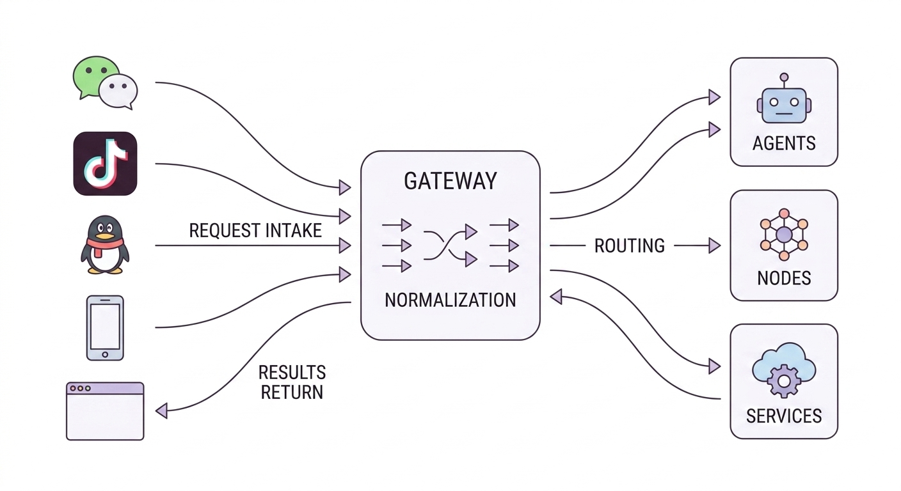
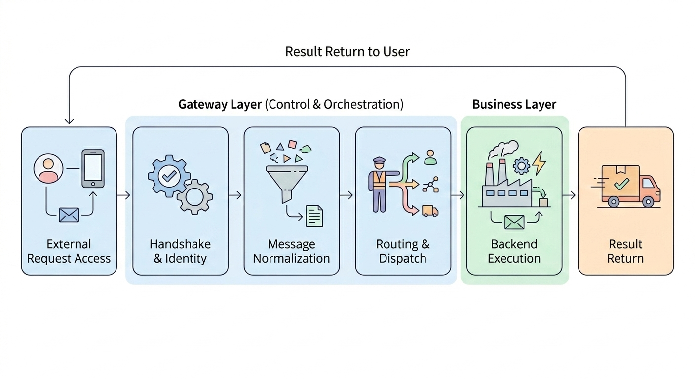

# 07 Gateway 开发与多通道通信

## 一、什么是 Gateway

在前面的所有操作中，我们都是假设单一用户，直接输入所有指令，模型直接执行所有指令。然而实际的生产生活中，信息的来源十分广泛，用户的操作也变得十分复杂。

举一个例子，跟一个网页设计一样，我们还没有考虑有很多用户访问的情况，没有考虑用户需要登录，也没有考虑在用户多的情况下负载均衡等，也没有考虑Agent执行的结果可能要推送到很多不同的应用和终端（比如要推送到微信、QQ、飞书、网页等）。要实现这些功能，在传统的后端服务设计思路里面就可以通过Gateway来实现。

在智能体系统中，模型、Prompt、Tools 和 MCP 负责完成理解、推理与执行，但用户请求往往并不直接进入模型接口，而是先来自不同的外部入口，例如 Web 页面、CLI、桌面端、移动端或消息平台。不同入口的协议、身份模型、消息结构和回传方式并不一致，因此系统通常需要一层专门的组件来完成统一接入、统一调度和统一回传，这一层就是 **Gateway**。

例如龙虾能够流传起来，有一个核心的优势就是它接入了各种不同的消息通道，可以在各种即时通信软件入WhatsApp、微信、QQ等里面，直接跟智能体进行通信，给智能体发送消息，智能体发送消息后，解析消息然后执行对应操作。

### Gateway

可以理解为多通道智能体系统中的“通信中枢”。它位于外部入口与后端执行层之间，主要承担以下职责：

1. 接入各类终端与平台；

2. 统一管理连接与身份；

3. 统一消息结构与事件结构；

4. 将请求路由至对应的智能体、节点或后端服务；

5. 将执行结果回传至原始请求通道。

对于只运行在单一终端中的最小程序，Gateway 不是必需组件；但只要系统开始面向多终端、多平台或多设备协作，Gateway 就会成为整体架构中的关键部分。


<div style="text-align:center;font-weight:bold;">
图 1 Gateway 作为多通道系统中的统一通信入口
</div>


## 二、为什么智能体系统需要 Gateway

Gateway这个词大家都不陌生，在各种软件和功能中大家都会碰到Gateway这个词。在Agent中这个也是类似的意思。

如果一个智能体只通过一个入口使用，例如只在命令行中运行，或只嵌入在一个固定的 Web 页面里，那么输入、执行和输出通常可以直接串联完成。但在真实项目中，系统往往需要同时面对多个入口，常见需求包括：

* 用户通过 Web 页面发起任务；

* 运维人员通过 CLI 或控制台查看系统状态；

* 消息平台中的用户通过机器人发送请求；

* 节点设备向系统上报在线状态、能力或执行结果；

* 智能体在执行过程中需要向不同终端推送事件和中间结果。

如果每个通道都直接连接模型或直接连接后端服务，会产生明显问题：

* 消息结构不统一，后端逻辑难以复用；

* 身份认证、权限校验和会话管理会在多个入口中重复实现；

* 多终端状态难以统一维护；

* 审计、监控、健康检查和故障恢复难以集中处理；

* 智能体执行层与前端通道强耦合，系统扩展成本较高。

Gateway 的核心价值，是对上述问题进行集中治理，实现外部入口复杂性与内部执行层复杂性的分离管理。


## 三、OpenClaw 的单网关架构

OpenClaw 采用典型的单网关架构，以一个长期运行的 Gateway 进程作为控制平面的核心，所有控制类通信均先接入 Gateway，再由其统一完成连接管理、请求路由、事件广播和状态维护工作。

> 这几个功能大家应该都很熟悉，我来稍微解释一下路由这个词，这个词是一个网络里面的专业术语，英文是Router，原来意思就是将路由器上收到的数据包，转发到对应的接口，这里请求路由的意思就是将通过不同channel（如微信、飞书）过来的消息，分发到不同的处理程序。

在这一架构中，Gateway 的核心工作可以概括为以下几类：

* 接收来自控制平面客户端、节点和消息通道的连接或请求；

* 处理连接建立后的握手流程；

* 管理不同连接的角色、权限和在线状态；

* 将请求转发到对应的后端处理模块；

* 向相关连接广播系统事件、执行进度和状态变化；

* 维护 Gateway 自身以及各连接的健康状态。

该架构可以先抓住一条主线：不同客户端和节点都通过 WebSocket 连接到同一个 Gateway。控制端负责发起管理操作，节点负责提供设备能力，Gateway 负责维护连接、校验消息，并把请求转给合适的处理对象。

在 OpenClaw 中，Gateway 还会统一广播系统事件，例如 `agent`、`chat`、`presence`、`health`、`heartbeat`、`cron` 等。这样，上层客户端就不需要分别感知每个节点或通道的细节，而是通过 Gateway 获取统一的状态和事件。

单网关架构的核心并不是“只能部署一个服务进程”，而是“所有入口先交给同一个 Gateway 管理”。这样一来，无论请求来自 Web、CLI、消息平台还是节点设备，都可以使用同一套连接模型、权限模型、消息模型和状态模型。


## 四、一条典型的 Gateway 请求链路

从消息流转的角度，单网关架构中一次完整的请求处理流程可分为六个步骤，各步骤环环相扣，实现请求从接入到结果回传的全流程管理。

1. **外部请求接入**：用户通过 Web 页面、CLI、聊天平台等入口发起请求，平台接入层将外部协议的请求转换为 Gateway 可处理的内部格式；

2. **握手与身份识别**：若连接尚未完成 `connect` 初始化，Gateway 将要求其先完成握手流程；若已完成初始化，则根据连接的角色、作用域和当前状态处理请求；

3. **消息归一化处理**：将原始请求转换为系统统一的内部消息结构，补齐通道、会话、用户和元数据等关键信息；

4. **请求路由与分发**：Gateway 根据请求类型、会话绑定、操作权限和系统当前状态，将请求分发至对应的目标处理器，如智能体运行时、节点、审批流程等；

5. **后端业务执行**：请求进入执行层后，系统才正式开展智能体推理、工具调用、MCP 调用或节点命令执行等核心业务工作；

6. **结果与事件回传**：执行过程中产生的阶段性事件和最终执行结果，先回传至 Gateway，再由 Gateway 转换为适配原始请求通道的格式，推送至对应终端。

该流程充分体现，Gateway 的核心价值是整合并管理系统的控制平面，而非直接执行智能体的业务任务。为了进一步理解这条链路，需要继续拆开其中出现的几个角色：谁负责发起操作，谁负责承载设备能力，谁负责平台协议转换，谁负责真正执行智能体任务。


<div style="text-align:center;font-weight:bold;">
图 2 单网关架构请求链路示意
</div>


## 五、OpenClaw 单网关架构中的核心对象

上一节已经展示了一次请求如何经过 Gateway 流转。接下来我们会将这条链路中的每一个对象讲清楚：

### 1. Gateway

在前面的章节中，我们已经介绍了Gateway的具体功能：Gateway 是系统的统一入口。它接收来自不同客户端、节点和消息通道的连接，识别它们的身份，维护在线状态，并把请求分发到正确的后端模块。

> Gateway 负责把不同来源的请求统一接入，并分发到正确的位置。

### 2. Operator

`operator` 是 OpenClaw 网关协议中的控制平面客户端。它可以是 CLI、UI 或自动化程序，主要用于查看状态、触发任务、处理审批、调试系统和执行运维操作。

例如，管理员在 Web 控制台点击“查看在线节点”，这个 Web 控制台就可以作为 `operator` 连接 Gateway，并发起状态查询请求。Gateway 收到请求后，会根据该连接的权限范围判断是否允许执行。

> Operator 是用来管理和操作系统的控制端。

### 3. Node

Node 是连接到 Gateway 的能力执行端，可以是一台 macOS 电脑、一台 iOS 或 Android 设备，也可以是一台无图形界面的 headless 主机。它通过 WebSocket 接入 Gateway，并在握手时声明 `role: "node"`，表示自己主要负责接收命令并执行具体动作。

不同类型的 node 可以提供不同能力。桌面端节点可以提供画布、屏幕或相机相关能力；移动端节点可以提供设备状态、通知、照片、定位、短信等能力；headless 节点可以在远程主机上执行系统命令，例如 `system.which` 或 `system.run`。这些能力在协议中会体现为不同的命令范围，例如 `canvas.*`、`camera.*`、`device.*`、`notifications.*`、`system.*` 等。

Node 与智能体章节中的 Tool 不是同一层概念。Tool 是智能体运行时看到的可调用能力入口，Node 则是某些能力真正执行的设备或主机。当任务需要具体设备配合时，Gateway 会通过 `node.invoke` 将命令发送给具备对应能力的 `node`；`node` 执行后，再把结果返回给 Gateway。

> Node 是真正承载设备能力并执行 Gateway 命令的终端或主机。

### 4. Channels / Channel Adapters

Channels / Channel Adapters 是消息通道接入层，负责把外部平台的消息接入 OpenClaw。例如 WhatsApp、Feishu、QQ Bot、WeChat 插件和 WebChat 等，这些不同平台的消息协议、登录方式、群组能力和媒体支持并不相同。

Channel Adapter 的作用就是把这些差异挡在 Gateway 和上层流程之外。它更像一个“翻译层”：**外部平台说自己的协议，Gateway 使用统一的内部消息结构，中间由 Channel Adapter 负责转换。​**

> Channel Adapter 负责把不同聊天平台的消息翻译成 Gateway 能处理的统一格式。

### 5. Agent Runtime

Agent Runtime 是让智能体真正开始工作的部分。前面的 Gateway 主要负责“把请求接进来，并送到正确的地方”；到了 Agent Runtime，系统才会真正开始处理用户任务。

可以把它理解为智能体的执行引擎。它会读取本次请求对应的会话，准备上下文，加载需要的 Skills，调用模型，并在需要时执行工具。OpenClaw 提到，一次智能体运行会经历输入处理、上下文组装、模型推理、工具执行、流式回复和持久化等步骤。

例如，当用户在聊天平台中发送“帮我总结今天的告警”时，Channel Adapter 负责接收平台消息，Gateway 负责识别会话并把请求送入 Agent Loop。随后 Agent Runtime 才开始真正执行任务：整理上下文、调用模型、判断是否需要工具，并把过程事件和最终回复返回给 Gateway。

因此，Gateway 与 Agent Runtime 的分工可以概括为：Gateway 负责“把请求送进来”，Agent Runtime 负责“让智能体完成任务”。

> Agent Runtime 负责真正执行智能体任务并产出结果。


## 六、OpenClaw 网关协议的关键机制

OpenClaw 的 Gateway 不是简单地暴露几个 HTTP 接口，而是通过一套 WebSocket 协议维持控制平面通信。理解这套协议时，我们可以按一条连接从建立到调用的顺序来看：先建立 WebSocket 长连接，再完成 `connect` 握手，之后再通过请求帧、响应帧和事件帧持续通信。

### 1. 统一传输方式：WebSocket

Gateway 协议使用 WebSocket 作为传输层，消息是带 JSON payload 的文本帧。

这里的“帧”可以简单理解为：**WebSocket 长连接中一次发送的一条 JSON 消息。​** 它可能是一条请求，也可能是一条响应，还可能是 Gateway 主动推送的一条事件。

Gateway 需要长连接，是因为它处理的不只是“一问一答”。例如，客户端连接后需要保持在线状态，Gateway 需要推送健康状态、心跳事件、会话事件、节点事件等。这类持续通信场景更适合使用 WebSocket。

### 2. 连接握手：`connect.challenge` 与 `connect`

连接建立后，不能立刻发送业务请求。OpenClaw 协议规定，连接必须先完成握手：

1. Gateway 先发送 `connect.challenge` 事件；

2. 客户端收到 challenge 后，再发送 `connect` 请求；

3. Gateway 校验通过后，连接才进入可用状态。

这个握手阶段主要用于完成：

* 协议版本协商；

* 客户端身份确认；

* 角色声明；

* 作用域声明；

* 节点能力声明等。

Gateway 首先发送 challenge：

```json
{
  "type": "event",
  "event": "connect.challenge",
  "payload": {
    "nonce": "...",
    "ts": 1737264000000
  }
}
```

客户端随后发送 `connect` 请求：

```json
{
  "type": "req",
  "id": "req-001",
  "method": "connect",
  "params": {
    "minProtocol": 3,
    "maxProtocol": 3,
    "client": {
      "id": "web-console",
      "version": "1.0.0",
      "platform": "web",
      "mode": "operator"
    },
    "role": "operator",
    "scopes": ["operator.read", "operator.write"],
    "caps": [],
    "commands": [],
    "permissions": {},
    "auth": {
      "token": "YOUR_GATEWAY_TOKEN"
    },
    "device": {
      "id": "device_fingerprint",
      "publicKey": "...",
      "signature": "...",
      "signedAt": 1737264000000,
      "nonce": "..."
    }
  }
}
```

这段示例里需要重点关注三类信息。

* `role`、`scopes`、`caps`、`commands`、`permissions` 用于声明连接的角色、权限范围和能力；

* `auth` 用于共享密钥认证。Gateway 可以使用 `connect.params.auth.token` 或 `connect.params.auth.password`，具体取决于配置的认证模式；

* `device` 用于设备身份认证。WebSocket 客户端在 `connect` 时携带设备身份，并签名绑定前面 `connect.challenge` 中的 `nonce`。

因此，`connect` 是后续通信的入口校验。只有完成它，Gateway 才能知道当前连接是谁、是什么角色、能调用哪些能力。

### 3. 三类核心消息帧：请求帧、响应帧与事件帧

握手完成后，客户端和 Gateway 之间主要通过三类帧通信。

#### （1）请求帧

请求帧用于客户端调用 Gateway 方法。它通常包含 `type`、`id`、`method` 和 `params`。其中，`method` 表示要调用的方法，`params` 表示参数，`id` 用于和后续响应对应起来。

```json
{
  "type": "req",
  "id": "req-002",
  "method": "status",
  "params": {}
}
```

在上面的示例中，客户端通过 `status` 方法查询 Gateway 状态。

#### （2）响应帧

响应帧用于 Gateway 返回某个请求的执行结果。响应中的 `id` 会和请求帧中的 `id` 保持一致，这样客户端就能知道这条响应对应哪一次请求。

```json
{
  "type": "res",
  "id": "req-002",
  "ok": true,
  "payload": {
    "status": "ok"
  }
}
```

#### （3）事件帧

事件帧用于 Gateway 主动推送信息，不一定对应某个客户端请求。例如，Gateway 可以推送健康状态、在线状态、会话事件、节点事件等。

```json
{
  "type": "event",
  "event": "health",
  "payload": {
    "healthy": true
  }
}
```

这三类帧可以覆盖两类常见通信需求：需要回复的调用使用“请求帧 + 响应帧”，需要主动通知的状态变化使用“事件帧”。

### 4. 角色与作用域

OpenClaw 会在连接建立时区分当前连接的角色。官方协议中最常见的两类角色是 `operator` 和 `node`。

`operator` 是控制平面客户端，例如 CLI、UI 或自动化程序。Gateway 主要通过 `scopes` 判断它能做哪些操作。

`node` 是能力宿主，例如移动端、桌面端或 headless 节点。Gateway 主要通过 `caps`、`commands`、`permissions` 判断它具备哪些能力、允许执行哪些命令。

这样设计的好处是：同样连接到 Gateway 的客户端，不会天然拥有相同权限。管理端、节点端、自动化程序可以在同一套协议中使用不同的权限边界。

### 5. 健康检查、心跳与状态同步

健康检查、心跳与状态同步可以理解为请求帧和事件帧的具体使用场景。客户端可以通过 `health`、`status` 等方法查询 Gateway 状态；Gateway 也可以通过 `presence`、`tick`、`health`、`heartbeat` 等事件主动推送状态变化。

这些能力解决的是同一个问题：Gateway 是长期运行的控制平面，必须知道哪些连接还在线、系统是否健康、节点状态是否变化，并把这些变化及时同步给相关客户端。因此，它们是长连接控制平面能够稳定运行的基础。

### 6. 幂等机制

幂等机制指的是：**同一个操作被执行一次或重复执行多次，最终产生的外部效果保持一致。​** 这里讨论的重点不是普通查询，而是带副作用的操作。所谓副作用，是指请求会改变外部状态，例如发送消息、执行节点命令、触发任务等。

在 Gateway 场景中，幂等机制的作用是防止重复提交带来重复执行。由于网络重试、超时补发或断线重连，同一个请求可能被发送多次。如果缺少幂等控制，同一条通知可能被重复发送，同一个节点命令可能被重复执行。常见做法是为这类请求提供幂等键。Gateway 或后端服务第一次处理该幂等键时，正常执行并记录结果；如果之后再次收到相同幂等键，就直接返回已有结果，或拒绝重复执行。

需要特别注意，幂等机制不是模型层面的能力。大模型可能重复提出相似的调用意图，也可能因为上下文变化生成不同内容；真正负责保证幂等的是 Gateway、后端业务服务和存储层。它们通过幂等键、执行记录或结果缓存来识别重复请求，从而约束系统执行层，避免重复执行危险或有副作用的动作。

## 七、Gateway 案例

前面的章节已经分别介绍了 Prompt、Tool、Skill 与 MCP。到了 Gateway 这一章，需要再往前补上一层：**请求并不是直接进入 Agent，而是先进入 Gateway，再由 Gateway 决定把请求送到哪里。**

为了让这一层关系更容易理解，这里给出一个与前文代码保持一致的最小案例。本章配套示例位于：

`minimal_agents/examples/chapter-7/gateway/teaching_gateway_demo.py`

这个案例演示的是一条最小但完整的链路：

1. 不同来源的请求先进入 `SimpleGateway`；
2. Gateway 将原始请求整理成统一格式；
3. Gateway 按路由把请求转发给 `MinimalAgent`；
4. Agent 调用本地 Tool 读取 Markdown；
5. Agent 生成回答后，再由 Gateway 统一封装为响应结果。

示例代码如下：

```python
from __future__ import annotations

import json
from dataclasses import asdict, dataclass
from pathlib import Path

from minimal_agents import HelloAgentsLLM, MinimalAgent, ScriptedLLMBackend, ToolRegistry


# Gateway 接收进来的统一请求对象。
# 无论消息来自网页、命令行还是聊天平台，先整理成这一种结构。
@dataclass(slots=True)
class GatewayRequest:
    channel: str
    user_id: str
    session_id: str
    message: str


# Gateway 向外返回的统一响应对象。
# 外部调用方只需要认这一种结果格式即可。
@dataclass(slots=True)
class GatewayResponse:
    channel: str
    session_id: str
    agent_name: str
    reply: str


class SimpleGateway:
    def __init__(self) -> None:
        # 路由表：记录“某个路由名”应该交给哪个 Agent 处理。
        self._routes: dict[str, MinimalAgent] = {}

    def register_agent(self, route: str, agent: MinimalAgent) -> None:
        # 把 Agent 挂到 Gateway 上，后面 dispatch(...) 时就能按名字找到它。
        self._routes[route] = agent

    def dispatch(self, route: str, request: GatewayRequest) -> GatewayResponse:
        # 1. 根据路由名找到目标 Agent。
        agent = self._routes[route]
        # 2. 先把请求整理成 Agent 更容易理解的统一输入。
        normalized_prompt = self._normalize_request(request)
        # 3. 真正执行任务的仍然是 Agent。
        reply = agent.run(normalized_prompt)
        # 4. 最后把结果重新包装成 Gateway 的统一响应格式。
        return GatewayResponse(
            channel=request.channel,
            session_id=request.session_id,
            agent_name=route,
            reply=reply,
        )

    def _normalize_request(self, request: GatewayRequest) -> str:
        # 这里演示最简单的“归一化”方式：
        # 把 channel、user、session 等元信息拼进文本中，
        # 让 Agent 在收到请求时拥有更完整的上下文。
        return (
            f"[channel={request.channel}] "
            f"[user={request.user_id}] "
            f"[session={request.session_id}] "
            f"{request.message}"
        )
```

这里最值得注意的是 `dispatch(...)` 这一层。它本身并不负责模型推理，也不直接实现工具能力，而是做三件事：

- 接收外部请求；
- 归一化请求格式；
- 调用对应 Agent，并把结果包装回统一响应。

这正是 Gateway 与 Agent 的边界所在。Agent 仍然负责“理解任务并执行任务”，Gateway 负责“接入请求并分发请求”。

运行该示例脚本，可以看到来自不同来源的请求都被封装成统一结构，再由同一个 Gateway 转发给同一个 Agent 处理。也就是说，`web`、`feishu`、`cli` 这些差异，首先由 Gateway 吸收；而 Agent 内部拿到的则是已经整理好的统一任务输入。

> 这一案例的重点，不是实现完整的网络服务，而是先把 Gateway 的最小职责讲清楚：接入、归一化、路由、回传。

## 八、作业练习

本章作业位于：

`minimal_agents/hw/chapter-7/gateway/gateway_homework_template.py`

配套的示例 Markdown 文件位于：

`minimal_agents/hw/chapter-7/gateway/gateway_homework_note.md`

其中 Agent、Tool 和示例输入文件已经提前准备好，读者不需要再从零搭建整套运行环境。

作业中已经预置了三条模拟的 WebSocket 消息帧，分别来自：

- `web`
- `feishu`
- `cli`

这些消息帧统一采用如下结构：

```python
{
    "type": "message",
    "channel": "web",
    "user_id": "student-web-001",
    "session_id": "session-web-001",
    "text": "请读取这份 Markdown，并介绍它的结构。"
}
```

读者需要自己完成的部分，已经全部用 `TODO` 标出来了。核心任务包括：

1. 在 `SimpleGateway` 中维护路由表；
2. 实现 `register_agent(...)`，把 Agent 注册进 Gateway；
3. 实现 `normalize_frame(...)`，把原始消息帧转换为统一的 `GatewayRequest`；
4. 实现 `dispatch_frame(...)`，将请求转发给正确的 Agent；
5. 输出统一结构的 `GatewayResponse`。

配套练习目录如下：

```text
minimal_agents/
└── hw/
    └── chapter-7/
        └── gateway/
            ├── gateway_homework_template.py
            └── gateway_homework_note.md
```


> 作业的核心目标，是让读者亲手补出一个最小 Gateway，而不是继续把所有逻辑都直接写进 Agent。

## 九、小结

Gateway 是多通道智能体系统中的统一接入入口与通信中枢，是实现多终端、多平台、多设备协作的核心组件。OpenClaw 的单网关架构为 Gateway 开发提供了清晰的参考范式：以一个长期运行的 Gateway 进程作为控制平面核心，通过 WebSocket 协议建立统一的长连接，通过`connect`请求完成身份与能力的声明，并用请求帧、响应帧、事件帧组织整套通信过程。

Gateway 开发的核心重点，需先完成**连接管理、协议定义、角色与权限管控、状态同步、请求路由、事件回传**六大基础模块的开发与测试。只有当这六大模块稳定运行后，多通道通信和智能体调度才能建立在可靠的基础之上，系统的后续扩展也会更高效、更安全。

## 参考资料

* OpenClaw 网站：Gateway 网关架构<https://docs.openclaw.ai/concepts/architecture>

* OpenClaw 官方文档：Gateway 网关协议<https://docs.openclaw.ai/gateway/protocol>

* OpenClaw 官方文档：Gateway<https://docs.openclaw.ai/cli/gateway>

* OpenClaw 官方文档：Nodes<https://docs.openclaw.ai/nodes>

* OpenClaw 官方文档：Chat Channels<https://docs.openclaw.ai/channels>
