# 09 低代码框架Dify

除了前面我们介绍的从底层开始开发智能体，实际上现在也有很多工具，可以帮我们很方便实现智能体的功能，不用我们来写代码了。很多公司都提供了相应的软件，例如Coze，Workbuddy、Dify。Dify是使用广泛的一个开源平台，可以很方便的实现智能体的功能，我们已经基于这个开发了很多个智能体了，下面我们就来简单说一下Dify如何搭建。
## 一、Dify的基本介绍

[Dify](https://github.com/langgenius/dify) 是一个开源的 LLM 应用开发平台，其直观的界面结合了 LLM 模型管理、 工作流、知识库等，可以快速进行可编排任务或 Agent 的原型试验，直至生产环境。以下是其核心功能列表：

**1. 工作流**: 在画布上构建和测试功能强大的 AI 工作流程，利用以下所有功能以及更多功能。

**2. 全面的模型支持**: 与数百种专有/开源 LLMs 以及数十种推理提供商和自托管解决方案无缝集成，涵盖 GPT、Mistral、Llama3 以及任何与 OpenAI API 兼容的模型。

**3. Prompt IDE**: 用于撰写提示、比较模型性能以及向基于聊天的应用程序添加其他功能（如文本转语音）的直观界面。

**4. 知识库**: 广泛的 RAG 功能，涵盖从文档导入到检索的所有内容，支持从 PDF、PPT 和其他常见文档格式中提取文本的开箱即用的支持。前面讲到的通过RAG实现记忆功能，在 Dify 基本不用写代码就能够实现了，而且还有可视化的管理。：）

**5. Agent 与工具系统**: 可以基于 LLM 函数调用或 ReAct 定义 Agent，并为 Agent 添加预构建或自定义工具。Dify 为 AI Agent 提供了 50 多种内置工具，如谷歌搜索、DALL·E、Stable Diffusion 和 WolframAlpha 等。在 Dify 上开发或集成工具，都是一件相对容易的事情。

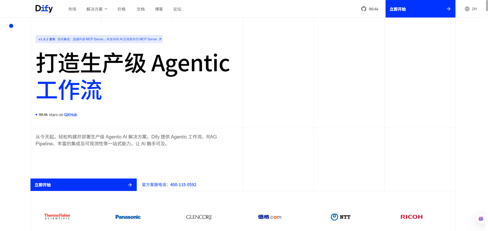

<div style="text-align:center;font-weight:bold;">图1 Dify官网</div>

Dify 有非常强大的插件市场，提供了一站式插件管理和一键部署功能，使开发者能够发现、扩展或提交插件，为社区带来更多可能。插件概念涵盖较广，包括模型产商、工具或MCP等，例如，如果安装一个OpenAI插件，你就可以接入 OpenAI 的模型到 Dify 里；如果安装一个 Google插件，你的工作流或 Agent 就可以拥有网络搜索的能力；如果你安装一个MCP SSE插件，你就可以接入任何官方或第三方的MCP服务器。

> 总结一句话，如果你是要实现比较标准的Agent，尤其是基于RAG的Agent，用Dify基本上就能很方便的满足你的需求。


## 二、Dify的本地部署

Dify 提供了快速的 Docker 部署方法，同学们可以先安装 [Docker](https://docs.docker.com/desktop/)，然后键入以下命令：

```shell
cd docker
cp .env.example .env
docker compose up -d
```

> 大家可以参考 `.env` 文件中的注释修改 Dify 的相关配置。

运行后，可以在浏览器上访问 http://localhost/install 进入 Dify 控制台并开始初始化安装操作，创建账户后便能进入 Dify 工作室。

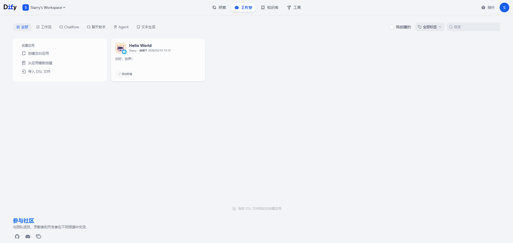

## 三、开始使用

让我们搭建一个最简单的、接入知识库的聊天应用吧！

我们将学会如何在平台中配置大模型、搭建知识库，如何在工作流画布上添加节点并连接节点，然后让应用顺利跑起来！

### 1. 配置大模型

点击右上角的个人账户，进入“设置”页面，我们将看到一个“模型供应商”选项卡。

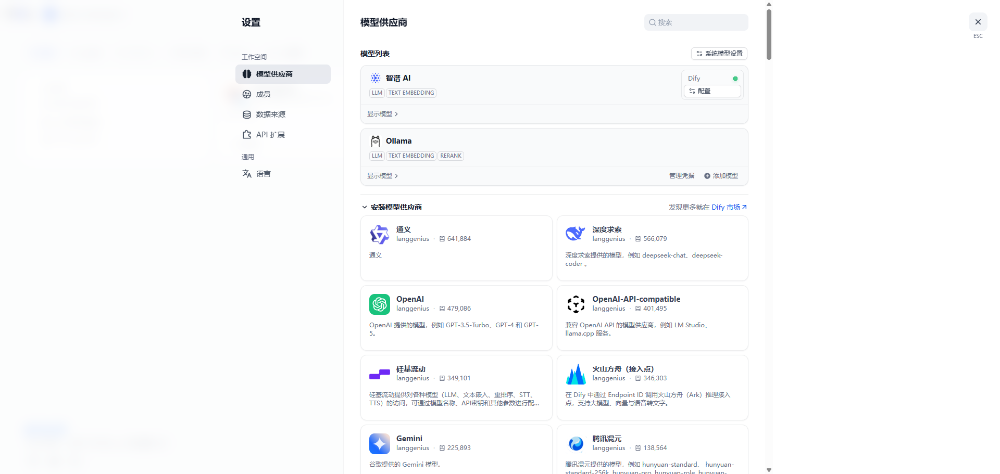

我们可以在这个界面中选择多种模型供应商，例如：

- **国内的模型产商**：智谱 AI（GLM）、月之暗面（Kimi）、深度求索（DeepSeek）、通义（阿里）、火山（字节）、混元（腾讯）
- **国外的模型产商**：OpenAI、Gemini、Arthropic
- **本地模型**：Ollama、vllm
- **任何兼容 OpenAI 标准接口的模型**：OpenAI-API-compatible

根据选择的模型产商，安装对应的插件，然后填入 API Key，就可以使用其提供的模型了，比如智谱 AI提供的模型：

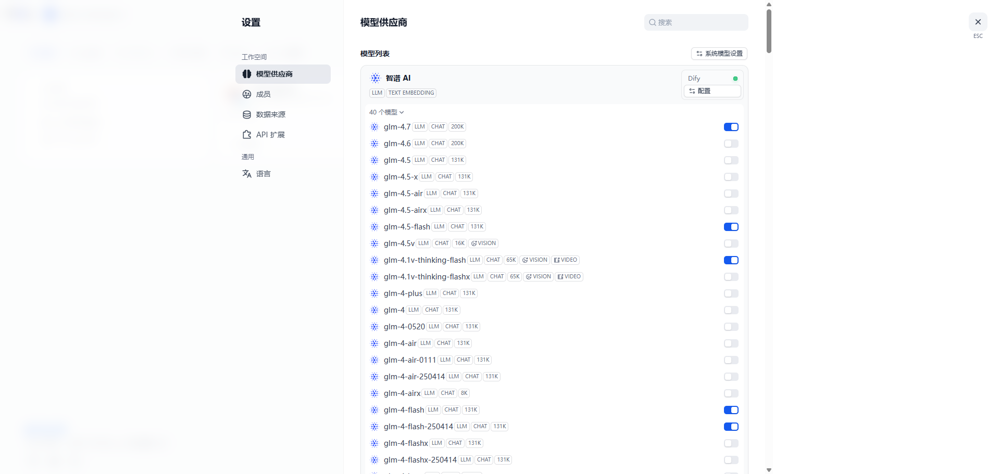

> 注意，模型产商对应插件中可选的模型可能不是最新的，这种情况下可以选用`OpenAI-API-compatible`。

在模型列表右上角有一个按钮“系统模型设置”，可以设置 Dify 中默认的模型，我们通常需要这些模型：

- 系统推理模型：通常我们提到的大模型
- Embedding 模型：用来进行文档嵌入，在进行知识库构建和检索时会使用该模型
- Rerank 模型：用来进行提高文档的准确率，在知识库检索时**可选**使用该模型

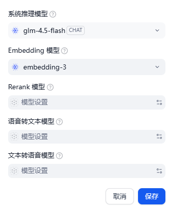

### 2. 搭建知识库

在最上方的导航栏中，可以选择进入“知识库”页面：

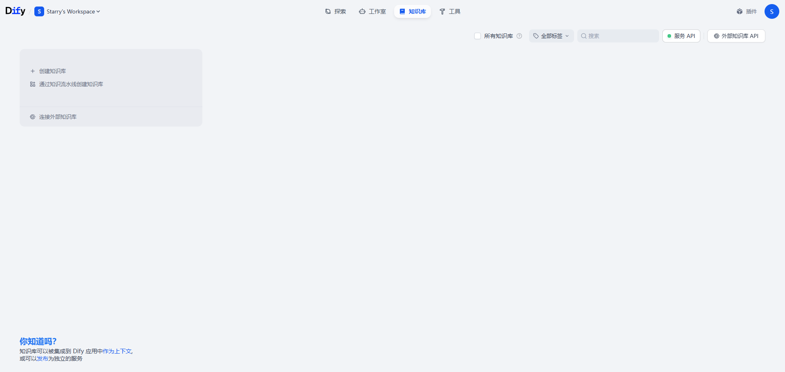

点击“创建知识库”按钮，我们将可以选择三种数据源：

- **导入已有文本**：导入本地的文件，比如Word、PDF、Markdown等都可以；
- **同步自 Notion 内容**：Notion 是一个整合了笔记、资料表格、看板等多种功能的软件，可以个人使用，也可以用于团队协作中；
- **同步自 Web 站点**：顾名思义，可以同步网站内容。

> 或者先创建一个空知识库再导入数据源也是没问题的。

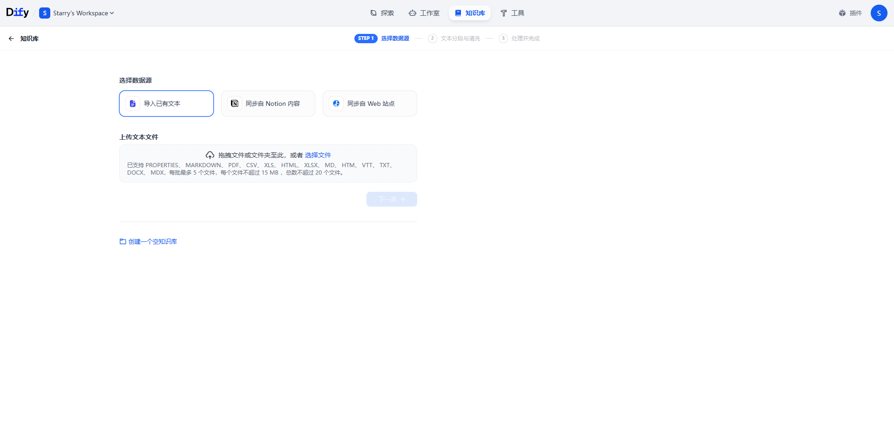

我们导入一篇论文《Attention Is All You Need》，来作为后续的测试数据源。

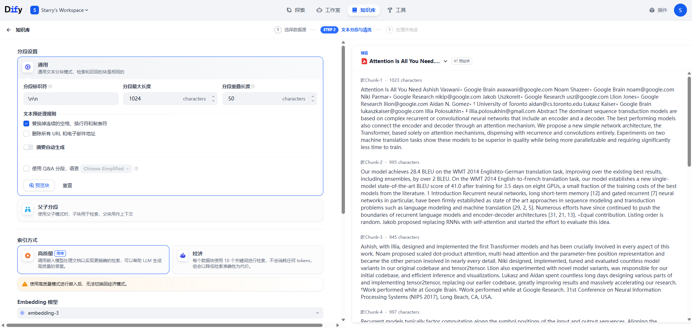

这里有一些分段设置，也就是如何把这篇文章切成小块、用于检索。保持默认配置，预览后觉得没问题就点击“保存”。

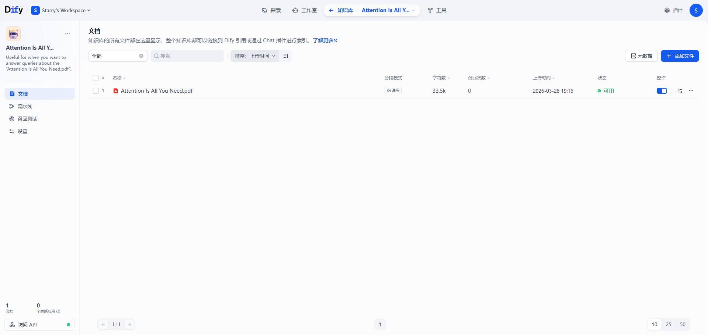

进入到这个知识库中，你将看到上传的全部文件。我们也可以继续添加新的文件来充实知识库。

### 3. 创建应用

在工作室页面中，我们可以选择“创建空白应用”。

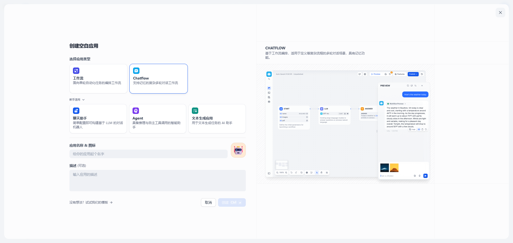

我们可以创建的空白应用包括：

- 工作流：面向单轮自动化任务的编排工作流
- Chatflow：支持记忆的复杂多轮对话工作流
- 聊天助手：简单配置即可构建基于LLM的对话机器人
- Agent：具备推理与自主工具调用的智能助手
- 文本生成应用：用于文本生成任务的AI助手

其中，后三个在“新手适用”选项下，内置了许多强大的功能，大家可以去试试这三种应用类型。

#### （1）聊天助手

在聊天助手应用中，只需要撰写提示词、设置变量与知识库即可，构建即时可用的对话应用非常方便。

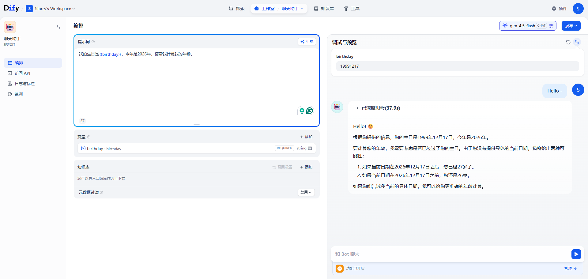

#### （2）Agent

在 Agent 应用中，相比“聊天助手”应用，还可以加入智能体可用的“工具”。Dify 自动为你填充了可用工具的上下文窗口，使得你仅需要“添加工具”即可驱动 Agent 做更多的事情。由于 Dify 有强大的插件市场，开发基础的 Agent 应用变得非常简单。

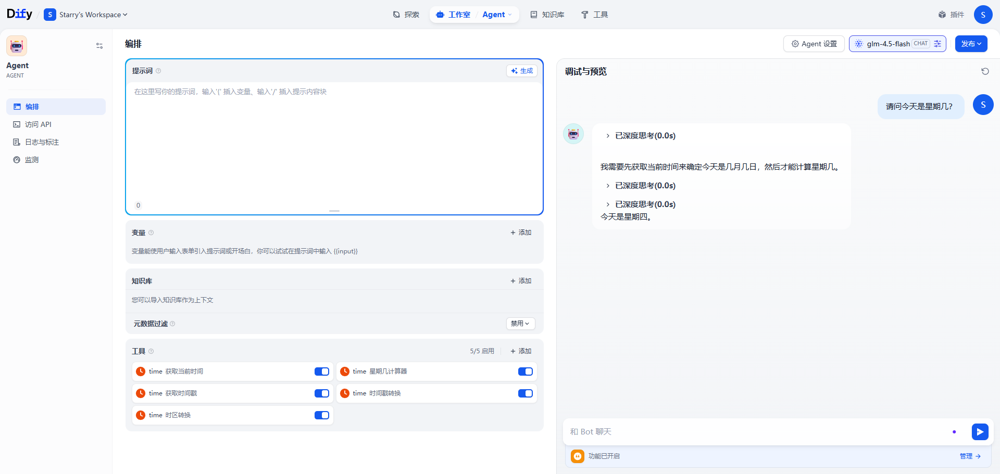

#### （3）文本生成应用

文本生成类应用主要是一种根据用户提供的提示，自动生成高质量文本的应用，它可以生成各种类型的文本，例如文章摘要、翻译等。它可以单次运行、高效创作，且特别适用于需要批量运行的场景。

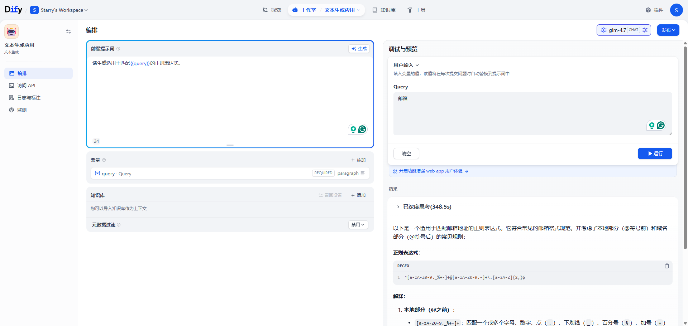

### 4. 工作流、画布与节点

让我们创建一个最简单的Chatflow应用：

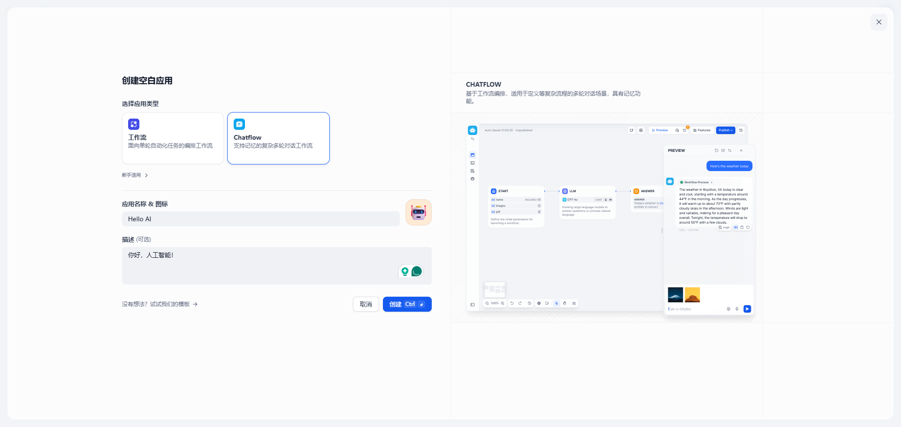

创建成功后我们将看到一个基本的模板：

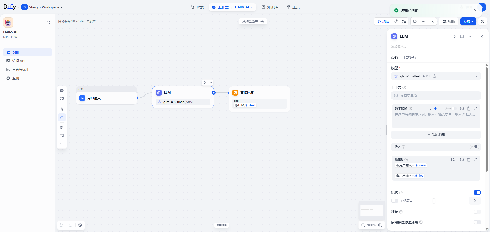

这个工作流画布上预置了三个节点，分别是：

- **开始节点**：设置用户输入等字段，默认包含`userinput.query`
- **大模型节点**：运行一次大模型，包含指定的Prompt
- **直接回复节点**：返回给用户的消息

我们可以直接点击右上边的“预览”跑一次这个工作流：

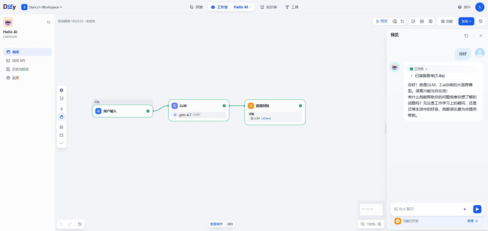

现在让我们扩展这个基础的应用，我们可以右击画布空白添加一个节点：

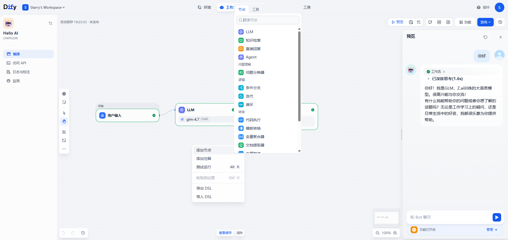

让我们加入一个“知识检索”节点，并把节点间连接起来。

> 你可以拖动节点边缘的端点来拉出连线，也可以选中连线按“DEL”删除。

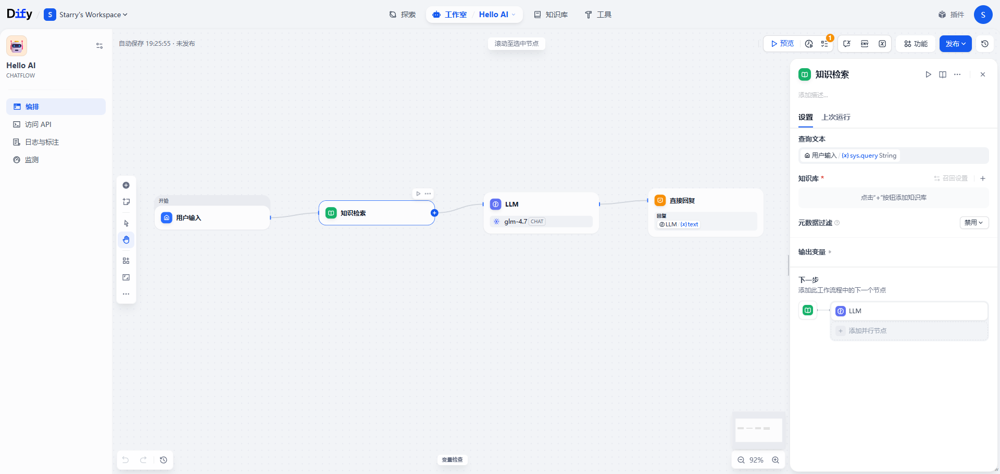

让我们配置这个节点，选中刚才创建的知识库：

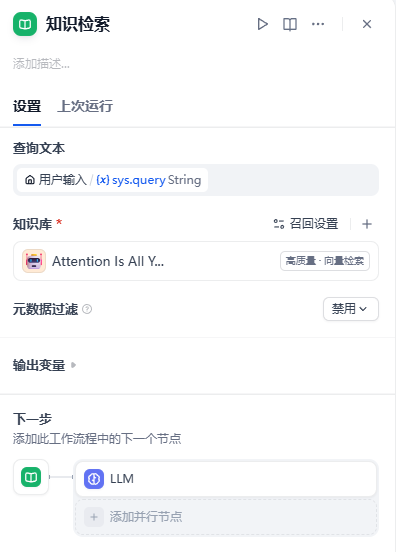

### 5. 连接节点

连接节点，并非单纯指把节点之间用连线连接起来，还需要设置数据（变量）的流动。

例如，用户输入节点是一切的开始，它的`userinput.query`是用户的输入。

对于知识检索节点，我们应该以用户的输入作为查询文本：

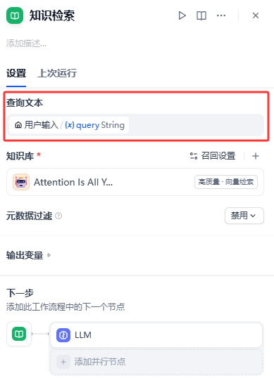

对于大模型节点，我们应该以知识检索的结果作为上下文，与用户输入一同嵌入到大模型的Prompt中，例如：

```
### System Prompt ###
你是一个AI相关领域的专家，为学生讲解知识。

这是知识库的检索内容，你将依据此回答学生的问题：
{{#context#}}

### User Prompt ###
{{#sys.query#}}
```

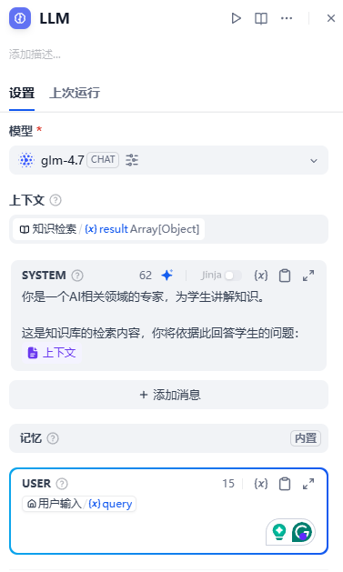

对于直接回复节点，我们应该以大模型的输出作为回复内容：


> 所有输入文本的地方，都可以通过 “{” 或者 “/” 来呼出变量选择窗口。

### 6. 运行工作流

把节点都成功连起来后，就可以点击右上边的“预览”按钮测试工作流啦！

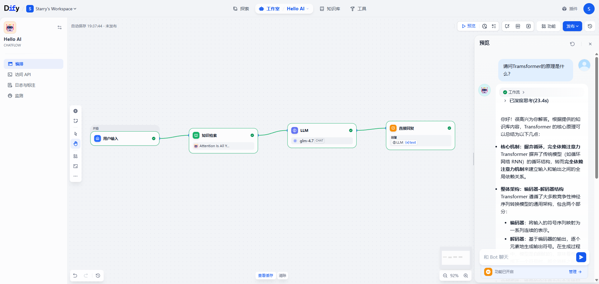

你可以点击聊天窗口的“工作流”来检查每个节点的输入输出：

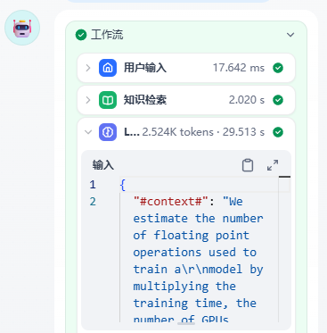

当你觉得工作流没有问题的时候，就可以点击右上角的“发布”按钮分享这个应用啦！

## 四、总结

总之，Dify有非常非常多方便的功能，站在巨人的肩膀上，同学们可以依据自己的想象力更轻松地搭建属于自己的Agent。编写工具扩展Agent的能力也好，编写工作流约束Agent的执行过程也好，这些都是值得思考的地方。

最后附上官方教程文档的链接：https://docs.dify.ai/zh/use-dify/getting-started/introduction。

## 五、作业练习

本章作业位于：

`minimal_agents/hw/chapter-9/dify/`

这一章的作业不再要求继续补 Python 代码，而是要求亲手完成一个可以运行、可以展示的 Dify 应用。作业重点是把本章介绍过的内容真正串起来，例如：

- 选择合适的应用形态：Chatbot、Chatflow、Workflow 或 Agent
- 设计节点之间的输入输出关系
- 尝试接入知识库、工具或插件
- 记录自己的设计思路与运行效果

建议先阅读作业目录中的 `README.md`，再选择一个明确的问题场景开始搭建，例如课程问答助手、知识库检索助手、文档格式化助手等。

## 附录、实战：格式化输入输出助手

在这个实战项目中，我们将从头搭一个略微复杂，但有可复用性的工作流。这个工作流将抽象出一系列共通的工作流程，结合检索增强生成，给出一个可以支持多种下游任务的格式化的输入输出结果。我们将在这个过程中使用到许多许多的节点，让大家了解每个节点的用法，最终能自己搭建有趣的应用。

### 1. 从知识库开始

我们将使用检索增强生成（RAG）来给予 LLM 更多的信息，从而提高 LLM 的回答质量。因此我们先搭建一个工作流来从知识库中获取内容。为了实现一个可复用的小助手，我们希望让工作流选择不同的知识库进行检索，也就是知识库路由。

在设计上，我们不应该把所有文档都放在一个知识库里，而应该分门别类先整理好，然后给这个知识库一个描述性话来方便知识库的选择。我们已经创建了一个AI相关的知识库，让我们再创建一个Agent相关的知识库，直接使用这个教程的所有文档。


再往之前的知识库里面塞点东西，这样我们就有了两个知识库用于测试：


我们创建第一个工作流叫做“知识库路由”，然后在开始的用户输入节点中加入一个输入参数“query”：


右击画布插入两个节点“AI知识库检索”和“Agent知识库检索”，然后选择相应的知识库：


当用户传入查询时，我们需要选择一个知识库进行检索，这可以使用一个“问题分类”节点，让大模型来选择一个分类，然后路由到具体的知识库里：


> 记得检查一下每个节点连线后的输入与输出，始终盯紧数据流。

当然，也可以让用户来选择需要搜索的知识库：当用户指定知识库的时候搜索特定的知识库，如果用户没有指定知识库的话就使用默认的问题分类器。这就需要用到条件节点，顾名思义使用就好：


> 补充一下，每个节点右上角三个小点菜单中都可以查看该节点的帮助文档哟~
>
> 

得到知识库的检索结果后，我们需要将结果合并起来，尤其是这种只走了一边分支的工作流，我们希望能有一个变量指向执行工作流那边的结果，这就需要用到“变量聚合器”节点。聚合变量之后，我们最后添加一个输出节点，把聚合的变量结果当作工作流的输出结果，这样，我们就完成了这个工作流的设计与实现。


执行这个工作流，我们就可以根据用户的输入自动选择知识库进行查询啦，例如我们输入“智能体记忆系统”，可以得到以下运行结果：


> 绿色高亮的就是工作流执行时经过的节点。


> 因为我们没有配置“Rerank”模型，召回的结果其实不是很好，在实际生产中，可以配置一个“Rerank”模型来让查询结果更精确！

如果遇到Bug了，也可以在“追踪”栏目中查看每个节点具体的执行流程：


> 思考，为什么我们不同时在多个知识库中查询，然后再把结果聚合起来？

最后，调试没问题的话，点下右上角的“发布”按钮吧！
