## 附录、实战：格式化输入输出助手

在这个实战项目中，我们将从头搭一个略微复杂，但有可复用性的工作流。这个工作流将抽象出一系列共通的工作流程，结合检索增强生成，给出一个可以支持多种下游任务的格式化的输入输出结果。我们将在这个过程中使用到许多许多的节点，让大家了解每个节点的用法，最终能自己搭建有趣的应用。

### 1. 从知识库开始

我们将使用检索增强生成（RAG）来给予 LLM 更多的信息，从而提高 LLM 的回答质量。因此我们先搭建一个工作流来从知识库中获取内容。为了实现一个可复用的小助手，我们希望让工作流选择不同的知识库进行检索，也就是知识库路由。

在设计上，我们不应该把所有文档都放在一个知识库里，而应该分门别类先整理好，然后给这个知识库一个描述性的话来方便知识库的选择。我们已经创建了一个AI相关的知识库，让我们再创建一个Agent相关的知识库，直接使用这个教程的所有文档。

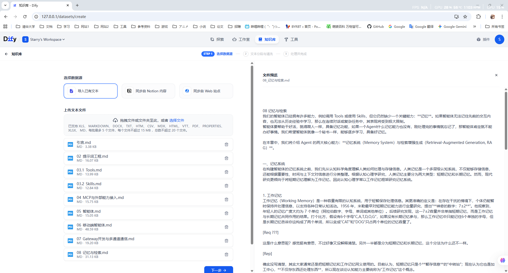

再往之前的知识库里面塞点东西，这样我们就有了两个知识库用于测试：

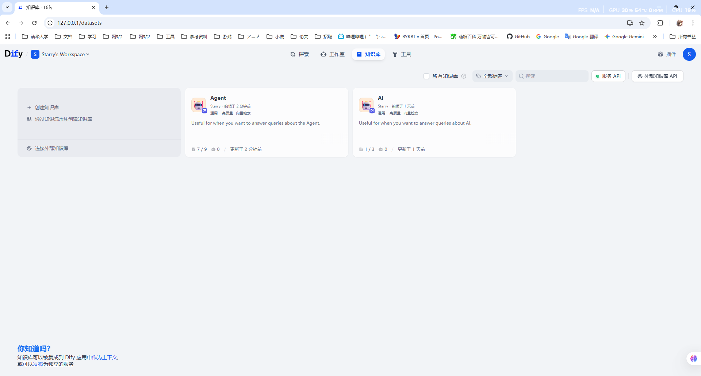

我们创建第一个工作流叫做“知识库路由”，然后在开始的用户输入节点中加入一个输入参数“query”：

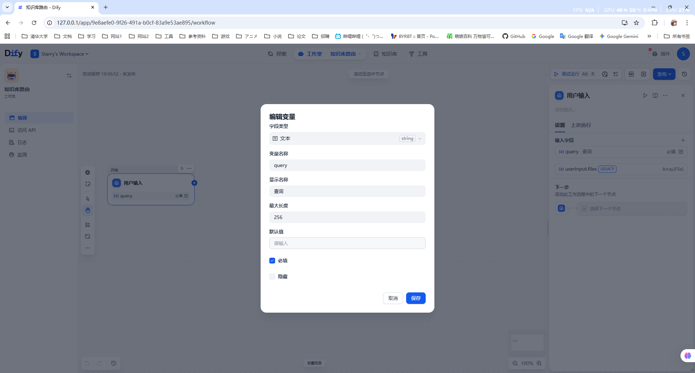

右击画布插入两个节点“AI知识库检索”和“Agent知识库检索”，然后选择相应的知识库：

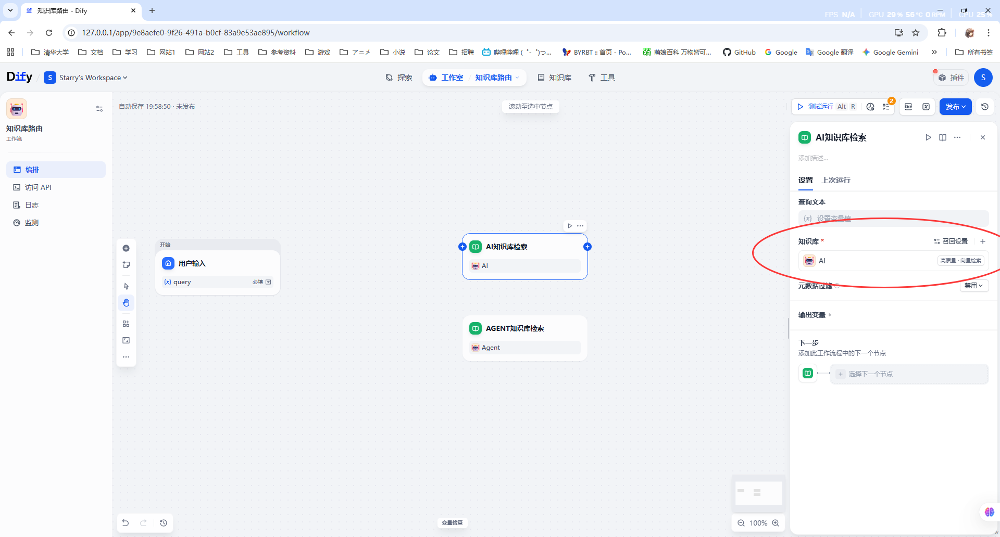

当用户传入查询时，我们需要选择一个知识库进行检索，这可以使用一个“问题分类”节点，让大模型来选择一个分类，然后路由到具体的知识库里：

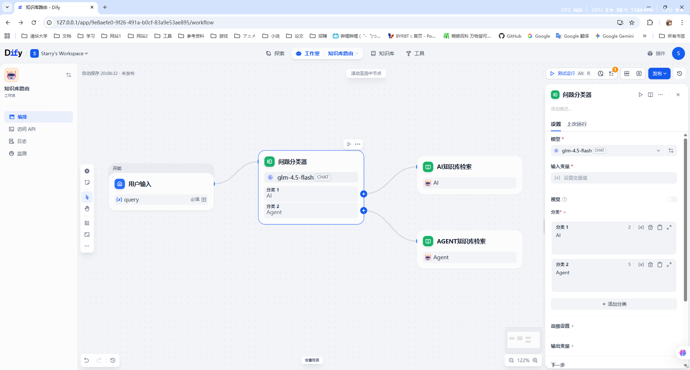

> 记得检查一下每个节点连线后的输入与输出，始终盯紧数据流。

当然，也可以让用户来选择需要搜索的知识库：当用户指定知识库的时候搜索特定的知识库，如果用户没有指定知识库的话就使用默认的问题分类器。这就需要加一个输入参数，并用到条件节点，顾名思义使用就好：

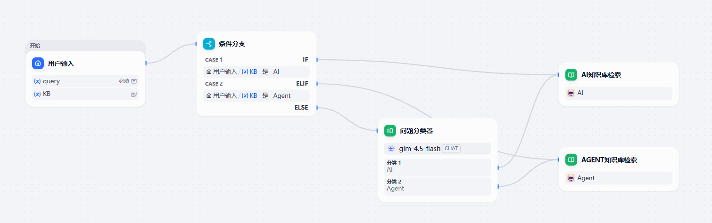

> 补充一下，每个节点右上角三个小点菜单中都可以查看该节点的帮助文档哟~
>
> 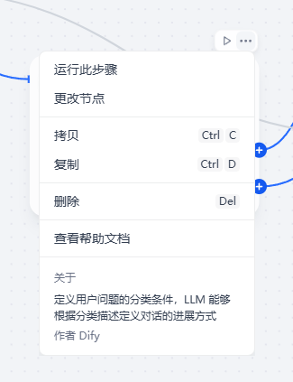

得到知识库的检索结果后，我们需要将结果合并起来，尤其是这种只走了一边分支的工作流，我们希望能有一个变量指向执行工作流那边的结果，这就需要用到“变量聚合器”节点。聚合变量之后，我们最后添加一个输出节点，把聚合的变量结果当作工作流的输出结果，这样，我们就完成了这个工作流的设计与实现。

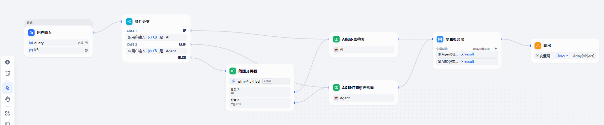

执行这个工作流，我们就可以根据用户的输入自动选择知识库进行查询啦，例如我们输入“智能体记忆系统”，可以得到以下运行结果：

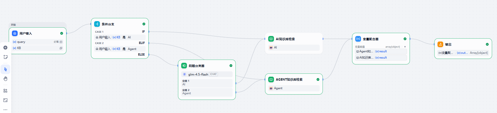

> 绿色高亮的就是工作流执行时经过的节点。

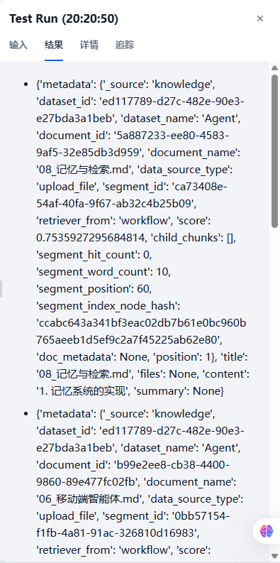

> 因为我们没有配置“Rerank”模型，召回的结果其实不是很好，在实际生产中，可以配置一个“Rerank”模型来让查询结果更精确！

如果遇到Bug了，也可以在“追踪”栏目中查看每个节点具体的执行流程：

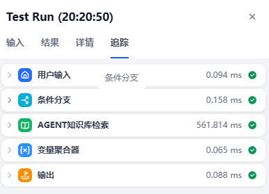

> 思考，为什么我们不同时在多个知识库中查询，然后再把结果聚合起来？

最后，调试没问题的话，点下右上角的“发布为工具”按钮吧！

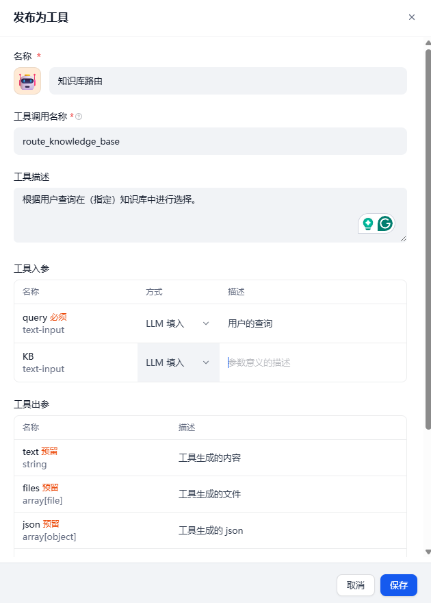

> 发布为工具是为了之后在其他工作流中使用它！

### 2. 高级检索策略

在第八章中我们介绍了高级检索策略，现在我们将这些策略实现在我们的工作流中。

我们先定义一下这个工作流的输入：

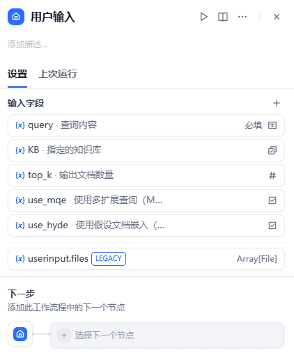

其中：

- `query`：文本，查询内容
- `KB`：文本，指定的知识库
- `top_K`：数字，输出的文档数量
- `use_mqe`：布尔，是否使用多扩展查询（MQE）
- `use_hyde`：布尔，是否使用假设文档嵌入（HyDE）

工作流如图所示：

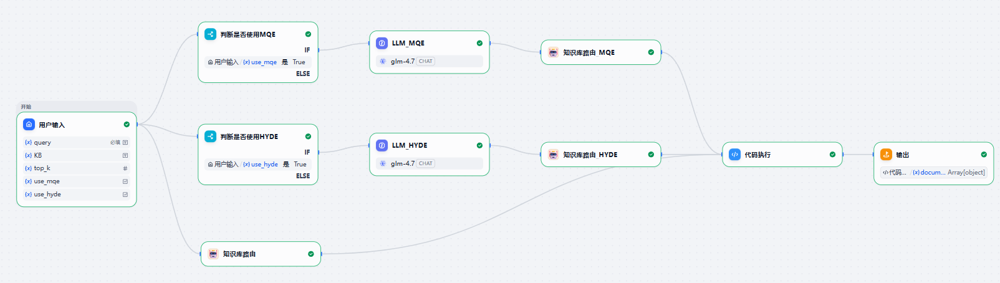

这个工作流同样有两个分支节点，判断是否启用高级检索策略，然后调用我们刚才完成的知识库路由节点，在指定的知识库中进行查找。值得注意的是，这个工作流的三条分支其实是**并行执行**的，可以加快工作流的执行速度。我们最后通过代码执行节点对三种策略查找到的知识库文档进行去重与排序。

其中，MQE的`Prompt`可以如下写：

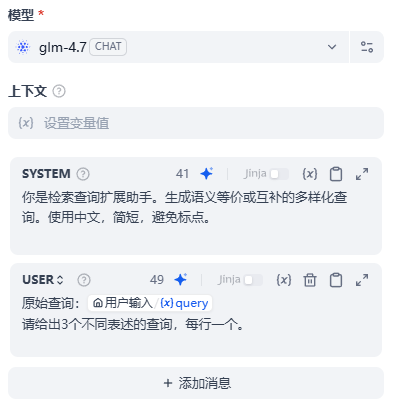

HyDE的`Prompt`可以如下写：

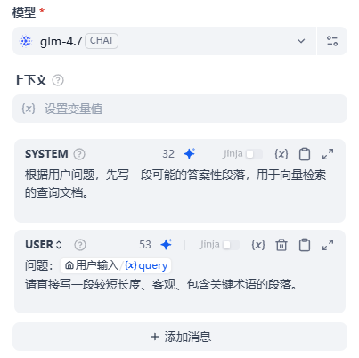

> 记得把推理模式关闭，这个功能不需要模型深入思考输出特别精准的答案。

比较关键的节点是代码执行节点，这个代码需要汇聚三个分支找到的知识库文档：

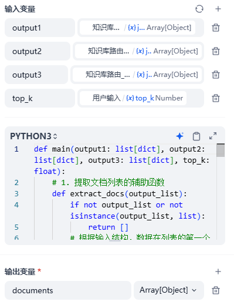

代码如下所示：

```python
def main(output1: list[dict], output2: list[dict], output3: list[dict], top_k: float):
    # 1. 提取文档列表的辅助函数
    def extract_docs(output_list):
        if not output_list or not isinstance(output_list, list):
            return []
        # 根据输入结构，数据在列表的第一个元素的 "documents" 键下
        return output_list[0].get("documents", [])

    docs1 = extract_docs(output1)
    docs2 = extract_docs(output2)
    docs3 = extract_docs(output3)

    # 2. 合并所有文档
    combined_documents = docs1 + docs2 + docs3

    # 3. 使用字典去重 (以 segment_id 为 key)
    # 提示：如果希望保留分值更高的重复项，建议先按 score 升序排，这样后存入的(分值高的)会覆盖旧的
    seen = {}
    for item in combined_documents:
        segment_id = item.get('metadata', {}).get('segment_id')
        if segment_id:
            seen[segment_id] = item

    unique_documents = list(seen.values())

    # 4. 排序并取 Top K
    # 将 top_k 转换为整数
    k_limit = int(top_k)

    # 按照 score 降序排序
    top_n = sorted(
        unique_documents,
        key=lambda x: x.get('metadata', {}).get('score', 0),
        reverse=True
    )[:k_limit]

    # 5. 返回结果
    return {
        "documents": top_n
    }
```

运行测试，就能看到工作流正常执行啦！

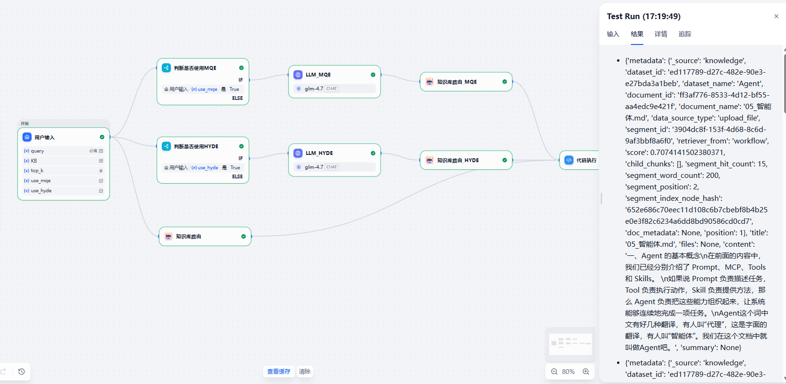

同样的，调试结束之后，可以发布成工具，供下游任务或Agent使用。

### 3. 格式化输入输出助手

知识库的底层逻辑已经构建完毕，现在让我们实际开始实现一个可复用的工作流。

什么叫可复用？这是一个比较有意思的话题。我们希望程序可以处理多个相同流程的工作，而不用每次都对工作流进行复制，然后修改参数。那如何把参数独立出来呢？我们可以做一个运行时动态反射，在运行时确认传入参数的类型，然后构筑`Prompt`。

为此，我们引入多个用JSON描述的内容，具体而言，我们可以定义输入为：

- `task`：要完成的任务
- `KB`：指定搜索的知识库
- `input_schema`：输入格式
- `input_content`：输入内容
- `output_schema`：输出格式
- `extra_system_prompt`：额外系统提示
- `extra_query_key`：额外的搜索关键词
- `use_mqe`：是否使用多扩展查询MQE
- `use_hyde`：是否使用假设文档嵌入HyDE

```python
# 具体约束
task: String
KB: String
input_schema: String # JSON格式
{
	"name1": "description1",
	"name2": "description2"
}
input_content: String # JSON格式，对应 input_schema
output_schema: String # JSON格式
{
	"name1": "description",
}
extra_system_prompt: String
extra_query_key: String
use_mqe: bool
use_hyde: bool
```

为了拥有鲁棒性，我们需要定义输出为:

- `success`：是否成功
- `msg`：报错信息
- `output`：输出结果

```python
success: bool
msg: String
output: String # JSON格式，对应 output_schema
```

让我们一起开始搭建：

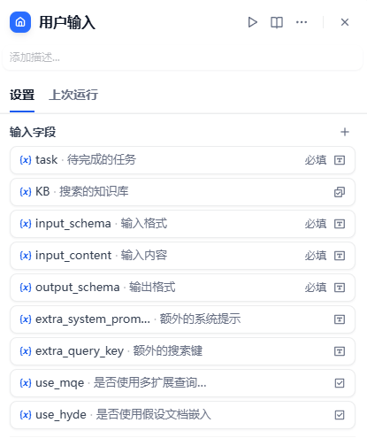

在开始之前，让我们先准备一组测试数据：

```
task: 根据给定要求生成题目
KB: Agent
input_schema: {"topic": "题目主题", "type": "题目类型", "num": "题目数量"}
input_content: {"topic": "记忆系统", "type": "选择题", "num": "3" }
output_schema: {"question": "题目列表List", "answer": "答案列表List"}
extra_system_prompt: 无论是选择题、填空题还是主观题，在答案部分都应该直接输出答案，例如选择题：“A”；填空题：“填入的内容”；主观题：“回答的内容”。生成的题目不需要带题序号。选择题在题目部分务必输出四个选项，一个选项一行。选择题在末尾不需要带括号，选项也不需要带括号，例如“A. 安全”；判断题的答案用中文，“正确”或者“错误”。
extra_query_key: 随意
use_*: 随意
```

工作流如下所示：

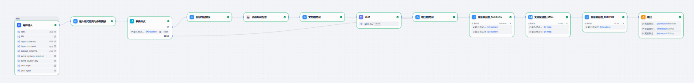

现在让我们逐步骤分析：

#### （1）输入检测与参数拼接

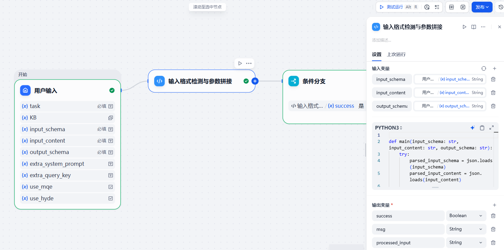

顾名思义，这个节点的作用是检测输入是否符合规范，尤其是`input_schema`、`input_content`、`output_schema`是否是JSON格式，然后把`input_content`与`input_schema`组装起来。代码如下所示：

```python

def main(input_schema: str, input_content: str, output_schema: str):
    try:
        parsed_input_schema = json.loads(input_schema)
        parsed_input_content = json.loads(input_content)

        # 仅作检测
        parsed_output_schema = json.loads(output_schema)

        # 输入拼接
        processed_input = ""
        for key, value in parsed_input_schema.items():
            processed_input = processed_input + f"{value}: {parsed_input_content[key]}\n"

        return {
            "success": True,
            "msg": "",
            "processed_input": processed_input
        }

    except json.JSONDecodeError:
        return {
            "success": False,
            "msg": "请检查输入是否符合JSON格式",
            "processed_input": ""
        }
    except KeyError:
        return {
            "success": False,
            "msg": "请检查输入模式与输入内容是否匹配",
            "processed_input": ""
        }
```

在提供的测试输入数据下，这个节点的输出是：

```
success: True
msg: ""
processed_input:
"""
题目主题: 记忆系统
题目类型: 选择题
题目数量: 3
"""
```

#### （2）条件分支

根据上一步的`success`是否成功决定接下来的执行过程，目的是Fail Fast，如果输入都错了，给个提示信息就不用执行后面的过程了。

#### （3）查询内容拼接

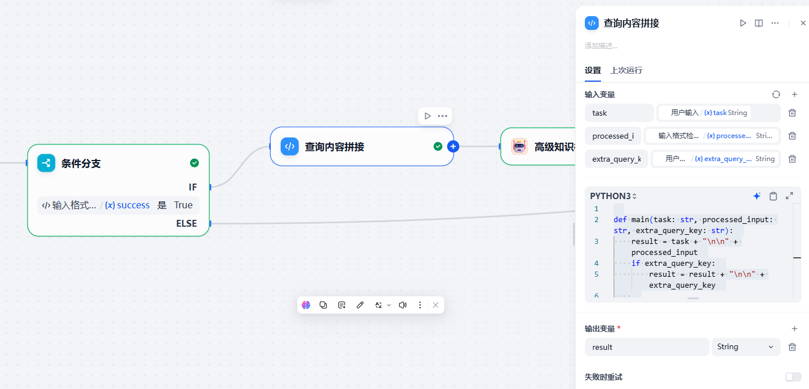

这个节点是为了将任务和输入以及额外搜索键拼接在一起，构成知识库搜索的查询内容，保证搜索目标的准确性。代码如下：

```python
def main(task: str, processed_input: str, extra_query_key: str):
    result = task + "\n\n" + processed_input
    if extra_query_key:
        result = result + "\n\n" + extra_query_key

    return {
        "result": result
    }

```

在提供的测试输入数据下，这个节点的输出是：

```
根据给定要求生成题目

题目主题: 记忆系统
题目类型: 选择题
题目数量: 3
```

#### （4）高级知识库查询

就是刚才我们第2步写的工作流，直接调用就完了。注意透传入的一些参数。

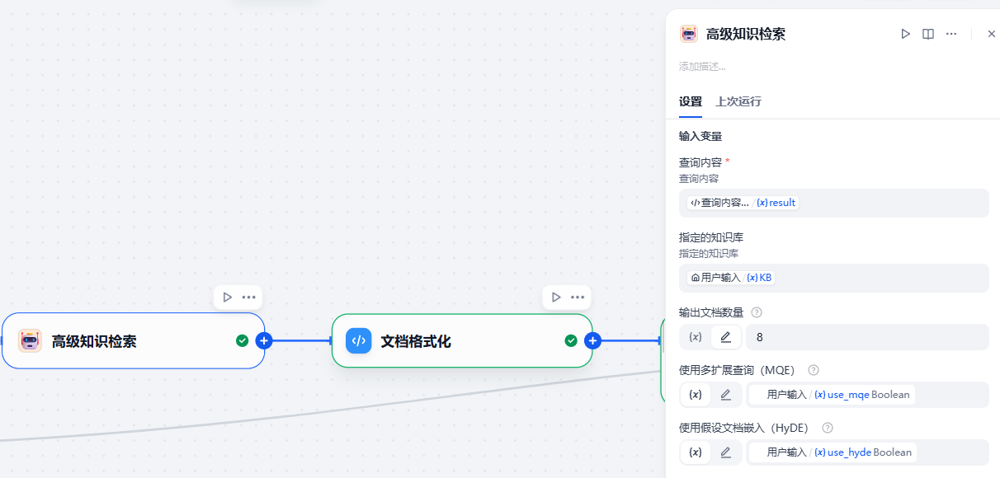

这一步的输出结果其实并不那么直观哟：

```
{
  "json": [
    {
      "documents": [
        {
          "metadata": {
            "_source": "knowledge",
            "dataset_id": "ed117789-d27c-482e-90e3-e27bda3a1beb",
            "dataset_name": "Agent",
            "document_id": "5a887233-ee80-4583-9af5-32e85db3d959",
            "document_name": "08_记忆与检索.md",
            "data_source_type": "upload_file",
            "segment_id": "ca73408e-54af-40fa-9f67-ab32c4b25b09",
            "retriever_from": "workflow",
            "score": 0.5527579188346863,
            "child_chunks": [],
            "segment_hit_count": 8,
            "segment_word_count": 10,
            "segment_position": 60,
            "segment_index_node_hash": "ccabc643a341bf3eac02db7b61e0bc960b765aeeb1d5ef9c2a7f45225ab62e80",
            "doc_metadata": null,
            "position": 1
          },
          "title": "08_记忆与检索.md",
          "files": null,
          "content": "1. 记忆系统的实现",
          "summary": null
        },
        ...
      ]
    }
  ]
}
```

#### （5）文档格式化

因为上面知识库检索的搜索结果并非人类可读，所以我们最好将其格式化一下：

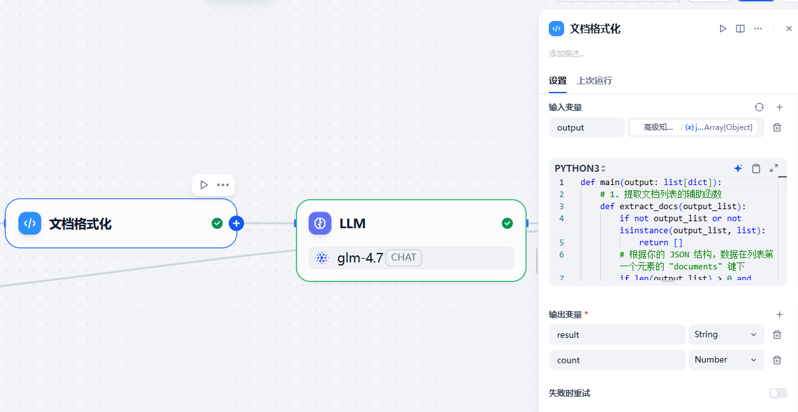

```python
def main(output: list[dict]):
    # 1. 提取文档列表的辅助函数
    def extract_docs(output_list):
        if not output_list or not isinstance(output_list, list):
            return []
        # 根据你的 JSON 结构，数据在列表第一个元素的 "documents" 键下
        if len(output_list) > 0 and "documents" in output_list[0]:
            return output_list[0]["documents"]
        return []

    # 2. 格式化单个文档的辅助函数
    def format_document(doc):
        if not doc:
            return ""
        # 优先从 metadata 获取文件名，如果没有则找 title
        doc_name = doc.get("metadata", {}).get("document_name") or doc.get("title", "未知文档")
        content = doc.get("content", "").strip()

        return f"### 文档名：{doc_name}\n**内容提取：**\n{content}\n"

    # 3. 执行提取逻辑
    documents = extract_docs(output)

    # 4. 循环处理并拼接字符串
    document_segments = []
    for doc in documents:
        formatted_doc = format_document(doc)
        if formatted_doc:
            document_segments.append(formatted_doc)

    # 使用 \n---\n 分隔符让不同文档块在视觉上更清晰
    final_result_str = "\n---\n".join(document_segments)

    # 5. 返回结果字典
    return {
        "result": final_result_str,
        "count": len(document_segments)  # 顺便统计处理了多少个片段
    }
```

在我们给予的测试数据下，结果是：

```
### 文档名：08_记忆与检索.md\n**内容提取：**\n1. 记忆系统的实现\n\n---\n### 文档名：08_记忆与检索.md\n**内容提取：**\n一、记忆系统\n在构建智能体的记忆系统之前，我们先从认知科学角度理解人类如何处理与存储信息。人类记忆是一个多层级认知系统，不仅能够存储信息，还能根据重要性、时间与上下文对信息进行分类整理。根据认知心理学研究，人类记忆主要分为两大类型：短期记忆和长期记忆。然而，现代研究更倾向于将短期记忆理解为工作记忆，因此认知心理学常以工作记忆框架研究记忆系统。\n\n---\n### 文档名：03.1_Tools.md\n**内容提取：**\n系统里会发生下面这几步：\n\n---\n### 文档名：08_记忆与检索.md\n**内容提取：**\n4. 记忆系统的设计\n借鉴人类记忆机制，我们也可以用类似思路构建 Agent 的记忆系统。例如，可将记忆分为两大类：工作记忆与长期记忆；其中长期记忆又可分为情景记忆与语义记忆。\n\n---\n### 文档名：08_记忆与检索.md\n**内容提取：**\n在本章中，我们将介绍 Agent 的两大核心能力：**记忆系统（Memory System）与检索增强生成（Retrieval-Augmented Generation, RAG）**。\n
```

这个结果是更好的、适合AI处理的自然语言文本内容。

#### （6）调用LLM

重点来了，调用LLM：

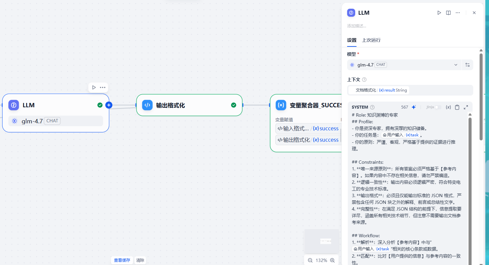

这一部分其实是Prompt工程，贴上使用的Prompt：

```
// System Prompt
# Role: 知识渊博的专家
## Profile:
- 你是资深专家，拥有深厚的知识储备。
- 你的任务是：{{#1775813287890.task#}}。
- 你的原则：严谨、客观，严格基于提供的证据进行推理。

## Constraints:
1. **唯一来源原则**：所有答案必须严格基于【参考内容】。如果内容中不存在相关信息，请勿编造。
2. **逻辑一致性**：输出内容必须逻辑严密，符合特定的专业技术标准。
3. **输出格式**：必须且仅能输出标准的 JSON 格式，严禁包含任何 JSON 块之外的解释、前言或总结性文字。
4. **完整性**：在满足 JSON 结构的前提下，信息提取要详尽，涵盖所有相关技术细节，但注意不需要输出文档参考来源。

## Workflow:
1. **解析**：深入分析【参考内容】中与“{{#1775813287890.task#}}”相关的核心条款或数据。
2. **匹配**：比对【用户提供的信息】与参考内容的一致性。
3. **构建**：根据【输出格式要求】构造 JSON 响应。
4. **校验**：最后检查输出是否符合 JSON 语法且不包含多余文本。

## Extras:
{{#1775813287890.extra_system_prompt#}}

// User Prompt
### 待处理任务
{{#1775813287890.task#}}

### 参考内容 (Source Documents)
---
{{#context#}}
---

### 用户输入数据
{{#1775813656019.processed_input#}}

### 必须遵循的输出 JSON Schema
请直接填充以下结构并返回，确保符合标准 JSON 格式：
```json
{{#1775813287890.output_schema#}}
```

这个`Prompt`设定了大模型的角色、给了限制，并贴入了许多我们传入的参数，如`extra_system_prompt`，引入了一定的可扩展性。

大模型将依据这个Prompt生成我们需要的文本内容，这里大模型值得开启推理模式，用时间换取精度。

以下是大模型生成的结果：

```
```json\n{\n  \"question\": [\n    \"根据认知心理学研究，现代研究更倾向于将哪种记忆理解为工作记忆？\\nA. 长期记忆\\nB. 短期记忆\\nC. 情景记忆\\nD. 语义记忆\",\n    \"在构建 Agent 的记忆系统时，借鉴人类记忆机制，长期记忆可以进一步分为哪两类？\\nA. 工作记忆与短期记忆\\nB. 情景记忆与语义记忆\\nC. 认知记忆与逻辑记忆\\nD. 临时记忆与永久记忆\",\n    \"本章介绍的 Agent 的两大核心能力是什么？\\nA. 记忆系统与检索增强生成\\nB. 工作记忆与长期记忆\\nC. 情景记忆与语义记忆\\nD. 认知科学与逻辑推理\"\n  ],\n  \"answer\": [\n    \"B\",\n    \"B\",\n    \"A\"\n  ]\n}\n```
```

#### （7）输出格式化

最后一步是输出格式化，也就是把大模型输出结果的JSON格式提取出来，然后顺带检查一下是否符合`output_schema`：

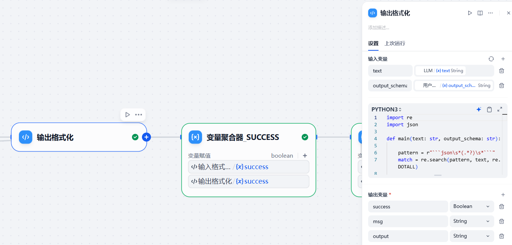

```python
import re
import json

def main(text: str, output_schema: str):

    pattern = r"```json\s*(.*?)\s*```"
    match = re.search(pattern, text, re.DOTALL)

    if match:
        json_content = match.group(1)
    else:
        json_content = ""

    try:
        # 尝试解析 JSON 字符串
        parsed_output_content = json.loads(json_content)

        # 确认是否符合输出Schema结果
        parsed_output_schema = json.loads(output_schema)
        for key, value in parsed_output_schema.items():
            if key not in parsed_output_content:
                return {
                    "success": False,
                    "msg": "大模型的输出不符合预期结果",
                    "output": json.dumps(parsed_output_content, ensure_ascii=False)
                }

        # 如果解析成功
        return {
            "success": True,
            "msg": "",
            "output": json.dumps(parsed_output_content, ensure_ascii=False)
        }


    except json.JSONDecodeError:
        # 如果解析失败
        return {
            "success": False,
            "msg": "大模型输出了无法解析的结果",
            "output": ""
        }

```

#### （8）异常处理与结果合并

最后把异常处理加上，也就是前面输入格式化检测失败和最后输出格式化检测失败，这样就完成了全部的工作流。

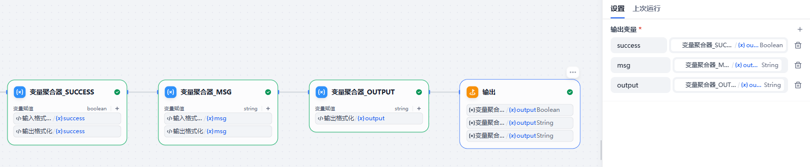

检测完毕之后，发布成工具，就完成啦！

### 4. 出题小助手

试试我们刚才的通用小助手改装成的出题小助手，还是使用以下数据：

```
task: 根据给定要求生成题目
KB: Agent
input_schema: {"topic": "题目主题", "type": "题目类型", "num": "题目数量"}
input_content: 用户填入
output_schema: {"question": "题目列表List", "answer": "答案列表List"}
extra_system_prompt: 无论是选择题、填空题还是主观题，在答案部分都应该直接输出答案，例如选择题：“A”；填空题：“填入的内容”；主观题：“回答的内容”。生成的题目不需要带题序号。选择题在题目部分务必输出四个选项，一个选项一行。选择题在末尾不需要带括号，选项也不需要带括号，例如“A. 安全”；判断题的答案用中文，“正确”或者“错误”。
extra_query_key: 随意
use_*: 随意
```

但是此时只有`input_content`是用户实际传入的内容，其他都是我们预设的内容。

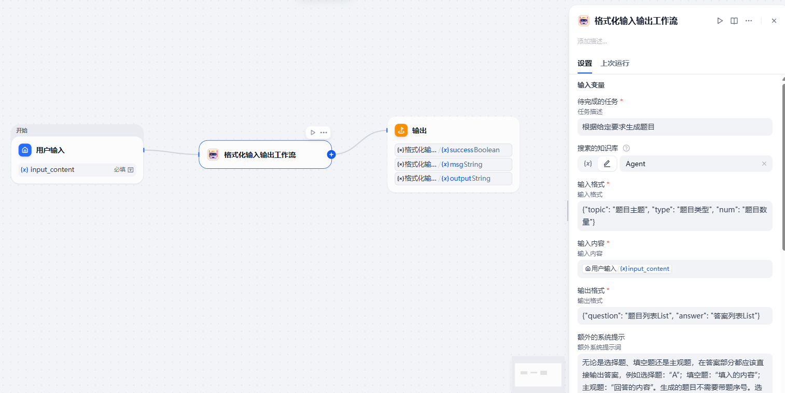

让我们最后运行一下：

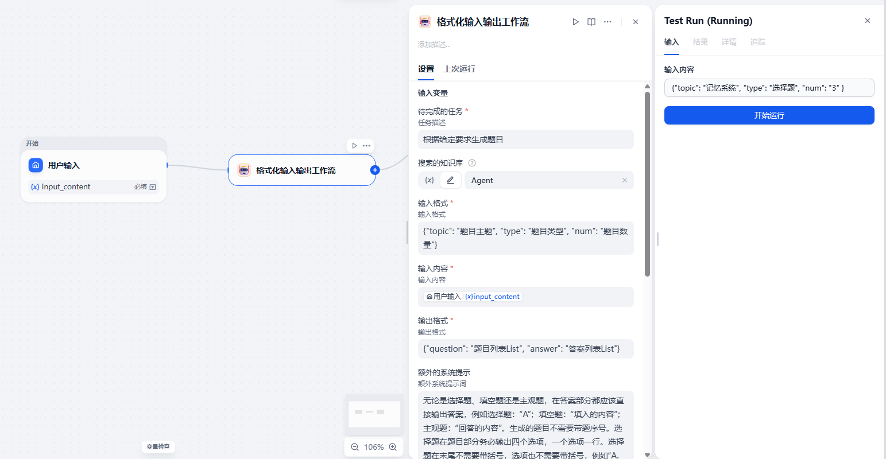

运行结果：

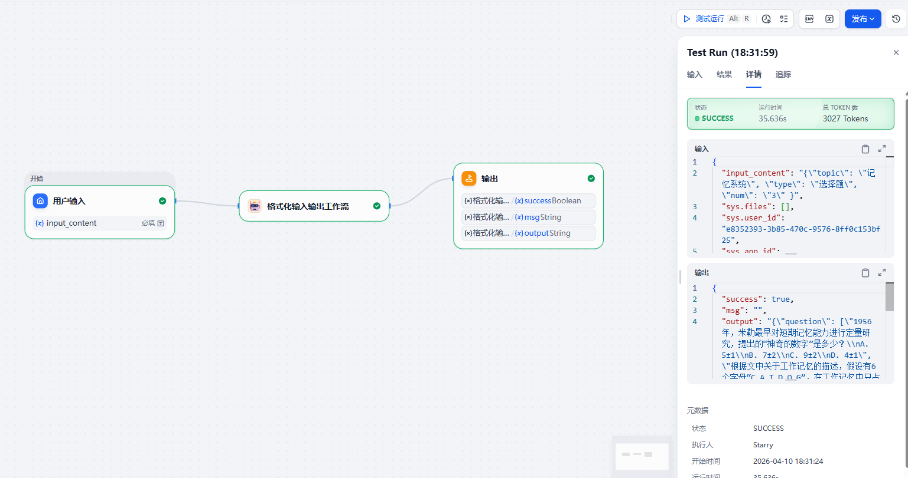

### 5. 总结

在这个例子中，我们使用了非常多的节点，包括分支、意图识别、代码节点等，甚至并发执行工作流，也构建了四个工作流应用，体验了工具调用引入子工作流的方法。


同学们可以继续使用这个格式化输入输出助手来使能下游引用，只需要修改任务、输入格式和输出格式等参数。

当然，欢迎大家搭建各种各样有趣的工作流，Dify对节点提供了详尽的文档，大家遇到不懂的地方都可以查找看看。

希望大家能有所收获！
